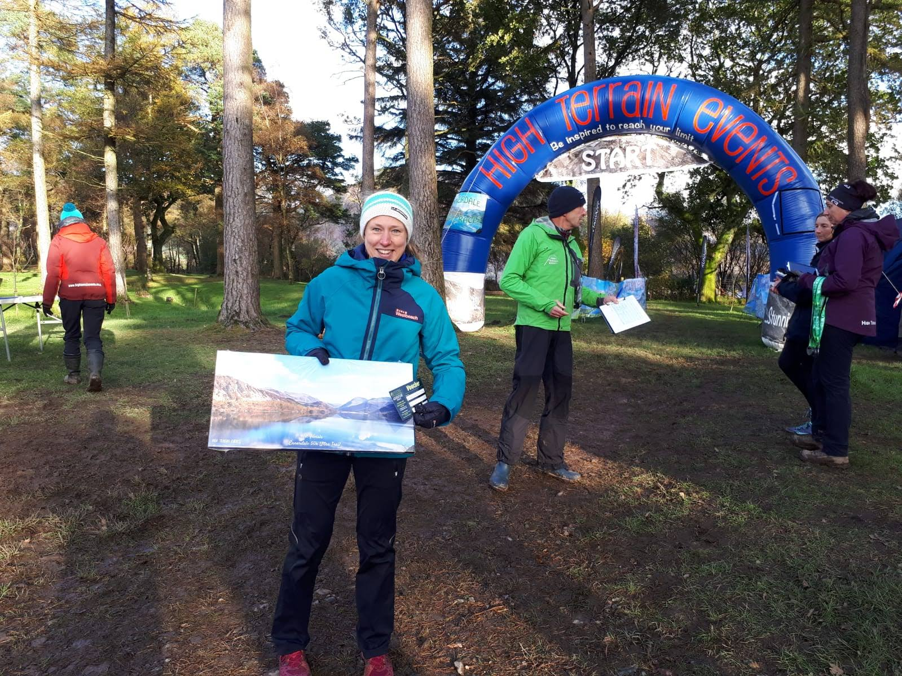

The end of my 2019 running season didn't quite go to plan. After a month of little running after Lavaredo I built back up slowly with the help of some great physio sessions with Kenny at [Space Clinics](https://spaceclinics.co.uk/). Matt carefully wrote me a training plan which we tweaked weekly depending on how my knee was recovering. At the beginning we didn't know if I'd be able to complete the training. But my knee slowly improved and I arrived in France ready to run the [Grand Trail des Templiers](https://www.festivaldestempliers.com/courses/templiers/) feeling fit and confident. I'd recce'd the route in August and was excited to run on the trails there.

Alas it wasn't to be this year. I woke up at 1am on race morning to an email titled "Annulation Grand Trail des Templiers". The race was cancelled! I ran it through Google Translate a few times to be sure. The Facebook post announcing the same had been shared over 1,000 times and had as many comments (mainly in angry French as far as I could tell). After a confused few hours convincing myself that this was real, I went back to sleep. The weather later in the day was the most extreme I've ever been in, with huge storms and lightning directly overhead. Cancellation was absolutely the right decision by the organisers.

I was still disappointed and full of energy though! I had a stressful week in France and all sorts of travel troubles trying to get home. Meanwhile Matt was busy in the background finding me a race to run for the big end of season finale...

The [Ennerdale Ultra Trail](https://www.highterrainevents.co.uk/ennerdale-ultra-trail) is a 50km race in the western Lake District, organised by the great team at High Terrain Events (who also organise the excellent Glentress races). It's two laps around Ennerdale Water and from the course description sounded very fast and runnable.  Matt looked at race times from previous years and suggested I aim to run 4 hours 30. It seemed reasonable when I broke that down, and 50km was much shorter than what I'd been training for, so I should have the endurance... but did I have the speed?

📷 https://www.granddayoutphotography.co.uk/

It's very hard not to go out too hard. The terrain at the start was flat and runnable. I'd been bouncing off the walls all week in some sort of reverse-taper madness. My legs felt good and fast felt easy. I tried to reign myself in. After the first few miles I ran alone. It was cold and drizzly but the views across the lake were stunning. The loop climbed gradually to Black Sail where there was a water station. I ran straight through and into the boggy section. This was quite slow but there were some long downhills to balance it out. Then the path dropped to next to the lake and became a lot more interesting: hopping over rocks and a roped scramble over Anglers Crag. My plan had been to run the first lap in 2 hours 10, but this section slowed me substantially and I finished the loop in 2:14 and in 8th place.

📷 https://www.granddayoutphotography.co.uk/

I overtook one guy in the halfway aid station as I didn't stop, and another guy who was walking just after it. He managed to hang on to me for a mile or so, but dropped back on the climb. I kept running but was annoyed to be moving much slower than on the first lap. I was feeling low from about mile 19 until just after Black Sail. I got a huge boost here from the encouragement from Ian the Race Director who had mountain biked around. By the time I got to the downhill section I was feeling strong and ran this much faster on the second lap, passing another guy. I caught the next guy as we reached the technical section and managed to lose him on this. It was tiring to constantly hop over rocks but I was feeling good again, and was pushing so hard I almost cramped up when I had to slow for the scramble! I knew I wasn't going to finish under my target but I kept pushing on to the finish and came in at 4:33.

I was pleased to finish 1st female and 4th overall. My second lap was 5 minutes slower than the first, which isn't perfect, but much better than most others in the race! It was a good finish to the season: I've learned lots from running some big international races but it's always nice to race a bit closer to home! I'm looking forward to a rest from racing now and starting on some strength training to build up to a big 2020!

Huge thanks once again to Matt Holland from [Improve My Running](https://improvemyrunning.com/) for the support and coaching.

