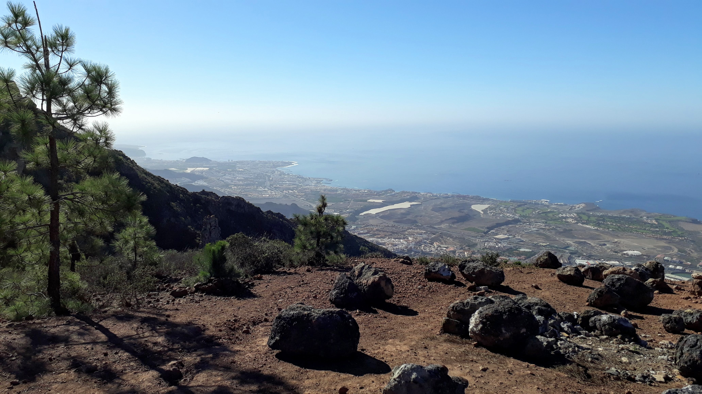
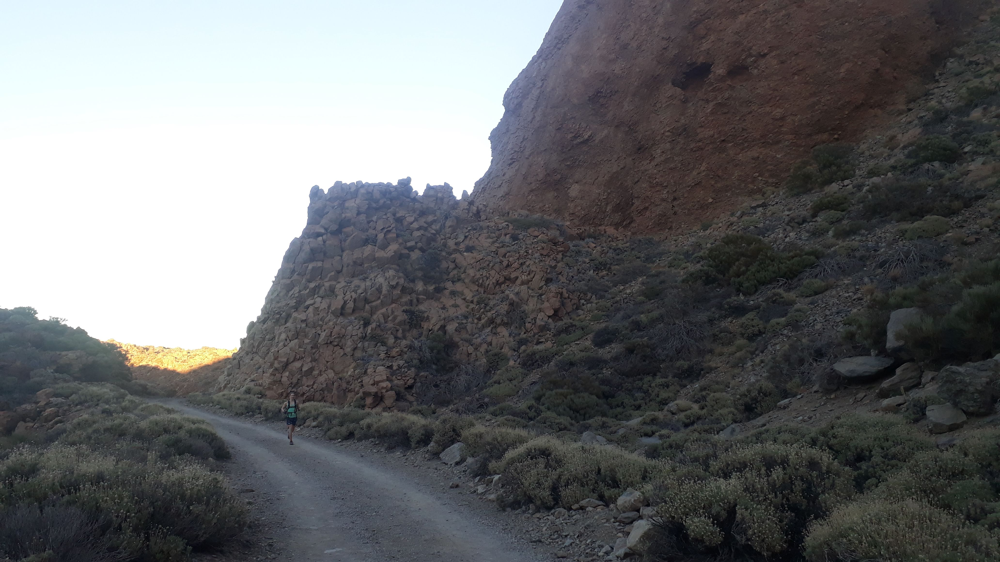
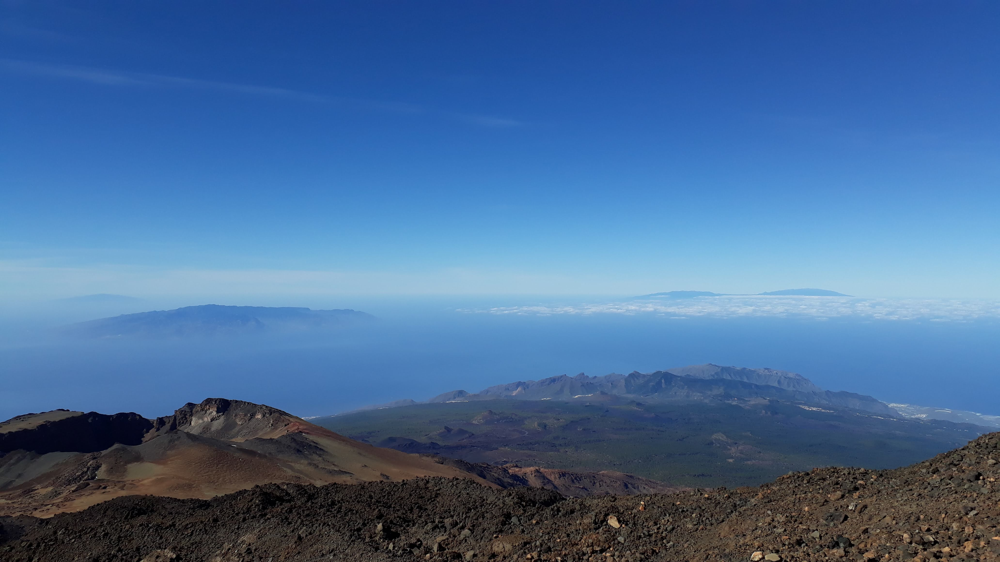
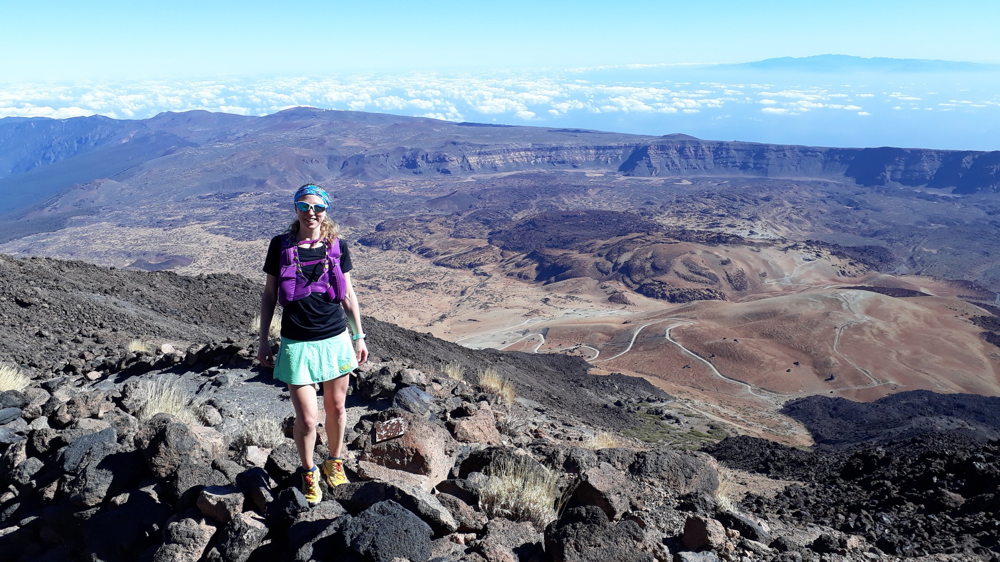
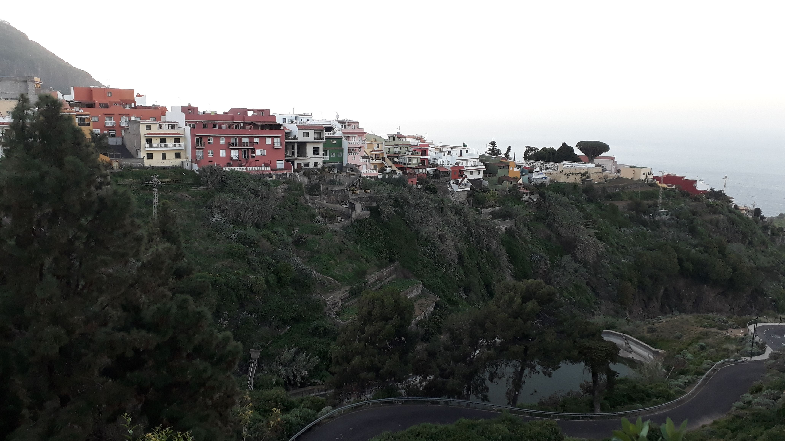
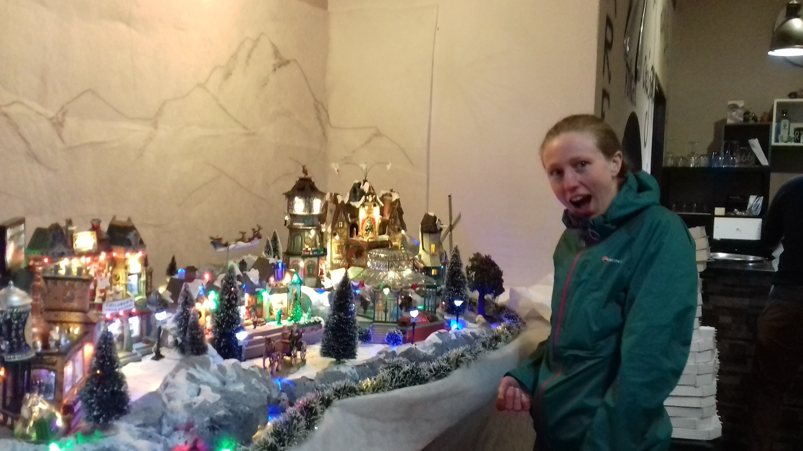
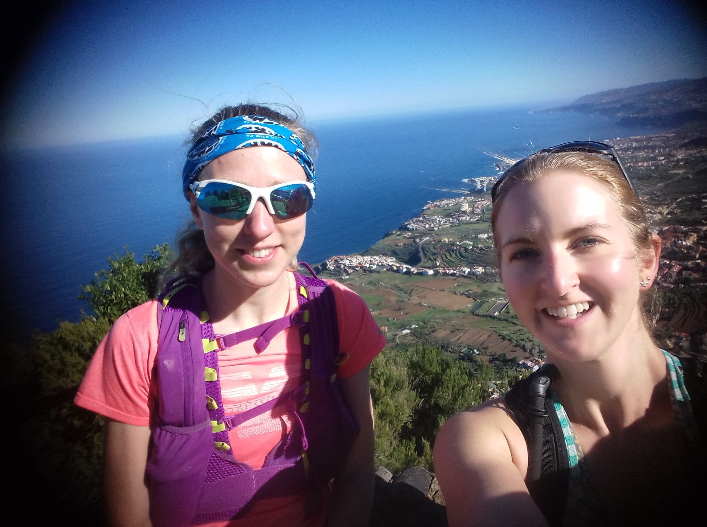
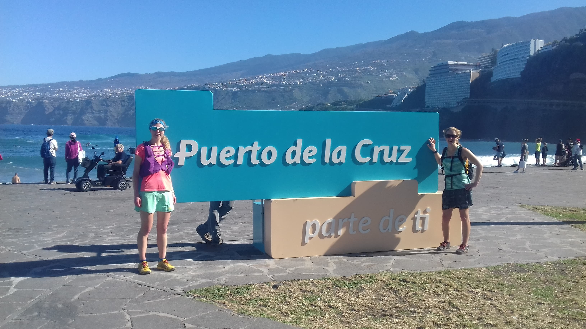

The hard part of the week was over. All Elaine and I had to do was run from the south to the west coast of the island, via the mountains in the middle and over three days. We planned to run the [Bluetrail ultramarathon route](https://www.google.com/maps/d/u/0/edit?fbclid=IwAR3tnHr3j2z2WaohixaBk8fBdPpUpdneU35-H6GLlZow_vA92SPhBJRkrNw&mid=1_vQtsQcmuDavUUult_mJtkyD3JWC-xSm&ll=28.250836142379%2C-16.64608050000004&z=11). A close look at the route profile the night before we started revealed we would spend the whole of day one, and the start of day two climbing up to over 3500m! To make it a little easier we skipped the initial 10km from sea level and started in Adeje as it was an easy place to leave the car for a few days. We enjoyed a very short run to leave the village, before heading uphill into a forest. The route followed a trail to the village of La Quinta, before winding round to Ilfonche, where we joined the GR131. Luckily Elaine had the gpx file of the route loaded onto her watch, which saved us from getting lost on more than a few occasions.
<!-- end -->

I was nervous about the first day. It was a lot of climbing and we weren’t really sure how far we had to go. I knew we would be ok once we reached Villaflor as I knew from the previous day that the trail was well marked from there. We would have daylight till about seven pm, so we should have enough daylight to make it to Parador in! However everything takes a lot longer when you’re spending most of the time hiking rather than running. The first five km took about an hour. It was hot and hard work, but there were stunning views out to sea with La Gomera, the Canary Island south of Tenerife, rising majestically out of the haze in the distance. We eventually reached Villaflor shortly before three pm, and stopped for a cold drink and to refill water. Now I was back on familiar ground and I set off confidently, keen to show Elaine the trails I’d run the day before. This time I couldn't believe I had ever managed to run up the trail. It was so steep! I didn't feel as strong today. When we reached the endless trail of black sand I got my poles out and marched up, knowing that at least this time would be the last time! Eventually we reached the final point of our climb for the day, and a sign pointing downhill to the Parador hotel. We flew down some technical switchbacks and marvelled at the amazing rock formations. It was a desert from another planet as the sun went down and the light bent in strange angles around the rocks. The trail flattened out and we meandered along, tired, hungry and almost out of water. Finally we could see a lone building in the distance, which could only be the Parador hotel! We both set off enthusiastically as the trail bent downward at a perfect angle for fast running. A little too enthusiastically and a little too early as it turned out, but we kept pushing to overtake all the walkers and finally reach the hotel!

The Parador hotel was large and fancy. We went straight in the swimming pool in our underwear and pretended we didn't notice the couple in the corner of the pool who we had evidently disturbed! We had an interesting dinner in the restaurant; there were no vegetarian mains so we shared a selection of starters including some Canarian specialties: salty potatoes, aubergine tempura with honey, and pumpkin cream with salty vegetables.

On the morning of day two we set off up Mount Teide, the highest mountain in Spain. To get all the way to the top you need a summit pass, which had unfortunately all sold out for the year by the time we realised. But we could get up to the top of the cable car station at 3555m (a good 1500m above where we were starting the day from!) It was a relentless climb through rocks and you had to keep your eyes on the path in case it disappeared! I bonked a little on the climb and convinced myself that I was feeling the effects of altitude (really I just needed a drink). We were hoping for a cafe at the top but there was only a vending machine and crowds of people getting off the gondola. The views were spectacular and we could see across to the islands of La Gomera and La Palma in the south and Gran Canaria in the east. As the air was colder up here we didn’t stick around for long. We were both excited by the prospect of lots of downhill!

The start of the descent was quite technical: steep switchbacks and lots of rocks, and hikers slowly making their way up (or some very carefully down!). It was dizzying and great fun. After the steep bit we hit a wider trail heading down through sand, and followed that to a road corner where there would be an aid station in the race. It felt like an important waypoint as it meant we had descended to the height we had started the day at! But there was still a lot further to descend before we had finished for the day. We were conscious that we hadn’t found anywhere to refill water and so were carefully rationing what we had left. Eventually the sandy trails became forest. The gpx file on the watch didn't allow us to make too many wrong turns. As we wound down through the trees the scenery around us changed from dry desert to something lusher and greener, with pines and chestnut trees. It was almost Scottish (although a lot hotter!). Eventually we found our our accommodation for the night in Los Realejos, and drank lots of water.

Our accommodation had a swimming pool again but this one was freezing cold and we were only brave enough to go in up to the tops of our legs! We headed to the only restaurant in town, a charming pizzeria full of locals. They had gone full out for Christmas with a whole Christmas village scene, lots of Christmas lights and decorations. This was probably a lot to do with all power cuts during our meal...

    

The final day was the short one. I'd originally estimated ten km, but as looked more closely we realised it would be more like eleven miles. Still, not far and it was mainly downhill... after the initial hour long climb! This culminated in what felt like hundreds of steps, at which point I got out my poles and used both of them to help lever myself up each step! After this it was all downhill to the sea! We reached some banana plantations and picked some very green bananas (which never really ripened) then followed the coast round manmade boardwalks to eventually reach the town of Puerto de la Cruz. We ran through the busy streets, dodging tourists and street sellers to the final beach. We finished with a swim in the sea, and even remembered to stretch!

