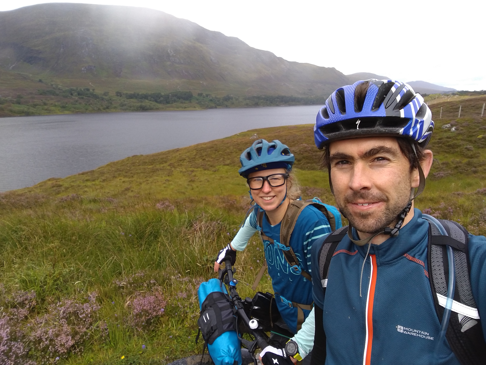

I've been doing a lot of mountain biking this year and absolutely loving it. Bikepacking seemed like the perfect way to explore the Affric Kintail Way, a 44 mile trail from Drumnadrochit on Loch Ness to Morvich on the north west coast. Will's sister and her husband are experienced mountain bikers and have done a lot of bikepacking, so they lent us some bags for the bikes, and gave us some tips! I'd naively thought we could carry all our gear in backpacks, but Mags and Adam explained that it's best to keep the weight on the bike and as balanced as possible (and saves your back and shoulders)!
<!-- end -->

It took a while to get used to riding our bikes with all the bags on! We'd run the first part of the route a few days before and knew it would be tricky on a bike. There was a diversion the first three or four miles from Drumnadrochit, so what would usually have been rideable turned into a push, then steep uphill on narrow single track. After this we rejoined the real trail on a big descent and made up for the slow slog of the first miles!

It was a lovely ride to Corrimony on quiet gravel forestry tracks. Then we joined a road and had a very cold descent to Carrich. Then we were back onto forestry tracks. The sun was shining and the path was undulating and fun. There was a steep winding descent to a car park at Dog Falls. We didn't hang around as it was very midgey. We climbed and descended some more and enjoyed bumping along high above Loch Beinn a' Mheadhoin and then Loch Affric.

We passed the (closed) youth hostel at Alltbeithe and from there the going got a lot tougher. It was very wet underfoot and the gravel path turned into grassy bog. We rode where we could and pushed where we couldn't. The bikes were heavy with the bags and pushing was hard work! We made very slow progress and soon became disheartened. The terrain became more remote and more extreme, with steep rocky sections to climb. At one point I tried to ride down a steep bit, got the front wheel stuck and went in slow motion over the handlebars, landing hard on my knee. After that I was scared to try any steep bits! We were planning to camp somewhere near the end of the trail but after taking three hours to cover ten miles we decided to call it a day. We did a final steep descent, mainly pushing the bikes, or dragging them along behind us, and found a spot to camp near the River Croe.

    

Within seconds of stopping the midges were upon us. We put the tent upwith our midge nets on. Unfortunately this took a long time as we hadn't put the tent up before - somehow the grand plan of trying it out in the living room the week before had never been realised. Eventually it was up and we took it in turns to change into long leggings and warm clothes in the tent, then Will bravely boiled some water on the stove for dinner. We retreated to the tent and spent a good five minutes stamping on all the midges that had somehow got in. There were thousands of them. Our new tent is very small a light, but not the most comfortable place to spend a lot of time in. However it was so midgey outside we had no other choice! We ate our dinner from our sleeping bags and read kindle books on our phones until we were tired enough to sleep.

I had a restless night being paranoid of midges, and all too soon the alarm went off. The midges were slighly less aggressive than the night before and we had our breakfast marching around to try and lose them, then found a windy spot to pack our bags in. We set off to finish the trail. After the first half mile the trail turned to farm track and it was easy riding to Morvich and the end of the Affric Kintail Way.

We'd decided the previous night that we couldn't face the big push that awaited us back to the youth hostel, so instead headed back to Drumnadrochit on the road through Glen Shiel. Unfortunately this is a key road from Fort William to Skye and was super busy, with cars and lorries flying past too close and too fast. We rode in tight formation, each taking our turn on the front, easily averaging 15 miles per hour. We stopped for second breakfast and some respite from the traffic at ?? and debated if we wanted to take a path off to the left, which would take us back to the youth hostel and the Affric Kintail Way. As it was a dotted line on the map we didn't think it was going to be an easy ride, so decided against it. Instead we continued on to Loch Ness where we could thankfully join the Great Glen Way at Invermoriston.

Turning off the main road was an initial shock as the single track winding road was so steep we had to get off and push! Thankfully after this we turned on to gravel tracks which traversed along above Loch Ness, finishing in some splendid single track to bring us near to Drumnadrochit. From here it was a tired final push along some quiet country roads back to the van.