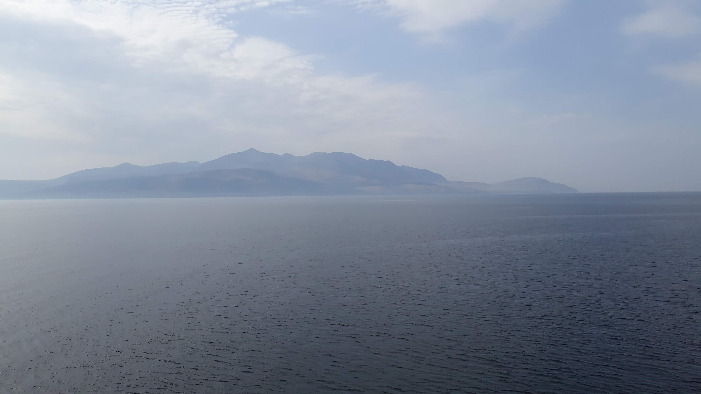

Adventuring at Easter is one of my favourite things. It's a great time of year to be forced to take a long weekend, and this year the weather gods were smiling on us. Given that next time I run the WHW I want to do it in less than 3 days, I wanted a new running adventure this year. The [Arran Coastal Way](http://www.coastalway.co.uk/) is about 65 miles which seemed a good distance to run over a few days. I was worried it may lack variety but at least we wouldn't have to worry about getting lost - we just had to keep the sea on our right. Even Aisling and I, who had got lost (twice) on an out and back the previous weekend, couldn't go wrong. I gathered some adventure buddies to join the fun and to add some spice we decided to go up the biggest hill on the island on the first day. On Easter Saturday five of us set out early from Brodick and started up Goatfell. I say early, but there were already people coming down the trail as we went up, and it was already quite warm! I regretted wearing a long sleeve top and realised Eoín had probably been right about not needing waterproof trousers. We picked our way up to the summit with some scrambling after leaving the main path by accident. From the top we could see for miles and it was beautiful.
<!-- end -->

We descended down to the coast at Corrie and turned left along the road. From Sannox Will and Ali, who were only joining for the day, turned back into the hills and ran back to Brodick via Glen Rosa. Aisling, Eoín and I continued along the coast. As the others disappeared, the enormity of what we were doing hit us and we ran quietly for a while. Wide gravel track soon became more interesting single track, reminiscent of the Fife Coastal Path. As we approached the north of the island we decided to cut the corner as we'd been advised that the path around the northern edge barely existed. Instead we climbed up a hill and traversed around another, then had a fun run down into Lochranza at the north of the island.

    

The heat was taking its toll by now and we were delighted to find a cafe and were revived by coke and cookies. From here we only had another 10 km to go and we were making better progress than we'd realised. From Lochranza the trail wound uphill, away from the road and into the woods. It was an awful almost-path at an awkward camber, full of spiders' webs and low hanging branches. It was impossible to get into a rhythm of running. When we finally dropped down to the road we found we were covered in ticks. Most of them brushed off easily, but we remained paranoid about ticks for the rest of the trip! The road was a relief after this and we settled in to the final few miles to our B and B at Pirnmill. It felt like the end of a triathlon: running in a beautiful location on an empty road. We were running tired but still moving swiftly and smoothly. The sun burned down on us and the road and we were glad to reach the village. Arriving at the B and B after a long 25 mile run was an anticlimax as our host was out and had left the the house open and a note on the door! The sea looked inviting so we climbed across some rocks for a paddle. It was much colder than it looked and we weren't very brave so only went in up to our knees! After an early dinner at the only restaurant in the village (it was packed!) we watched some dolphins (or possibly porpoises) jumping in pairs in the sea. We retired feeling good about the first day's run.

The next morning we ate breakfast whilst watching red squirrels play in front of the house. Aisling had discovered an unwelcome visitor in the form of a tick in her leg and set about removing it before we set off. We started on the road and saw some seals playing near the shore. Then we scrambled and hopped over some rocks before reaching Blackwaterfoot, where we stopped for espressos and scones. Revived by caffeine and sugar we went back onto the rocks. In places rocks had been placed as stepping stones so you had to take small fast steps and maintain momentum to get across them. In others there was no path and you had to pick a line across rocks and sand. It was great fun but slow progress!

    

The coastal route took us past some caves and we explored the King's Cave (which may have been where Robert the Bruce encountered a spider). We didn't see any spiders but there were lots of cool carvings in the rock. It was low tide so we had to rejoin the road after this as the coastal path around the south of the island was inaccessible. The road was hilly but the scenery had changed: steep hills and dramatic crags had been replaced by rolling hills and grassy pastures. We learnt that Arran sits on the highland boundary fault like the Scottish mainland. As we traveled south we were reaching the Borders! We soon came across our second stop of the day: a delightful Vèlo cafe. We topped up on cold drinks and suncream before another long stretch on the road. Our final section was up and into a forest. Eoín unexpectedly pushed the pace on the climb. I gave chase but didn't have much turn of speed on tired legs in the heat! We detoured from the path to check out the best waterfall on Arran (which was better than we'd been imagining). The next detour was more annoying as the path we had planned to take down to the coast was fenced off. This meant a few extra miles on forest track before we dropped down to Whiting Bay. We stopped half a mile from our B and B to enjoy a beer in the sunshine. As soon as we stopped moving I started shivering from the cold wind and ended up sitting in the sun with my jacket and gloves on! We wobbled along to finish for the day after 31 miles (with almost half of that on road).

The last morning was very relaxed. Breakfast didn't start until late and we didn't have far to go. We started our victory leg with a climb up into the forest and followed a fire road to Lamlash. Already the sun was scorching and the dry trail felt more like the Canaries than Scotland! We raced down to Lamlash, enjoying the descent and followed the coastal path back to Brodick. The technical rocky path here was a nice end to the trail, and we finished with delicious Arran ice cream.

It was a great weekend and we were truly blessed by hot weather and sunshine. I hadn't expected it to be warm weather training but I'm classing it as that! Running around an island is a satisfying achievement and any trip that includes a ferry journey is an adventure in my eyes. I'm already planning my return for a weekend to spend a day cycling around the island and a day exploring the ridges behind Goatfell.