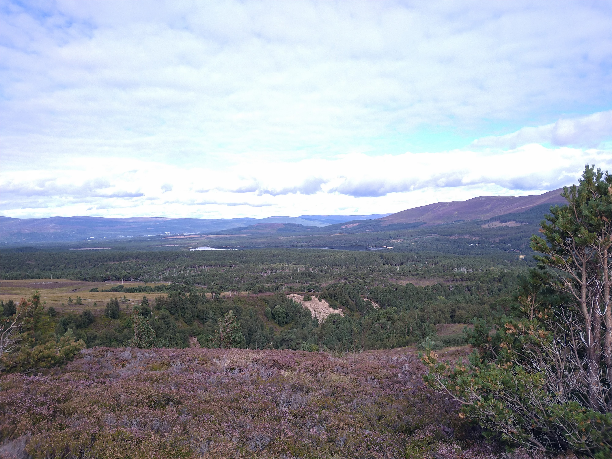
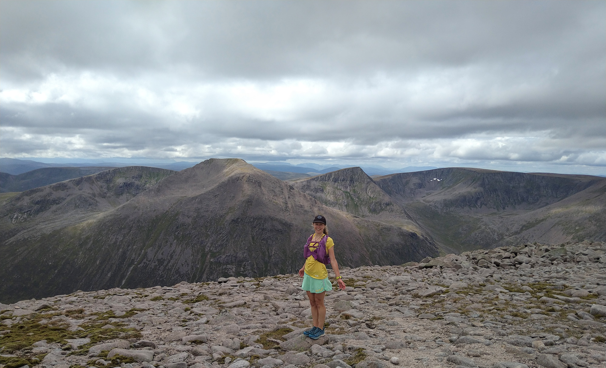
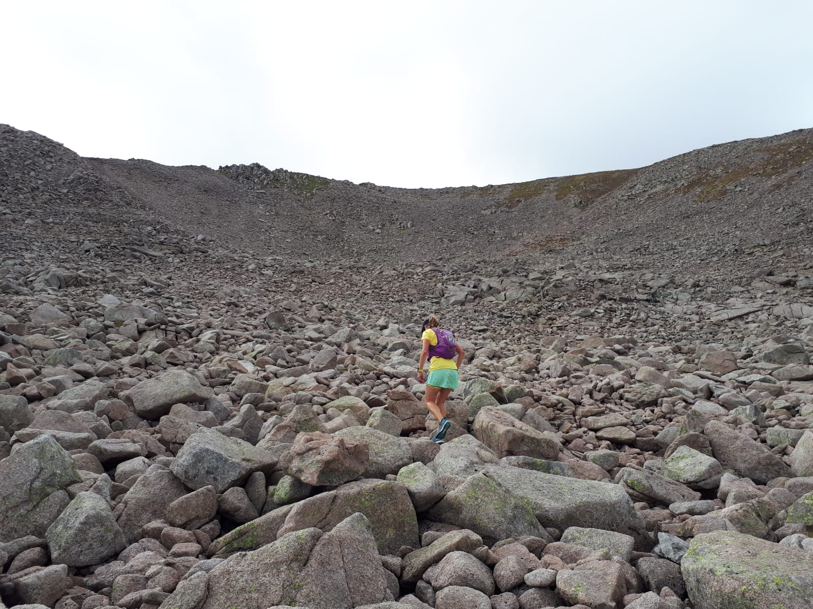
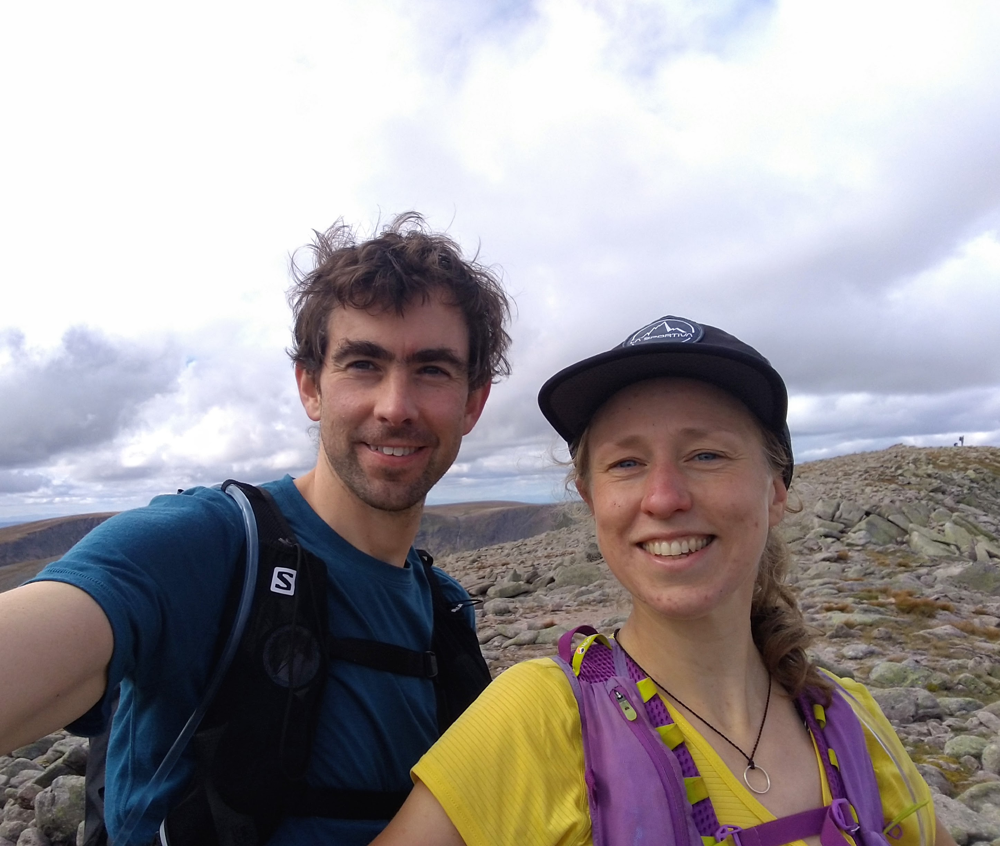
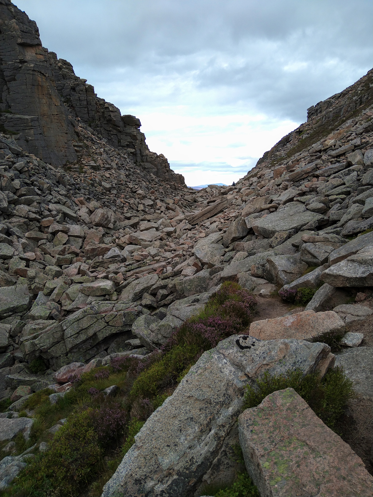

The day we planned to run the Cairngorm 4000s our van broke down in Perth. We spent 5 hours awaiting recovery and made a new plan. Luckily it was the start of a week long holiday and we could be flexible. Even more fortunately, the weather looked excellent for the next day. After many hours of waiting, and a lot of money, the RAC man fixed our van and we got back on the road. We made it as far north as Blair Atholl and found a campsite for the night, with a quick run in the hills to stretch our legs. Early next morning we drove to Glenmore and were back on track. We'd been eyeing up the Cairngorm 4000s route for a while and had become familiar with the map of the route. It's a big loop from Glenmore Lodge, taking in 5 Munros of over 4000 feet: Cairn Gorm, Ben Macdui, Cairn Toul, Sgor an Lochain Uaine and Braeriach.
<!-- end -->

We parked half a mile from Glenmore Lodge and began by running up to it. From there the track was closed so we ended up back on the road. We briefly turned off onto a trail but found this too was closed due to a landslide! We failed to find an alternative trail after a short slog up a stream, and returned to the road again. At the ski centre we took a wide gravel track to the left of the restaurant and headed for the top of the (closed) furnicular. After this we joined the main track to the summit of Cairn Gorm which was surprisingly busy. We didn't know where all the people had started from as the track we'd come up on had been empty! The summit of Cairn Gorm was sunny with splended views, but we didn't hang around as we were in short sleeves and the wind was cold!

The track to Ben Macdui was rocky and fun and we passed lots of people. The summit of Ben Macdui was busy and colder than the previous summit. I heard someone marvel that I was up there in just a skort and t-shirt, but I didn't feel very tough and soon after this we paused to put on jackets. There was no path down to the Lairig Ghru from Ben Macdui but we could clearly see where we were aiming for. To begin with we scrambled down rocks, which luckily felt solid and stable! Then we traversed around to the left to avoid some scree and found some grassier patches. These were less exposed and scary but it was even slower going as it was super steep and required a lot of concentration. When we'd planned our day we thought this descent might take 40 minutes; in reality it took us almost two hours. We definitely didn't take the best line! Finally we made it down to the Lairig Ghru and stopped to eat lunch. My left leg was shaking - a sure sign that it's not yet as strong as the right post-op, but it was still coping admirably!

The ascent of Cairn Toul was also without a path and was super steep. We followed a stream up and it was very midgey. I kept my head down and was glad of my peaked cap. I developed a rythym of wiping the midges from my face, then my neck, then arms, then back to my face again. They were everywhere. We climbed quickly and without much chat. We just wanted to escape from the midges. Higher up there was a light breeze and we stopped for a break and some sweets. We crested what looked like the top but were faced with a rocky scramble up to the ridge and summit. We did our best to pick a good line but the rocks felt loose and sketchy. I tried to tread as lightly as possible. When we finally reached the top we were surprised to see a few other people there (although they'd all come a more sensible way along a path!)

From the summit of Cairn Toul we followed the plateau around to the next two Munros: Sgor an Lochain Uaine and Braeriach. Braeriach still looked like a very long way, but this was fairly easy running. The views were stunning and weather was great so we had a fine time. The wind picked up as we reached the last summit, but we were glad as it meant the midges kept away. From Braeriach we descended back to the Lairig Ghru and a final climb to the Charlemagne Gap. This was a fun scramble and we passed a lot of people who were also making their way down at the end of the day, and cheered us on.

Emerging from the Charlemagne Gap we could see over to Loch Morlich but which still looked a very long way away. The last few miles seemed to stretch for a long time and we were both super tired by the time we eventually reached the van. It was a good tired, mingled with the satisfaction of an excellent day in the hills. We celebrated by ordering a takeaway pizza and eating it at Loch Morlich. Of course it was too midgey to sit down to enjoy it properly!

