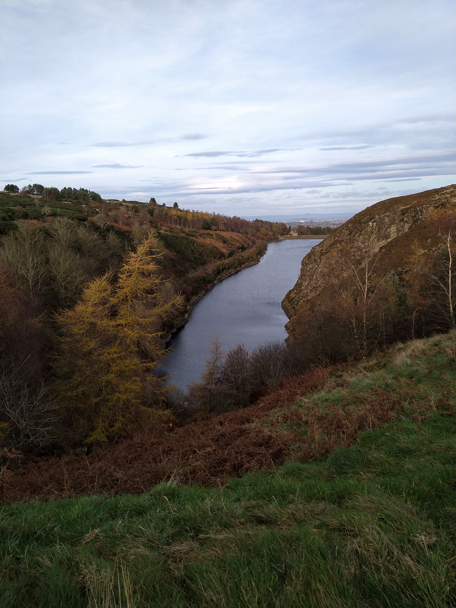
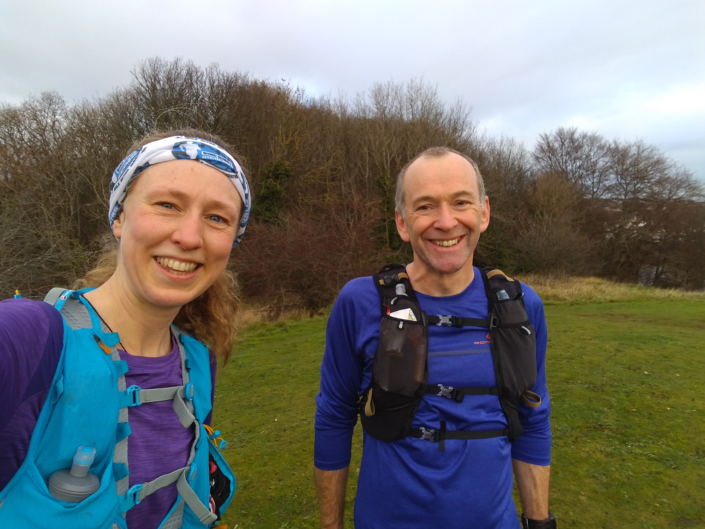
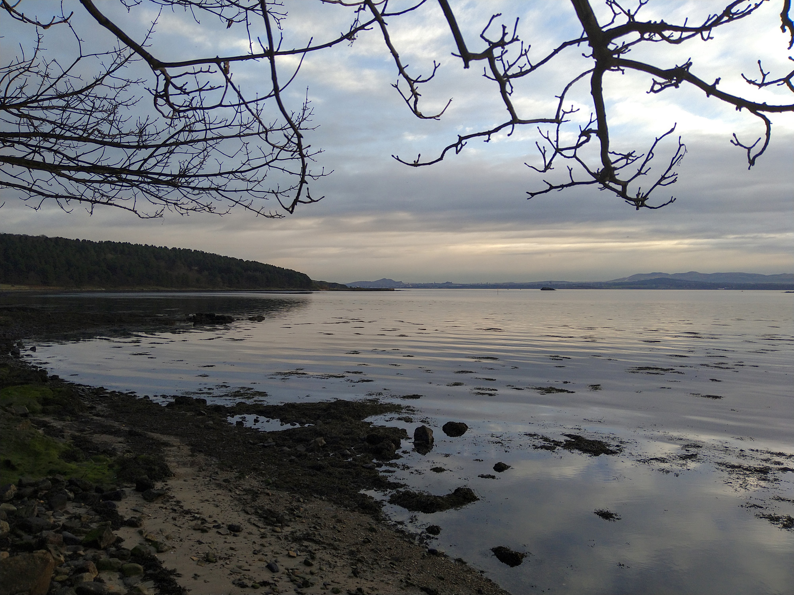
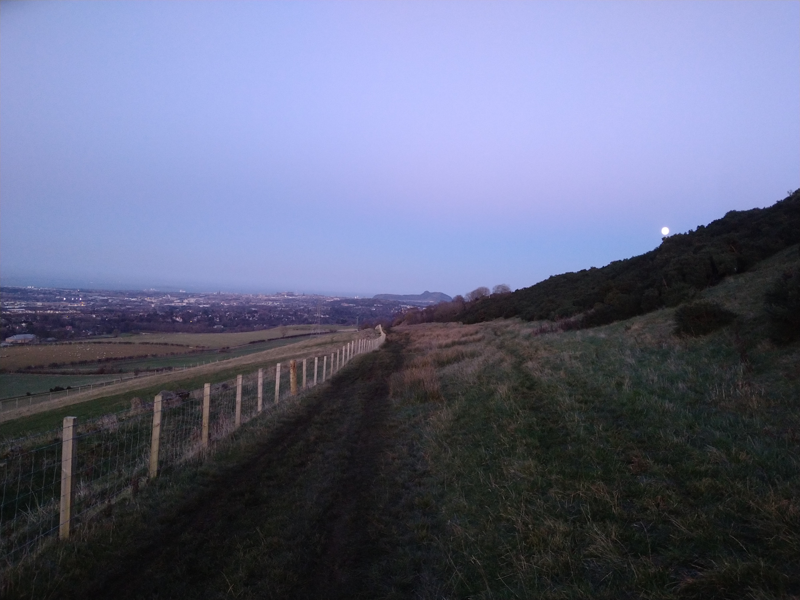
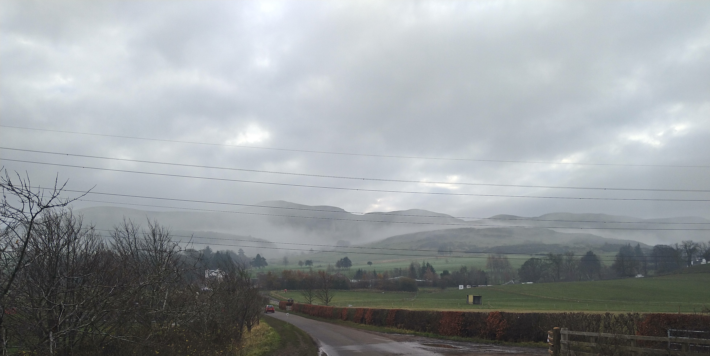
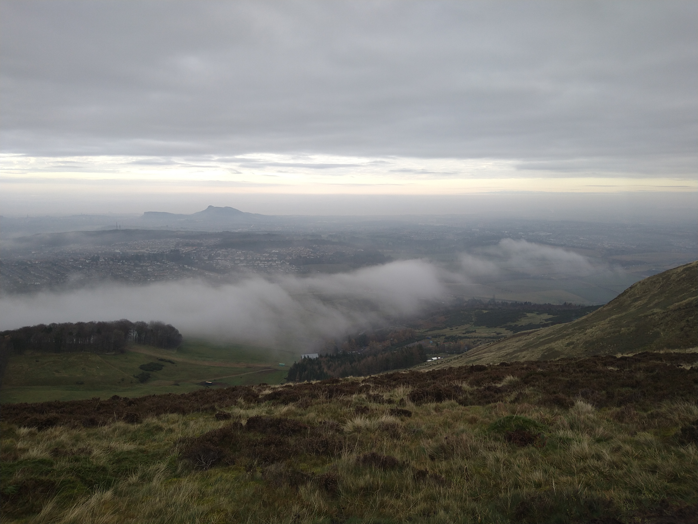
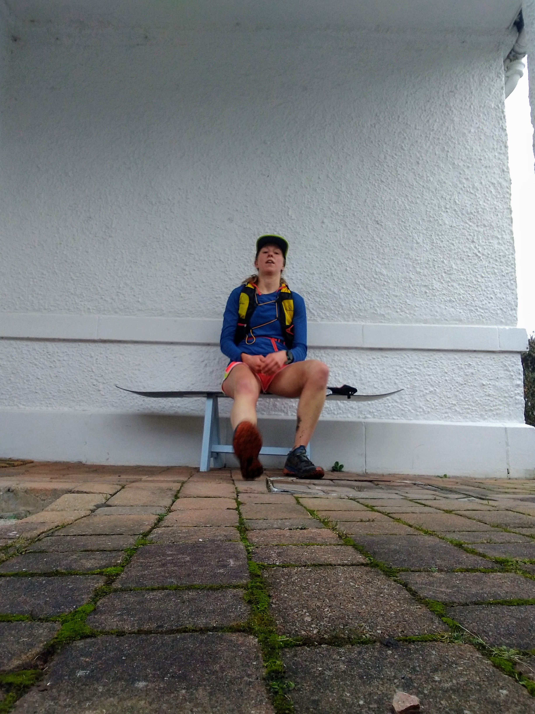

My one remaining race of the year - the [North Downs 50](https://www.centurionrunning.com/races/north-downs-way-50-2021) was finally cancelled due to the lockdown in England.
In some ways this was a relief. I still hadn't worked out if I was going to run. Travelling to the south of England from Scotland felt like it might be irresponsible.
The organisers - [Centurion Running](https://www.centurionrunning.com/) instead organised a [virtual challenge](https://www.centurionrunning.com/reports/2020/2020-one-community-ii-race-report) for the week leading up to the race.
I signed up to run 100 miles in the week.

I've run 100 mile weeks before when peak ultra training, but I'm definitely not in that shape at the moment! Here's how it went... 
<!-- end -->

### Monday
To get the week off to a good start I did my first run before work. Road shoes on, along the canal. It was cold and harder than I expected.
I was full of self-doubt.

> _When did I last run on the road? Am I going too fast? When did I last wear road shoes? Should I slow down? I should slow down..._

By the time I got home my right calf was sore.

After work I set out for another 4 miles on the road.
It was raining and windy, but the first mile was downhill with the wind behind me.
It should have felt easy.
It didn't. When I turned into the wind I was already cursing. I slowly crawled to the top of the hill.
Another runner overtook me as I neared the top. He looked super smooth. The hill wasn't bothering him.
I sped up as I turned for the final downhill, more to prove to myself that I could than anything else.
But now on the opposite side of the road from the other runner I sped up until I drew level with him and suddenly felt silly and embarassed.

I was not sure I could do this.

10/100

### Tuesday
I ignored my alarm. There would be no run before work.
I had back-to-back meetings all morning and by the time I finally left for a run at lunch time I was felt panicky.
I was taking on too much.
This week I needed to do quarterly reviews for my team, organise an openspace for next week and work through a team reshuffle.
I was only working 3 days in a desperate final bid to use up my holiday for the year (totally my fault and terrible planning!)

Why was I also trying to run 100 miles this week?

I set out feeling angry and frustrated - at work, at myself, at the world. I forgot to start my watch.
I could feel myself tearing up but I fought back the tears.
I focused on breathing and putting one foot in front of the other. 

I ran along the Water of Leith trail in light trail shoes.
By mile 3 I was running through fields at the edge of the Pentlands and next to some reservoirs. 
I had the trails to myself and I felt calm again.
It was just running. I could do this, one run at a time.

A clearer head helped an afternoon of meetings and I felt positive when I set out for my second run.
I met Gintas on the Water of Leith and we settled into an easy chatting pace.
We stayed low, looped round the trails at Heriot-Watt and back along the canal.
Finally running felt easy.

25/100

### Wednesday
Will and I headed out early on an easy loop of the Water of Leith, Poet's Glen and a couple of reservoirs.
My calf pain was gone and I felt good.

Despite not officially working I had a few calls in the middle of the day so missed most of the sunshine.
I headed back out just before it got dark and weaved through Craiglockhart and the Hermitage.
The trail there was as muddy as the Water of Leith, but not busy.
I listened to the latest [Some Work All Play podcast](https://open.spotify.com/episode/6yS7HKyqjnlFSCFj7kWqwG?si=orzfkyyyTCaEzctAWqqCyw), letting the infectious enthusiasm of David and Megan Roche wash over and inspire me.
I wiggled around the edge of Holyrood Park to Aisling's house.
We chatted outside at a bus stop, unintentionally confusing poor Fern who couldn't understand why we weren't taking her to the park.
I dodged crowds of people in town and the Meadows on the way home, avoiding the canal until I was a few miles out of town.

48/100

### Thursday
Starting the day with a half hour pilates class made my aching hips and legs feel new again!
I planned for an easy day with a seven mile run at lunch.
But I started working at 08:30 and bounced between reviews and frantically trying to finish slides for a presentation in the afternoon (check them out [here](https://rnewstead1.github.io/presentations/worker-threads.html) if you're interested in learning about worker threads in Node.js).
At midday I realised there was no way I had time for a run, and shifted it to after work.
Presentation done, reviews done, I could relax, and set out into the dark for another Poet's Glen loop.

55/100

### Friday
Another day off, but I was up early for a meeting.
The follow-up calls and notes took longer than I'd anticipated and I left the house later than planned.
I rode my single-speed up and over Costorphine to Dalmeny and left my bike at the station.
The current covid restrictions meant I could leave Edinburgh for informal exercise as long as it started and finished in the same place.
We had no desire to push the boundaries of the rules but Neil and I agreed this allowed us to run together (he lives in Fife).
I was looking forward to having company on my longest run of the week!

We planned to meet in the middle of the Forth Road Bridge but I confused left and right and ended up at a roundabout with no idea where I was.
I backtracked and picked up the cycle path and eventually collided (not literally, we kept our distance) with Neil.
He led me on a tour of Fife through Inverkeithing and Dalgety Bay to Aberdour, and back along the coastal path.

It was great to see somewhere different. Plus it's always sunny in Fife.
We parted on the bridge and I staggered back to my bike, hips sore from all the tarmac pounding.

On the cycle home I wished for gears as I wobbled all over the road up Drum Brae Hill, crunching the pedals and ignoring my screaming quads.

77/100

## Saturday
I felt tired after Friday's long run and delayed running until it was almost sunset.
I headed out via Heriot-Watt then up Poet's Glen, through the farm and back along the road.
The end was in sight!

86/100

## Sunday
Knowing I would complete the challenge didn't make it any easier to get out the door.
Simply getting out of bed was difficult.
Will was keen to run but my lack of enthusiasm was dragging him down so I encouraged him to go out alone.
I let myself laze around for another hour and then pulled myself together.
I listened to a podcast which cheered me up immensely - [Brene Brown interviewing Jason Suedeikis and Brendan Hunt about Ted Lasso](https://brenebrown.com/podcast/brene-with-jason-sudeikis-brendan-hunt-on-ted-lasso/).
When the podcast finished I had settled into the run and was approaching the hills.

They were sitting in cloud with the summits peaking through. I was excited to get above the cloud before it passed!
As I hiked uphill my legs felt surprisingly good.
After a week of avoiding the hills I missed them.

The views over the city from the first summit of Caerketton were tremendous.
I ran over Allemuir, Capelaw and Harbour Hill before descending to Ranges Road, and home via the reservoirs.

100/100

I ran one hundred miles in a week and it felt hard.
I've done this before, but this felt much harder.

With all my races cancelled this year I've struggled for motivation to get out the door.
I've let life stress take over.
I've doubted myself - my fitness and my worth - on a daily basis.

> _Am I still a runner if I don't race? If I don't set a new FKT?_

The answer is _yes_ of course.
Certainly that's what I'd say to anyone else who asked that question, or had similar doubts.
Deep down I know it, but sometimes I find it hard to believe.

I shared my self doubt with my friend [Amy](https://twitter.com/aycyang) this week and after talking through things I realised my intention.
Next year I want to run 100 miles in one go.
Hopefully the [West Highland Way race](https://westhighlandwayrace.org/) will go ahead and I can run that* as it already means so much to me.
If it doesn't, I will pick a (appropriate to any restrictions) route and run the distance myself.

\* in this case 96 miles === 100 miles.

> _I believe in hope. I believe in believe._
>
>-- Ted Lasso

