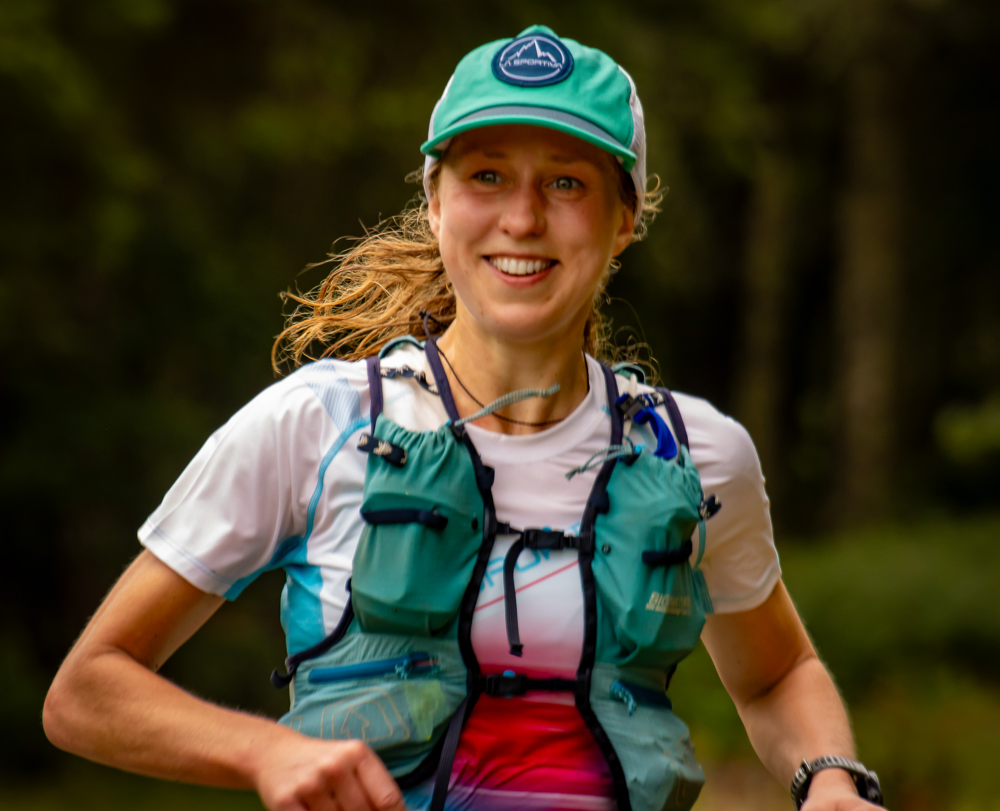
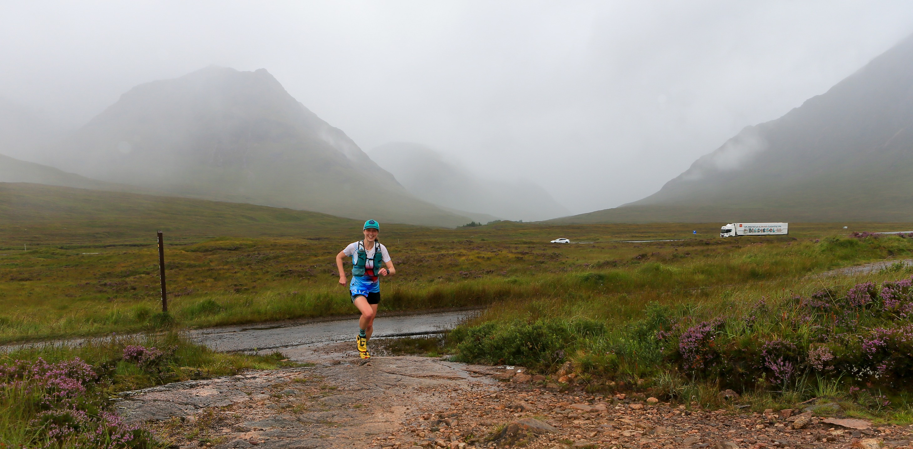
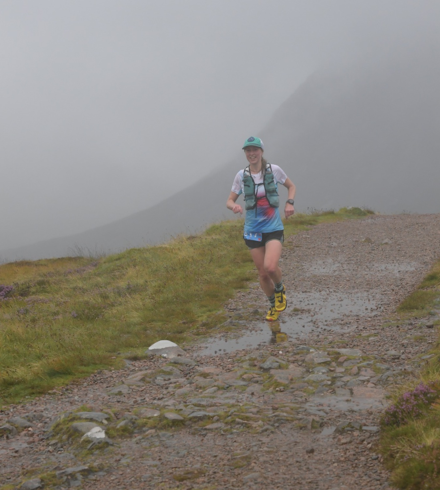
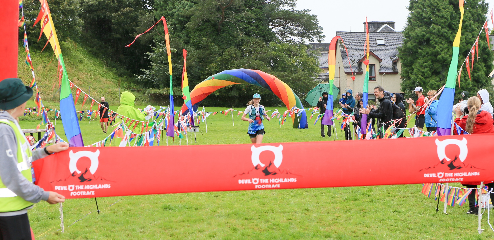
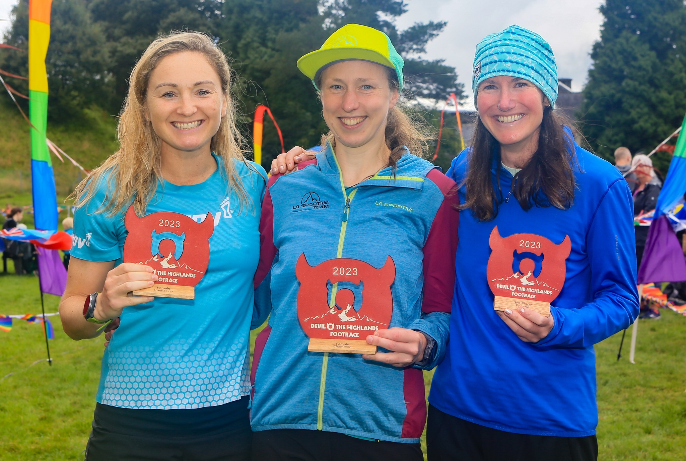

I got to the start line of the [Devil o' the Highlands Footrace](https://www.devilothehighlandsfootrace.co.uk/) feeling fit and strong.
In fact this was probably the strongest I've ever felt running uphill.
Training had gone well &mdash; no heroics, just lots of easy running, weekly hill reps, lots of tempo intervals.
I signed up for coaching with [Pyllon](http://www.pyllonultra.com/) at the start of the year and have been working with John Connolly.
I love it.
I don't have to think about what training to do.
I have a plan that I trust and that makes my life simpler, which in turn makes it easier to get out the door to train!
Going into the race I felt better uphill than I've ever felt.
I surprised myself on long runs by being able to add in tempo surges late on and still finish feeling good.
I ran on the West Highland Way a lot to let my legs remember the terrain.
I was confident in my fuelling plan (alternating between a gel and a bar every 45 minutes).
I hadn't run for much over 4 hours in training so going the distance was certainly an unknown, but I hoped all the running I'd done before meant my body would remember.
I wasn't feeling very confident downhill, especially on technical terrain.
I blame this on all the postpartum hormones as I'm still breastfeeding, but I wasn't too worried as there aren't too many technical descents in the Devil.
Overall I believed I could be competitive in the race!

<!-- end -->
Of course life threw a few curveballs.
Fitting training in around a baby who still wakes in the night meant careful planning.
I'd usually try to run after an early morning feed, but there were times when I was too tired.
Some mornings Will found me curled up in the armchair next to Jane's cot, dressed in my running gear, both of us fast asleep.
The month before the race we found out Jane's nursery was closing down and had the unplanned stress of suddenly needing to find alternative childcare.
Luckily we found a spot in a lovely nursery where she's very happy, but it's much further away.
The start of my taper coincided with an extra ten miles of cycling each day to collect her from nursery.
It turns out I feel similarly about cycling with a baby on the bike to how I feel about buggy running.
It's a great idea but it's hard work!

I've run enough ultras to know that I get super nervous in the week before a race.
I've learnt to ignore the imaginary niggles that appear in my last few runs.
I was thankful that life was so busy that I didn't have too much time to stress too much!
I packed everything (including my drop bags) early in the week before any panic set in.
However, I am known to panic-buy before races.
Before the Highland Fling in 2018 I was convinced I needed arm warmers and ordered about 4 pairs, none of which arrived in time for the race.
This time I decided I needed a new bike to take Jane to and from nursery.
I'd been riding an old and heavy secondhand mountain bike, which meant the uphill slog with Jane in the childseat was a real leg burner.
I was convinced this was going to ruin my taper.
However, it turns out you can't just walk into a shop and ride a bike away, so I had to order one to pick up the week after the race.
I probably need to shake this pre-race habit as it's getting expensive!

We stayed in the Premier Inn in Fort William the night before the race.
It was very convenient for the 4am bus, but the temperature gauge in the room read 26 degrees and the window only opened a crack, so we slowly roasted all night.
That afternoon I chatted with John about race strategy, in particular: should I walk or run the climbs?
Normally in an ultra I'd walk, without any questions.
However, I was feeling so strong uphill, and a nagging voice in the back of my head said that 42 miles wasn't too far.
It was set to be very strong women's field, and I knew I'd have to run hard to have any chance of winning.
Both Meryl Cooper and Morgan Windram-Geddes were entered and would be tough competition.

Race morning started at 3am, breastfeeding a half-asleep Jane and then creeping out of the room to the bus.
John Duncan had asked me to make sure the bus left on time and to let him know when we set off.
Luckily the driver was on top of things and didn't need any encouragement, and we arrived in Tyndrum with plenty of time for registration.
The rain was already starting and everyone was having a dilema about whether or not to wear a waterproof jacket to start (I didn't, it was too warm).
I chatted with Scott and Helen from Carnethy, and John and Grant from Pyllon, and avoided thinking about how nervous I felt.
At the start line Meryl and Morgan squeezed in next to me and Adrian took a photo of the three of us.
I think we all wondered if this would be the podium later, and in what order. 
I didn't let myself feel any pressure.

When the race started the three of us ran the first few miles together, with no one wanting to take the early lead.
Eventually Morgan pulled away and I settled in behind with Meryl just behind me.
The pace was easy and sustainable.
Meryl was very strong downhill and ran past me easily on each descent.
Keeping on my nutrition plan I ate a bar just before the first checkpoint at Bridge of Orchy.
I find it challenging to eat so early, but it does set me up well for later in the race.
Under John's advice I started with only a single full bottle, and got that and another filled at the first checkpoint.
However I was very slow doing this and got a bit flustered by the efficiency of the marshals as I flapped around trying to open bottles.
Meryl scampered past like a pro and had started up the hill before I'd managed to get my second bottle filled.
With water sloshing everywhere I rushed after her and put in some effort to catch up.
I ran easily up Jelly Baby Hill, passing Meryl and coming close to Morgan at the top.
At this point I realized that I might be the strongest uphill, which would hopefully help later in the race.
However Meryl flew past me again on the next descent.
To be competitive I was also going to have to push on some downhills!

I ran and chatted with Meryl for a while over Rannoch Moor.
I gradually pulled away but we ran into Glencoe aid station close together, and with Morgan still within sight just ahead.
I was much more efficient at Glencoe.
I had a good system of storing gels on one side of my pack and bars on the other, which meant it was easy to restock at aid stations, and easy to grab whichever I needed.
I overtook Morgan on an uphill just before the Devil's Staircase.
I knew that my best chance to get a good lead was to push up the climb, then hope I could stay ahead on the descent.
I ran all the way up the Devil's Staircase, which I'd done in training, but never with 20 miles of racing already in my legs!
I overtook quite a few men on the way up and felt a little silly as I was the only one running.
Luckily I found someone to follow down the first technical part of the descent.
This definitely helped me go faster, and took away the stress of thinking about what line to take.
When I reached the landrover track I kept running at a decent pace.
I was confident from the training I'd done that my quads could handle this hammering (and recover for the later descents!)

I ran into Kinlochleven in the lead and feeling strong.
It was a huge boost to see John and Grant and their smiles as they saw me arrive.
As I emptied my drop bag my whole arm turned black from a swarm of midges that stuck to my wet skin.
It must have been a horrible place to be marshalling, but everyone was very cheerful!
I had to power-hike some of the climb out of Kinlochleven and got frustrated at myself.
I've never managed to run this whole climb and I got stuck in my head about it.
I went into a bit of a negative spiral as I shuffled slowly uphill across Lairigmore.
In hindsight I was probably a little low on fuel: I think I only ate a mini Chia Charge bar during this section which wasn't enough!
Despite the weather there were lots of hikers out with enormous bags, who stopped to clap and cheer, and I let this raise my spirits.

At Lundavra I was sad to realize I didn't have a cup to get any Coca-Cola, but I didn't dwell on this as I was planning to have a caffeinated gel soon.
John told me that at Kinlochleven I'd had a four and a half minute lead over Meryl.
That didn't sound like a big gap, and I knew it might be less by now.
I found out afterwards that I increased my lead over these later sections, but I didn't know that at the time so I kept my effort up!
The undulating roller coaster through the woods after Lundavra was a welcome change after the long drag through the valley.
I was super happy when the path joined the landrover track at the top of a climb and I came across an unexpected aid station.
The wonderful marshals here gave me some Coke in my water bottle and this immediately gave me a lift!
I was ready to run hard on the last descent.
With each kilometre I grew more confident that no one was going to catch me.
By the time I reached the turn for Cow Hill I couldn't stop smiling.
This was the one bit I hadn't reccied but I was ready for it.
I power-hiked the steeper section and finally saw signs pointing down to the swimming pool and the finish.
I dibbed my timing chip for the final time, ran through the rainbow arch, and heard my name being announced as the women's race winner.
Down the finish chute I saw Will and Jane clapping.
They were both hidden under hoods but the big smile on Will's face was clear to see.

It felt like a dream come true.
When I won the Highland Fling I shied away from acknowledging it.
Part of me couldn't believe I'd won and as time passed I started to think that it was just a fluke.
This time I'm going to own it and enjoy it!
My running goal after having Jane has been to run an ultramarathon again, and be competitive at it.
I've built up slowly and patiently all year. 
It's been at the back of my mind throughout all of my training: from completing Couch to 5k last autumn, to early morning hill reps, to juggling long runs around feeds, naptimes, and work.
I've loved the process, I loved the race, and I'm thrilled with the result.
Having Will and Jane at the finish to share it with me made it all the sweeter!

[Official race results](https://www.sportident.co.uk/results/HighlandFling/2023/Devil/)

Adrian's [preview](https://runnersaresmilers.com/devil-o-the-highlands-preview/) and [race report](https://runnersaresmilers.com/devil-othe-highlands-report/) 