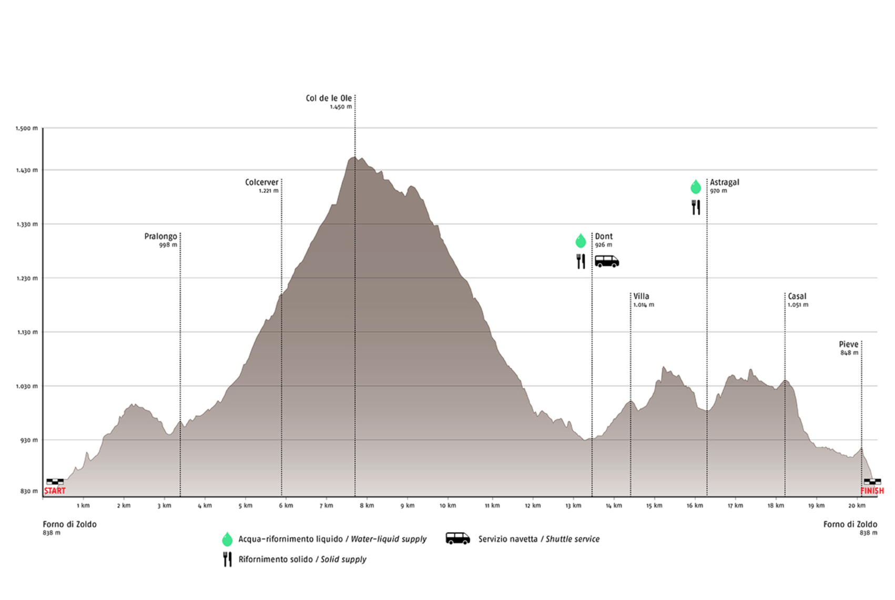
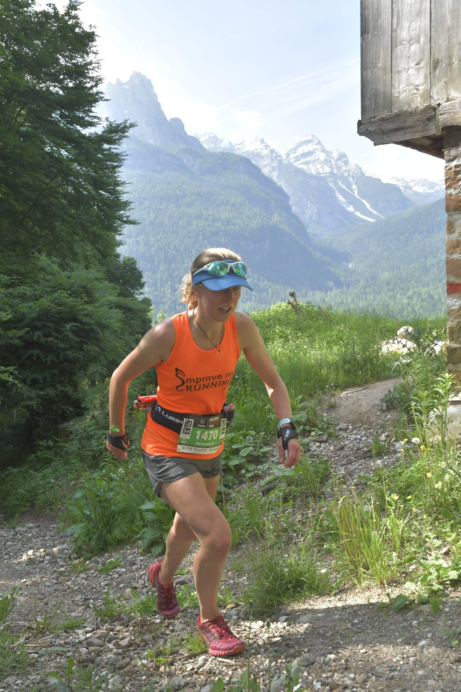
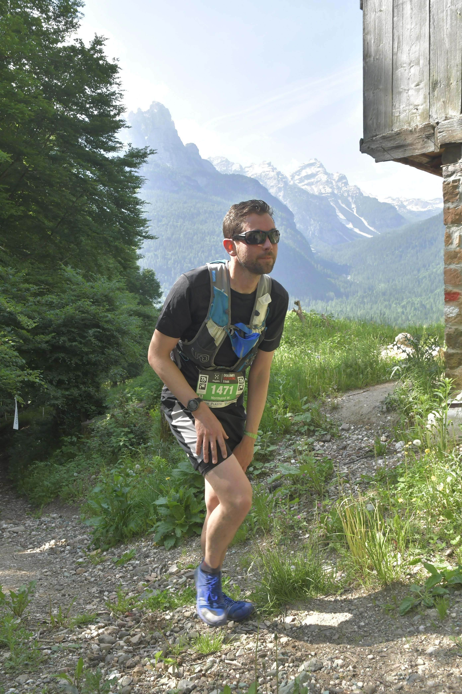
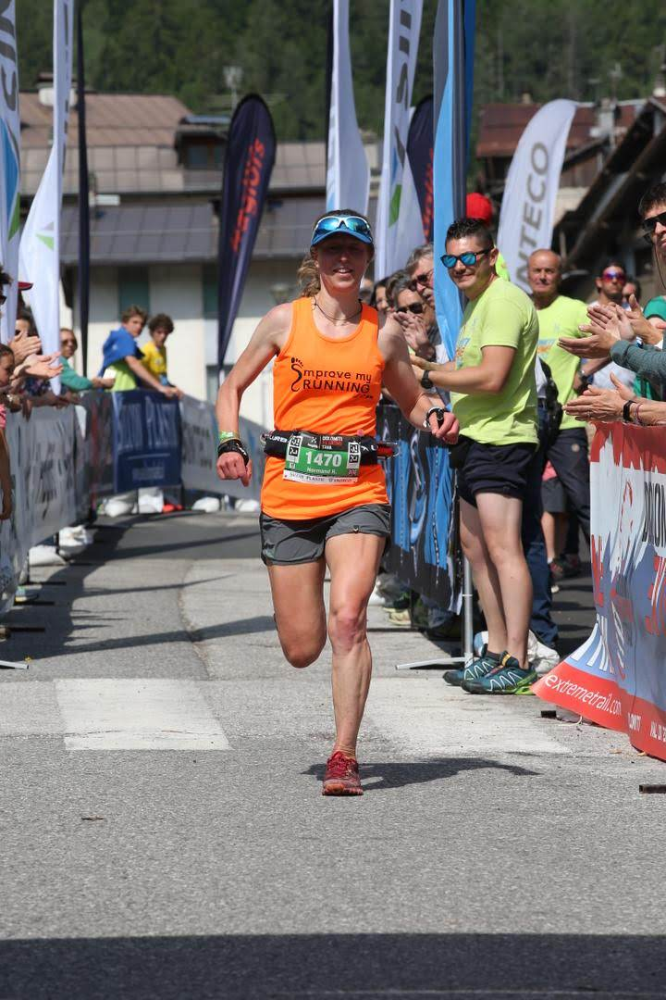
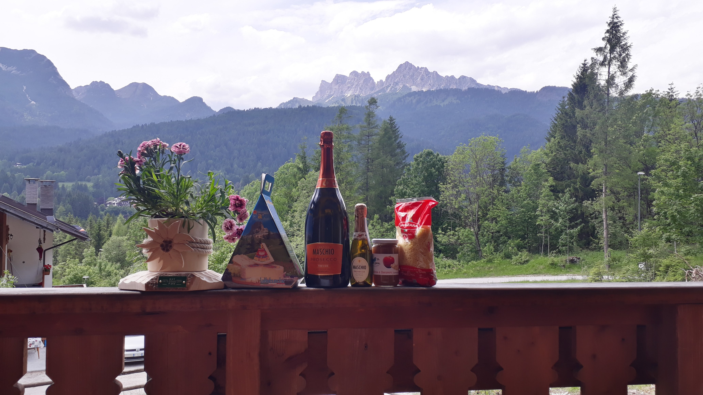

Will and I signed up for the 23km race at the [Dolomiti Extreme Trail](http://www.dolomitiextremetrail.com/race-23k.html) to finish off a week of training (er, I mean a holiday) in the Dolomites. Having both eventually got our race medical certificates signed, we proudly presented them at registration where they were barely glanced at by the officials. We were a little put out, but soon got over it when we looked in the goody bag and saw that we'd each got 1kg of spaghetti.

    

The race started in the main street of Forno di Zoldo. As we lined up on the start line we realised we'd both forgotten to put suncream on. It was still early but the sun was already out and the forecast was for temperatures in the 30s. We decided we'd have to run fast and finish before the midday rays could burn us. Other than that, we were ready. I had poles and a visor in a bid to fit in with the Europeans and I was pretty sure it was working. There was loud dramatic music playing and we counted down in Italian to start the race, amidst cheers from the crowd. Immediately after the starting tape there was a 90 degree right hand turn. This seemed like bad planning but luckily there wasn't too much jostling for position and Will and I settled in next to each other on the run out of town. We turned onto a trail for the first small climb and ran up it easily together. One guy in front immediately started to hike with his poles as he hit the incline. He was passed very quickly.

<!-- end -->

I pulled ahead of Will as we ran through the next village. I wanted to finish ahead of him but I knew it would be difficult. 23km and 1300m ascent is the sort of race where he thrives, but I was feeling super fit and wanted to push on the hills to see how I could do. After the first few small bumps we reached the big climb up to Col de le Ole at 1450m. I got my poles out at the bottom here - they weren't really necessary but I wanted the practice! It was a wide gravel track with switchbacks, so I alternated between hiking the steep sections with the poles and running the flatter bits with the occasional stab at the floor with the poles and pretending I was a train (translation: looking like a massive idiot).

There was an unexpected aid station two thirds of the way up the climb (officially there was only meant to be one, but it seemed every village wanted to join in). After this the climb got very steep and rocky. I was spurred on by a 64 year old German man who told me I was a "very good runner" as he overtook me (although I didn't fully trust this compliment as he'd only seen me hiking up the hill). Whenever I looked back on a switchback I could see Will not too far behind me, alongside a lady in a yellow tshirt. I didn't want either of them to catch me!

Finally we reached the top and ran along a narrow ridge before dropping down into a forest. The descent was great: not too steep or technical which meant you could run really fast. I caught lots of people here, including my German friend. When we finally reached the bottom and the (official) aid station I was told I was the 'prima femmina' female. My Italian isn't great but I had an inkling this meant first. I didn't want to get too excited and just smiled and nodded. Will was still hot on my heels but he seemed to have shaken yellow tshirt.

From here it was up and down weaving through small villages on a mix of tarmac and trail between them. The villages were full of cheering locals who'd set up food and water stations, and in one place, a cold shower! The next time I looked behind there was no one in sight and I realised I had pulled ahead of Will. People were still shouting "prima femmina" at me so I kept pushing. There was a fast downhill finish and I had a good sprint in to the line.

Will finished 3 minutes later and we were 19th and 21st respectively. For being the prima femmina I won 2l prosecco, 900g cheese, 500g pasta (to add to the 2kg we'd got at registration), beer, a tshirt, a plant, a backpack, and at the award ceremony they played the national anthem for me on stage. It felt very over the top but I tried my best to look patriotic (and not catch Will's eye).

The whole race was on a clear marked trail and well groomed mountain paths (although I did almost take a wrong turn winding through one of the villages). It had the friendly vibe of a low key hill race, but from the award ceremony and crowds felt much bigger. I'd definitely recommend it if you're looking for a European race. 50 and 103km options also available.