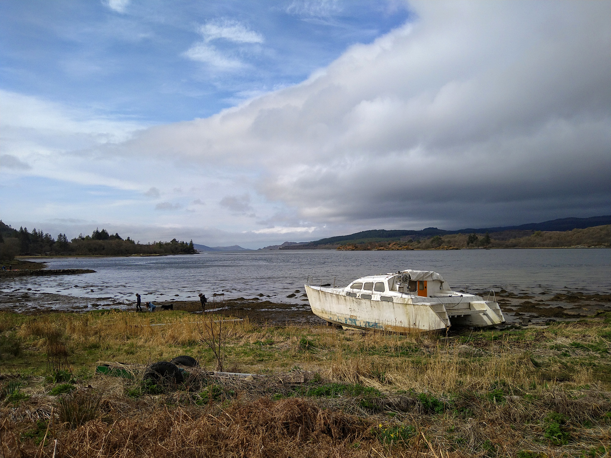

After two years of being stuck at home over Easter I was excited to be able to have a four-day adventure again this year!
At 30 weeks pregnant I was still running regularly but very slowly and only short distances, so going by foot wouldn't get me very far.
I decided to cycle the Five Ferries route.
People usually aim to cycle this in a single day.
This sounds fun but quite stressful as you have to time it well for each ferry!
I used Fiona Outdoors' excellent [blog post](https://www.fionaoutdoors.co.uk/2016/10/great-bike-rides-the-five-ferries-route.html) to plan my route.
My plan was to ride it over four days, which would give me plenty of time to explore, take the occasional detour, and not have to rush for ferries!
The distances I planned were very unambitious: only around 20 miles a day.
This was deliberate; I know I am prone to overdo it, which means I'm then very tired on subsequent days.
I knew I would be able to ride 20 miles over a whole day even if I was super tired.

<!-- end -->

## Day 1: Ardrossan to Lochranza
_24.39 miles_

Ardrossan ferry terminal is a very unglamorous place to start an adventure.
In reality this one started in a Sainsburys carpark but that's even less glamorous.
The ferry was very crowded and most people ignored the facemask signs (still required indoors in Scotland for another three days).
I hid in a corner and read my book.
Heading off the ferry, I joined the procession of cyclists but peeled off just outside Brodick, stopping for tea and biscuits with Anne (my brother-in-law's mum).
Adam (said brother-in-law) had convinced me to take a more adventurous route across Arran rather than straight up the east coast to Lochranza.
So from Brodick I took the String Road across the middle of the island.
It was a big climb for the first two miles but I span slowly in my smallest gear and eventually arrived at the top.
Anne had said the view from the top was spectacular, but unfortunately by this point I was in the cloud and there was nothing to see.
It got quite wet.
As I was warm I didn't think to put on a jacket, assuming I'd drop out of the cloud and it would be dry.
Alas this was a bad call.
By the time I reached the west coast I was soaked through, quite cold, and it was still wet!

But I was happy to by the coast.
The wind was behind me and the rain felt refreshing.
The road by the sea was lovely: the water blue-green and I'd occasionally stop to watch seals playing by the shore.
It was mainly flat but with a few short steep climbs and I seemed to always arrive at the bottom of these with a car behind me!
Finally stopping to put on a waterproof jacket I discovered one of the two screws that attached my rack to my bike had disappeared.
Of course at this point I realised I hadn't bought any spare screws or anything useful to fix it.
Luckily there was a general store in Pirnmill and I went in to look for some cable ties.
They didn't have any to sell but the lady disappeared into the back and found me some.
Rack now more securely attached I pedalled on towards Lochranza.
It was much too early to check in to my hostel so when the rain finally stopped (or cloud lifted, I'm still not sure), I stopped for lunch on some rocks.

I wandered round the gift shop at the distillery in Lochranza to kill some time.
Miraculously when I came out the sun was shining so I sat on a bench to read my book for a few hours until it was time to check in to the hostel.
I finally felt human again after a hot shower and time to dry my shoes on a radiator.
I had a quick wander round Lochranza to look at the castle, then ate an early dinner and went to bed.

## Day 2: Lochranza to Tighnabruaich
_20.54 miles_

I left the hostel at 8:15 after a quick breakfast but was then so early for the ferry I cycled a quick lap of Lochranza first.
As the ferry to Brodick the previous day had been so busy I worried this one would be too.
This was not the case: it was just me, a few cars, and three other cyclists.

The single track road from Claonaig to Kennacraig was excellent cycling.
There was an initial climb and then a long descent, and very few cars.
From Kennacraig I followed the quiet A83 into Tarbert, arriving just after 11am.
I picked up lunch at a deli and sat in the sun by the pretty harbour.

The ferry from Tarbert to Portavadie was smaller and quieter again.
In Portavadie I ate lunch in the sun before I got too cold in the wind.
Then I sheltered in the warm marina cafe until my swim booking at 2pm.
The [pool](https://www.portavadie.com/spa-and-leisure/) was excellent, but too busy with lots of shouting children (probably my fault for visiting on Easter Saturday!)
I swam some lengths at the far end of the indoor pool and sat outside in one of the warm pools for a while.
Being in warm water with a cold breeze on my face felt very luxurious.

After my swim I had a hilly 4 mile cycle to Tighnabruaich, playing cat and mouse with a guy on a bike the whole way.
I find it very hard to switch off my competitive side even in now in my third trimester!
I checked in to the Kames hotel, bought an ice cream and walked along the coast for an hour, then had a short nap before dinner.

## Day 3: Tighnabruaich to Rothesay
_44.71 miles_

The morning was very grey.
I went outside to check the weather and it was drizzling gently but not too cold.
I overheard a couple of motobikers at breakfast deciding the day was a write-off due to the weather and that they would head home.
I didn't have this luxury!
I felt well prepared for cycling in the rain, less so for hanging around in the rain when I arrived somewhere too early.
The forecast said heavy rain at midday.
I set of with my waterproof jacket on and the aim of reaching a cafe for lunch before the rain arrived.

It was a big climb out of Tighnabruaich on a lovely winding road lined with pine trees.
The rain stopped as I climbed and the views were excellent.
The descent was seat of your pants fast but the road was smooth.
I feathered my brakes whilst whooping with joy.

I took the lower coastal road to Colintraive, which was bumpy and didn't have a good view of the water.
I reached Colintraive as a ferry was arriving and pedalled hard to reach it.
Then I waited 20 minutes until it was ready to leave!

On the five minute crossing to Bute the sun peeked out from behind the clouds.
I checked the forecast again and saw that the rain was now not due until 5pm. Brilliant!
I set off along the east coast, then followed a sign across the island to Ettrick Bay.
I sat outside the tearoom there for lunch, then wound inland and out again, always choosing the longer way to Rothesay.

There were lots of spiky climbs and it got very warm in the sun.
The views to the west across Arran were lovely and I had a lovely time, eventually cycling double the distance I'd planned for the day!
I rewarded myself with an ice cream in Rothesay before heading to my B&B to catch the end of Paris-Roubaix.

## Day 4: Rothesay to Ardrossan
_21.13 miles_

I hopped on an early ferry to Wemyss Bay on the mainland.
From here it was the bit of the trip I'd been dreading: 20 miles along the busy A78.
The first bit of the road was fairly quiet but it got busy after Largs.
It looked like there may have been a quieter cycle route from Largs to West Kilbride but the signs were infrequent and confusing.
After half a mile of stop-start and consulting google maps I returned to the A78, put my head down and rode on to Ardrossan.

I could tell that I'd gone a bit too far the previous day.
My legs were fine but my heart rate was higher than usual and I felt generally tired.
Luckily it was the final push and I could rest for rest of the day.
I finished feeling satisfied and happy that I could still manage to have an adventure while 30 weeks pregnant!