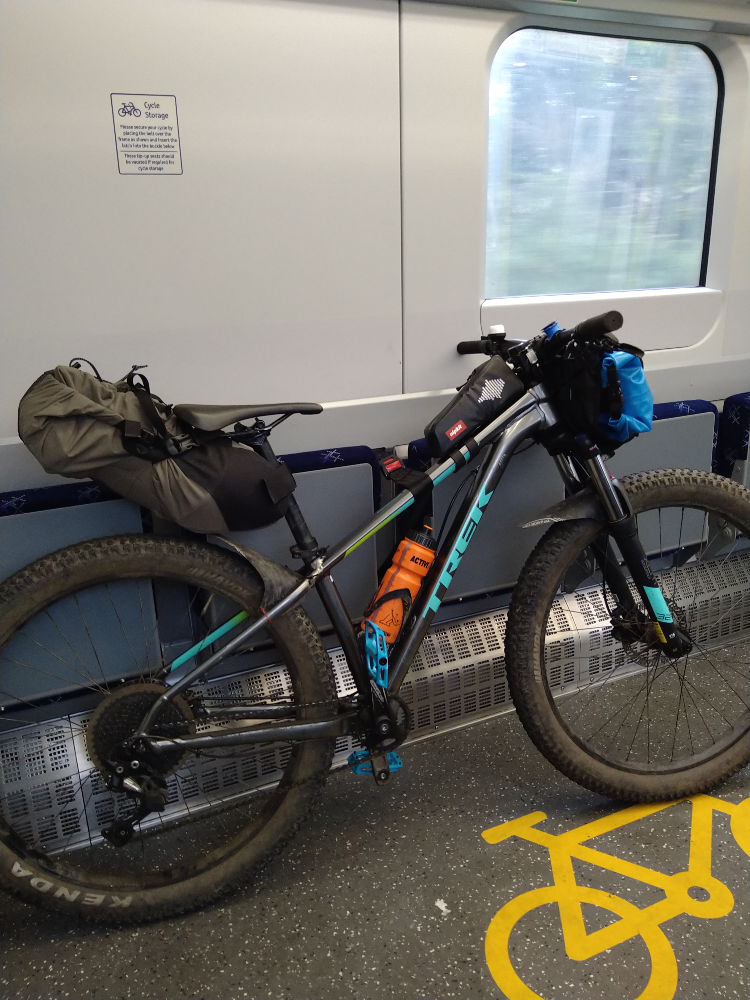
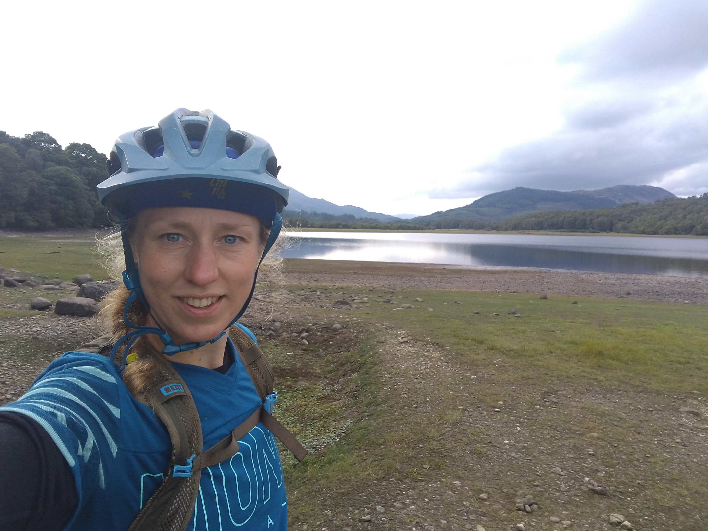
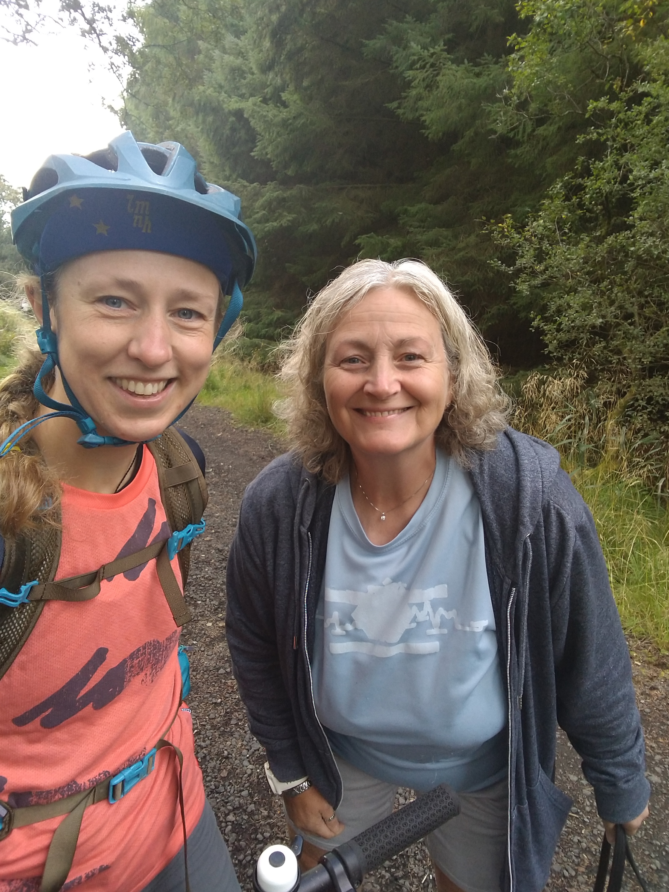
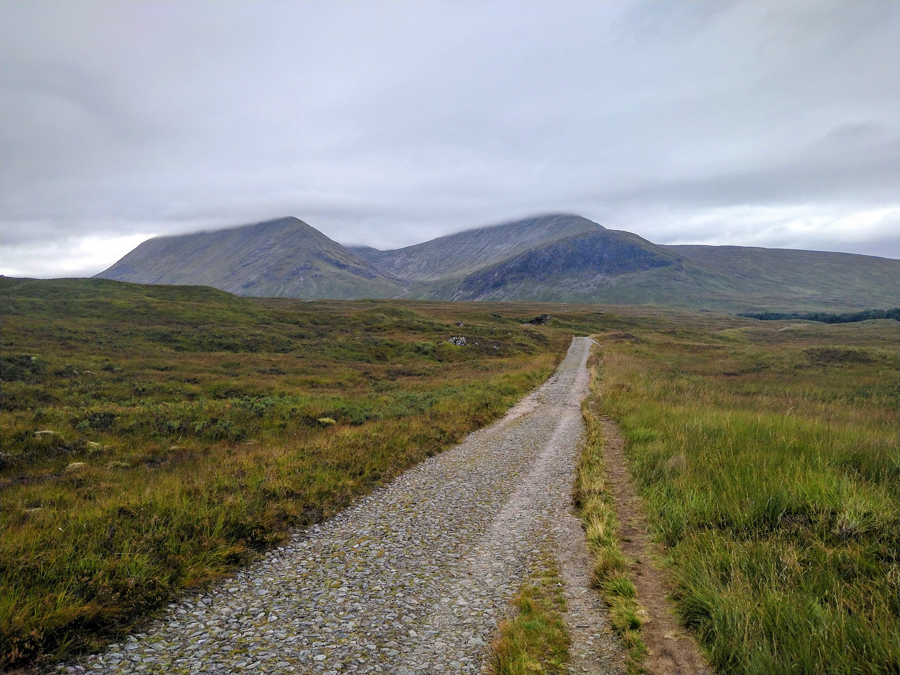
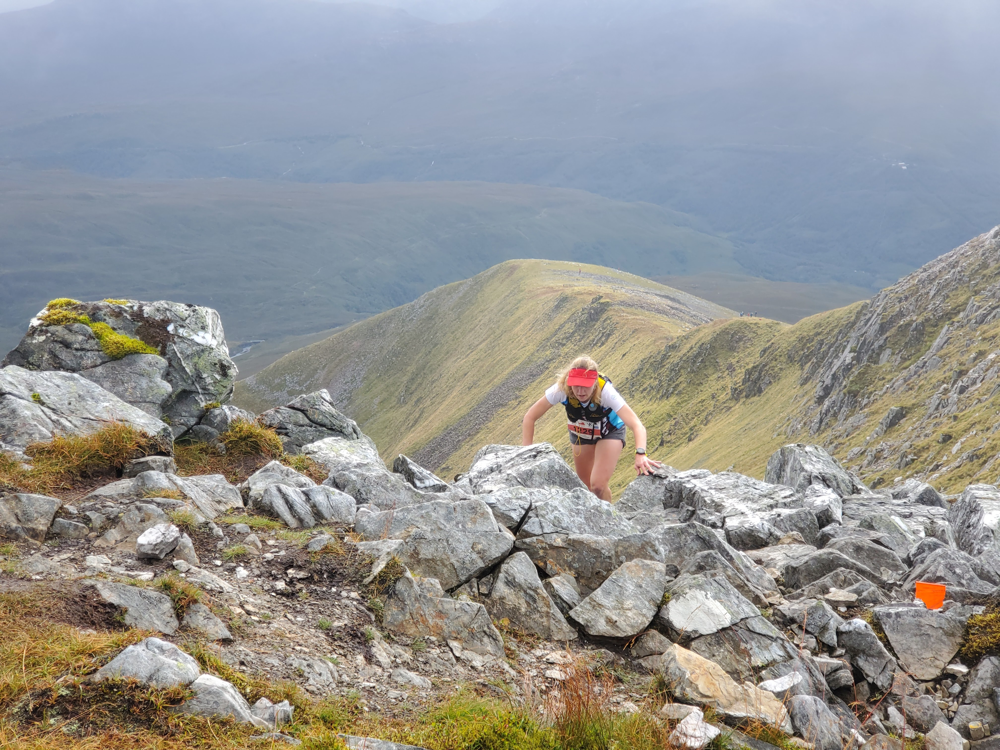

In early September I had some free time and was keen to have an adventure.
I had an ultramarathon to run the following week so a long run didn't seem like a sensible idea.
I needed to be in Kinlochleven by the weekend.
The obvious choice was to arrive by bike!
<!-- end -->

This was my first solo bike adventure, and I was nervous about it.
I planned a trip with two overnight stops.
I made the route as simple as possible.
On Wednesday morning I took a train to Glasgow, my bike fully loaded.

From Queen Street station I rode to Kelvingrove Park and followed the Kelvin Walkway out of the city.
I met my friend Jacqui and her son in Milngavie for coffee in the sunshine.
Then I set off again on the familiar trails of the West Highland Way.

I haven't run the start of the West Highland Way for a few years now and it was much more fun than I remembered!
I was pleased to arrive in Drymen, and stopped to buy a drink and some tablet to keep my energy up.
I followed the Old Gartmore Road uphill on National Cycle Route 7 and the Rob Roy Way.
I was slow up the hills but was making steady progress!
I turned off the road onto a track which wandered through the Trossachs to Aberofoyle.

In Aberfoyle I sat by the river and ate my packed lunch.
I didn't stop for long as I was worried about it getting dark and getting lost!
There was a huge hill out of Aberfoyle up into a forest.
I cruised along lovely wide trails with great views of Loch Drunkie and Loch Venachar.

Finally I reached the main road at Kilmahog.
Then it was only a short ride up the west side of Loch Lubnaig, and through Strathyre.
I was staying at [The Golden Larches](http://www.thegoldenlarches.com/) in Balquidder Station.
I've driven past on the A84 lots of times but never stopped before.
Alistair the B&B owner was super helpful and friendly.
He locked my bike away safely and brought me dinner of Mac & Cheese, chips and garlic bread (a Scottish classic!)

Day 1's route had been following the route for leg 1 of [An Turas Mor](https://www.anturasmor.co.uk/).
It was easy to follow and there were some useful stickers on gates to mark the way!
On day 2 I headed back to the familiar trails of the West Highland Way.
I'd planned to follow the A85 to Crianlarich but was worried about the busy road.
Luckily Alistair suggested a better route.
I stayed on cycle route 7 / Rob Roy Way to Killin, then took a B road that ran parallel to the A85 to the north.
I was happy to run into Ruth as I neared Killin and stopped to chat.
She was on her way up to Kinlochleven for the weekend too!

Before rejoining the main road I cycled along a farm track and through a field of Highland Coos who were not best pleased at having to move for me!
I rang my bell and plotted escape routes in case they chose to attack.
As I joined the A85 I soon realised fast cars were far more of a danger than the cows!
Tucking in to the left as much as I could, I put my head down and rode to Crianlarich as quickly as possible.

Safely back on the West Highland Way, the Crianlarich rollercoaster was great fun.
The climbs and descents were much steeped than I remembered!
I stopped for lunch at the Real Food Cafe, feeling happy and comfortable.
I knew where I was, where I had to get to, and that it was possible to get there before dark!
From Bridge of Orchy I cheated on the West Highland Way trail and stayed on the smooth, fast road to the Inverarnan hotel.
It saved me a lot of time (and pushing!) and I felt very pleased with myself.
However my smugness soon wore off as I reached the cobbles of the old military road.
Every pedal revolution was a series of slow bumps.
My front pack bobbed up and down and my saddle pack kept dropping to rub on my back wheel.
With many stops to readjust my kit, I bumped my way slowly up to Glencoe.
That night I stayed in the bunkhouse at [Kingshouse](https://www.kingshousehotel.co.uk/bunkhouse/) and had a whole room to myself due to their covid measures.
I had an excellent dinner in the restaurant there.
The food was delicious and the atmosphere cosy and full of tired hikers.
It felt like a proper mountain lodge.

Unfortunately the weather forecast for Friday was bad and due to get worse.
By the time I reached the bottom of the Devil's Staircase I was already wearing full waterproofs.
As expected I had to push almost all the way up.
It was hard work with a bike laden with kit.
Not too many people overtook me but at one point the guy behind had to help me lift my bike up a particularly steep rocky step!

The downhill was 70% fun and 30% terrifying.
Some sections were definitely too steep and too technical for my skills!
The wet rock was very slippy but I managed to stay upright.
I enjoyed flying past lots of walkers on the way down.
I finished at a pub in Kinlochleven and warmed up with some hot food.

Luckily La Sportiva crew from Lyon had just arrived in Kinlochleven and gave me and my bike a lift from here.
We had a house in Ballachulish for the weekend for the [Salomon Skyline Scotland](https://www.skylinescotland.com/) event. 
On Saturday Will, Simon and I raced the Mamores VK.
It was very steep and hard.
I kept motivated by reminding myself how much harder it would be if I was pushing a bike!
I was pleased to finish as 3rd woman (this event is definitely not one of my strengths!)
Will had a super strong run to finish in under an hour and 7th position overall.

Hard work done, we relaxed for the rest of the weekend cheering on runners in the other events. 