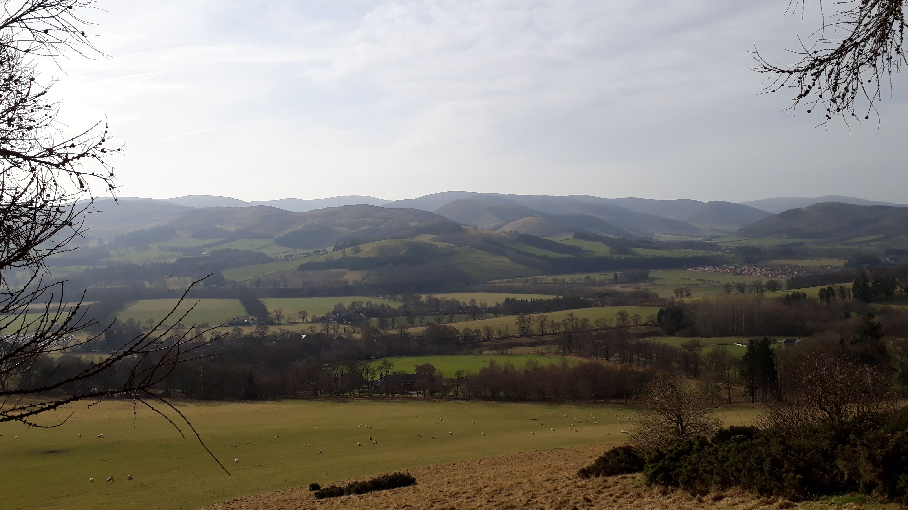

After a spectacular blow up at the Glentress marathon last year I knew I had to return. My training plan was aimed at Glentress as a test to see where I was at and if the plan was working. I had a few goals: to feel strong throughout the second lap, to beat my time from last year, and a half-target of 3:45. The last goal felt a bit ambitious as it was 14 minutes quicker than last year, but it felt like a nice round number to aim for.

Training had gone well. I’d finished the hardest week feeling close-but-not-quite-at breaking point and then had a 2 week gradual taper. By the end of race week I was feeling refreshed, strong and focused. I talked Will into running the half marathon the day before and signed up to help out so we could spend the whole weekend down in the Borders. The weather was glorious and marshalling was a lot of fun. The folks at [High Terrain Events](https://www.highterrainevents.co.uk/) certainly know how to put on an excellent event. I loved being involved and finished early enough to rest in the afternoon and even have a power nap before dinner.
<!-- end -->

On race morning the trails were super dry so there was no confusion over shoes. My trusty La Sportiva Helios were perfect. There were lots of familiar faces around at the start and it was great to catch up with different running friends. The air was cool as we stood around but the forecast was for the sun to break through in the late morning, so I was hoping for a view at the top! As the race set off Nicola disappeared into the distance with the front pack almost immediately. I relaxed and put her out of my mind, knowing I had to run my own race. The first miles felt easy and I tried not to think about being back here at the start of the next lap. I felt comfortable on the first loop around Eagles Nest, then hit the trails climbing up to the switchbacks of the black mountain bike run. I’d forgotten how much fun the trail was: winding single track with rocks and roots, weaving in and out of the forest and across the access road.

Reaching the top of the first climb, I was still running and I still felt good. The first downhill section after that was great fun: banked switchback trails you have to lean into, trying not to decelerate too much as you double back on yourself. The downhill finished at the bottom of the hill up to the mast and I ran slowly up the stony track, then onto open hillside and a dry single track traverse to a forest. Here there was a near vertical wall but luckily I had been expecting this after hearing the half marathoners complain about it the previous day. I used it as an opportunity to eat a Clif Shot Blok whilst power hiking up. The trail weaved up and down a bit more before finally starting the long descent. There were a few guys just in front of me and I caught them up and flew past, relaxing into the downhill and loving it. Down, down, down, we danced, dodging tree stumps and rocks, savouring the dry ground. I wasn’t at all worried about slipping as the trail was so dry. Before I knew it I was back at the Eagles Nest car park. Distracted by some encouragement from a friendly marshal and Will, I took a wrong turn to head down the fireroad instead of the trail. Oops. I backtracked, laughing at myself as I rejoined the course and picked up speed again for the final wiggling section of the descent. I saw Nicola and Matthew Curry starting their second lap as I approached the turnaround. They were only a few minutes ahead and both looking strong. I ran up the hill to finish the lap, greeted Ian, the race organiser with a big smile, and took off again for round 2.

")

I should have known better. It was never going to be that easy! This is a hard race and I needed to respect that. The first gradual climb up to the Eagles Nest car park was a slog and I walked a little bit, telling myself it was ok to do this for a short while. I fought on as the trail flattened out and I enjoyed the small loop again. I stayed calm and focused on breathing and making it through each climb without expending too much energy. I ran about half of the switchbacks, then alternated between a march and an attempted run (which probably looked more like a hunchbacked shuffle by now). When I reached the top of the first big climb, Emily told me I was now about 7 minutes behind Nicola. Well, I know I’m good at descending, but I’m not that good! I tried not to worry about it. My race plan was about me and no one else. I could still run fast downhill and tried to use this time to let my glutes recover for the next uphill, but as I made my way up to the mast my run turned into a trudge and I cursed. “I’m still rubbish uphill. Why do I think I can do this? If I’m struggling now, how will I cope in the bigger, harder, hillier, races I have next?” I was so filled with self doubt that I let this get in the way of my race and I struggled to start running again on the last climbs and the traverse across to the high point. A few guys passed me here and I felt even worse.

From the high point I knew I would be ok. On the downhill I was able to put my doubt aside and focus on the moment and the race I was running. I didn’t look at my watch; time was irrelevant now. All I had to do was get down the hill as quickly as possible. Luckily I love running downhill fast. And luckily it still felt good! I flew down the trail, arms freewheeling, feet tap dancing over rocks and roots. I could do this. There were a few small uphills remaining but I cruised up them, feeling strong again. Cheers from supporters on the course had changed from “You can catch her, she’s not far ahead”, to “Well done, great running”. I acknowledged this but didn’t let it distract me and kept my focus on my race: keeping light and my footwork fast. All too soon I was at the bottom and approaching the final hill up to the wigwams. I held my head high and used my arms to power up the hill, feeling tired but strong. I finished in 3:48.

")

After the race it took me a little while to process it and not beat myself up. Objectively I am pleased with my performance. It’s a big improvement (11 minutes) from last year. I was much stronger on the hills and I felt much better at the end. I still have a lot of room for improvement on the uphills in particular, but I have time to do that before my next race. Of course it’s hard to be objective when you’re racing a good friend and rival and I’m disappointed I wasn’t closer to Nicola in the end. However she had an amazing race and smashed the course record, finishing in 3:41. I’m super chuffed for her - good redemption for a hard race last year and definitely a great start to racing in 2019!

As for me, I’ve done some soul searching over the last few weeks and am at peace with my race. It was a good representation of where I’m at right now. I’ve come a long way in the last year but still have a long way to go. The training of the last few months is definitely paying off and this race proved that, but I’m still mentally holding myself back and not pushing as hard as I can. So, my goal for the next training block is to commit. Commit to pushing hard in each session, to being present, and to giving it my best shot.

Here’s to the next one.

