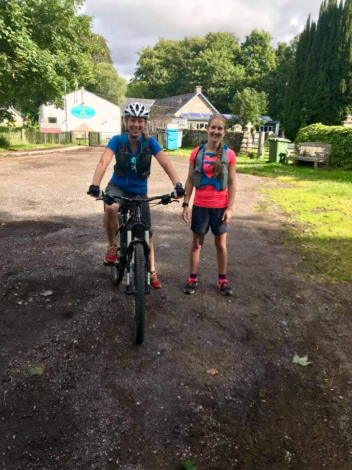
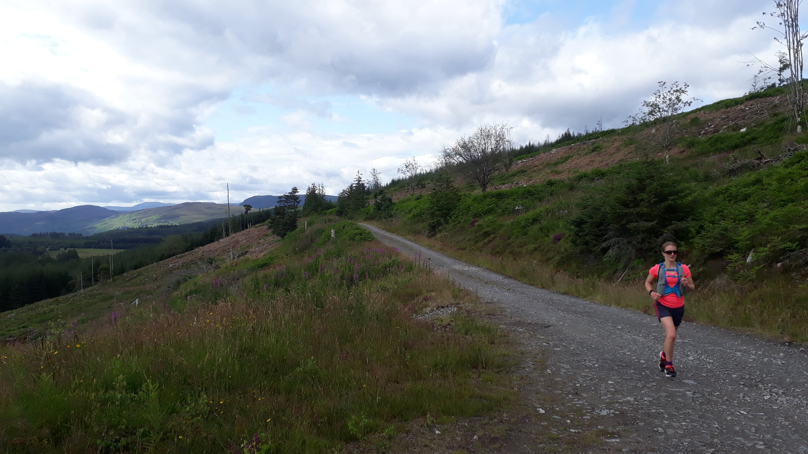
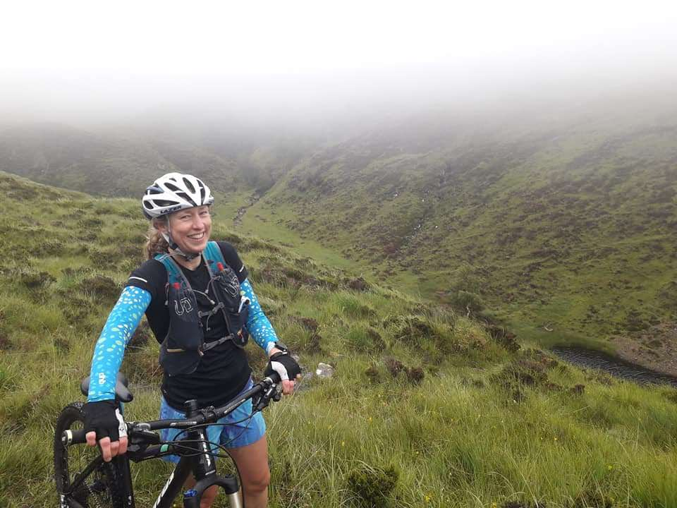
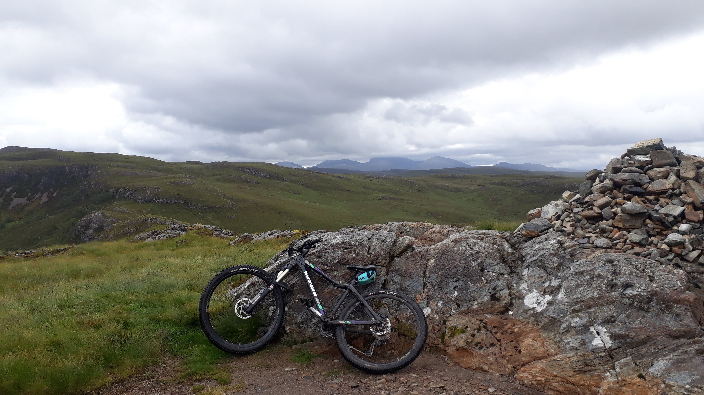
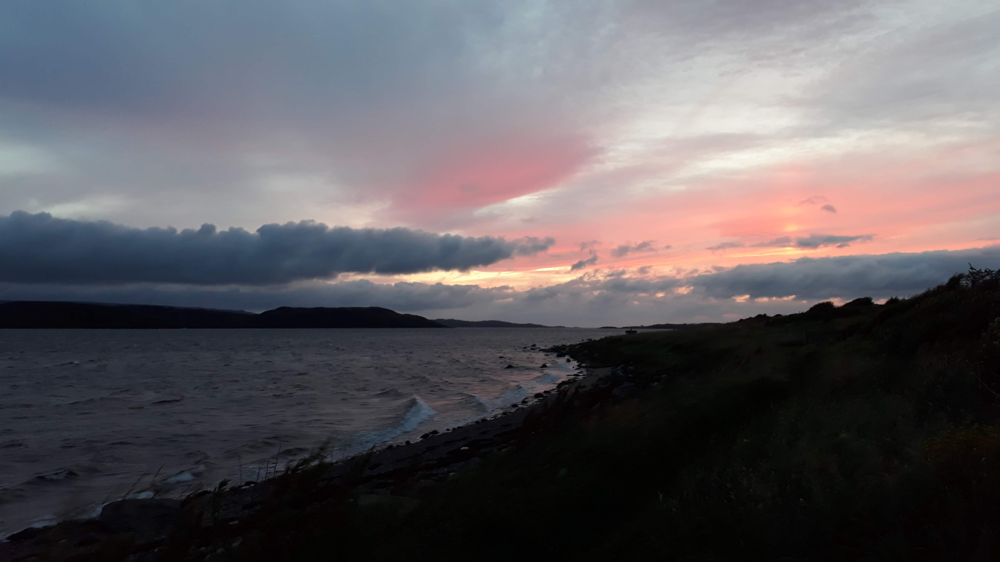

The Highland 200 was a dream of Elaine's, inspired by the [Highland 550](http://www.highlandtrail.net/) mountain bike route. The shortened running version was 200km over 4 days, taking in some of the most interesting parts of the Highlands. The original plan was for three of us to run and two others to support with driving, but of course it didn't work out quite like that. Sickness, childcare issues and injuries intervened and we tweaked the plan so that it just about hung together. Elaine would run, I would mountain bike, Janet would be car support and Tim and Jackie would join for the weekend to accompany Janet on adventures up Munros.

<!-- end -->

Mountain biking was not my first choice. However I picked up a knee niggle after Lavaredo and haven't run much since, so it seemed the safest option. In a previous life I did a fair bit of mountain biking and I'm not bad at it. I spent a summer leading kids on mountain bike trails in the Redwoods of California, but that was a long time ago (and on very cruisey trails). I'd borrowed a mountain bike to use for the summer to give my legs a rest after the Dolomites, but I wasn't very confident with it. On my first outing to the Pentlands the back tyre exploded which wasn't a great sign. I also wasn't confident about how my knee would hold up to 4 days of heavy activity. The physio had encouraged keeping active but there's a chance she didn't fully appreciate what my weekend plans entailed. Still, I was willing to give the adventure my best shot!

## Day 1 - Garve to Oykel Bridge

We set off from Garve in glorious sunshine. After an initial deviation from the route which ended in carrying the bike through bushes and over a fence, we quickly learnt that we should trust the GPS. The route for the first day was all on Landrover tracks. It was very easy to roll along on a mountain bike but not such a fun run for Elaine as the surface was hard and lacking in variety. I stopped frequently for her to catch up. This doubtless encouraged Elaine to run faster than she should have on day 1 of a multi day long run! But the weather was fabulous and the views stunning so we were not in a rush. We saw some herds of deer and stopped to listen to  them calling to each other. It felt like we were miles from civilisation and we saw no one. The navigation was easy and we arrived at the finish line in good time. To make it easier for Janet we continued on to Oykel Bridge and finished at a pub there. For this last section Elaine rode the bike and I ran (as it wasn't strictly on the route). It was easy undulating trail and my knee felt fine. I ran fast to avoid the bike getting too far ahead and understood why Elaine felt like she had been running slowly all day! We waited a while for Janet who arrived flustered and unimpressed with the google directions which had led her down a private road with a locked gate, meaning a long drive round to meet us! We stayed even further north in Lairg and were joined later by Tim and Jackie and shared a bottle of wine. It was an excellent first day of adventure.

_Distance covered for the day: [61.9 km bike](https://www.strava.com/activities/2545628479), [3.85 km run](https://www.strava.com/activities/2545628629)._

## Day 2 - Oykel Bridge to Inverbroom Lodge
Day 2 started on a decent Landrover track with some steep sections. My uphill mountain bike strategy was "point and pedal" and I was pleased to find that my legs were still strong from my month in the mountains, and in the lowest gear I could ride up slopes far steeper than I expected. We had an ambitious plan to take a fifteen km detour up a Munro (I planned to leave the bike at the bottom) but we arrived at the turnoff for it in thick mist and decided it was a silly idea! This turned out to be a very good call as the day got rapidly more difficult and energy sapping. We rolled down to a small lochearn with a lonely boat hugging its shore, then headed off path and into bog. I carried the bike down a steep tussocky slope to a river, across it and back up the other side. We laughed about it, not realising that this was to become the new pattern for the afternoon. But first some technical single track with a steep drop off on the left. It looked great fun to run but I was a little nervous on the bike. Luckily my good right leg was my uphill leg so I could use it to push off sections and I managed to stay on the bike (and on the trail)!

The day got wetter as we headed even further off path to follow the Cape Wrath trail. It seemed to be mainly unmarked but the GPS told us we were on track. We came across a hiker going in the opposite direction. He told us that we had a lot more off-path and boggy sections to come. He was right. The next three hours were a long slog through bog, across tussocky ground and up steep grassy banks. I pushed the bike when I could and carried it on my shoulder when I couldn't. A few times we climbed up things that were so steep the weight of the bike toppled me over. It was intermittently raining but quite warm. Elaine told me afterwards that the views were good, but I struggled to focus on anything other than keeping the bike on my shoulder and keeping moving. My sore knee did not enjoy the off camber weighted hike. Yet somehow we stayed in good spirits and kept smiling. This was all part of the adventure, and that's what we'd signed up for! Finally we reached Inverlael Forest and gravel tracks. I jumped back on the bike and freewheeled down, savouring the easy descents. We made up some extra distance in the forest here and finished feeling strong and happy as the sun came back out.

Elaine looked like she was running effortlessly all day!

Reunited with the others in the end of day sunshine

_Distance covered for the day: [38.82 km bike](https://www.strava.com/activities/2548140173)._

## Day 3 - Inverbroom Lodge - near Poolewe

Getting out of bed on the morning of day 3 was very difficult. My arms and back were very stiff from all the bike carrying! I wasn't sure how much more of that I'd be able to do. However we'd looked at the next part of route and thought that after the first section it should all be rideable. I made a last minute decision to run the first section with Elaine rather than wait around for her with the bike. We spent the first ten minutes trying to reunite a lamb with its mother. It had ended up in a neighbouring field and we came across them bleating at each other in distress and eventually managed to coax the lamb through a gate to rejoin the other sheep. Running together was much more fun and much more social than biking as our pace was more evenly matched. However I had to check my ego on the descent and let Elaine fly ahead. I picked my way down more cautiously in order to protect my left knee. After ten km we reached a road crossing where Janet had left the bike. I picked that up and we started on a big climb up a wide track. It got very steep with lots of loose gravel so I ended up pushing the bike for most of it. As the track got steeper and rockier still we were amazed to see three Landrovers pass us! We hadn't seen anyone else all day and it seemed very wrong to see these machines cutting through the landscape here!

After the big climb we had a fun gravelly descent and found the Landrovers at the end of the road. There were people standing around them looking like they were preparing to go deer stalking. We left them behind and turned onto onto a wet and muddy singletrack. It was bikeable but slow and Elaine had to keep looping back for me. We followed along a river until our route suddenly crossed it. It was both deeper and wider than we expected and the water came up over our knees. I waded across with the bike on my shoulder and was glad that the water wasn't flowing very fast! Our final climb of the day was steep, rocky and technical so I had to carry the bike up most of it. It was very hard work. The descent was similarly steep, rocky and technical but luckily not too narrow. My downhill mantra became "It's gonna be ok" and I repeated this to myself as I rolled down big boulders and somehow stayed on the bike, just about balancing on the right side of control. It was definitely the most technical trail I've ever ridden and I reached the bottom in disbelief that I'd made it down.

Somehow I stayed on the bike down this trail!

As we crossed the causeway between Dubh Loch and Fionn Loch I realised I had a puncture in the back tyre (not that surprising after the big descent!) We changed the inner tube and put the wheel back on but now something was very wrong with the bike. It would no longer freewheel. The pedals turned with the wheel but not in a useful way that would move the bike if I tried to ride it. We'd been out for around seven hours by this time and wondered if we'd somehow put the wheel on wrong because we were tired, but tried it a few times and it was still broken. I started to push and Elaine valiantly settled in to walk with me. After a few miles we realised this was a very slow way to travel and Janet was going to be worried about us. Also we were going to miss our dinner booking, which was a real concern as we were running out of food and getting hungry! Elaine ran on ahead to try and get phone signal to organise things. I kept pushing the bike and "riding" downhill - sitting on the saddle with my legs out to keep out of the way of the pedals, with the back brake on enough to stop the chain coming off. It wasn't the most comfortable but it meant I covered the downhill a lot quicker than on foot! I made it through the forest and was on the Landrover track heading towards Poolewe when Elaine and Janet rescued me in the car. Luckily we'd been able to reschedule dinner and after warm shower and a pizza, all was well again!

 _Distance covered for the day: [9.87 km run](https://www.strava.com/activities/2550050520), [37.78 km bike](https://www.strava.com/activities/2551849874) (although the last 11ish km were a push!)._

Views from our accommodation in Aultbea

## Day 4 - near Poolewe - near Torridon

After a long chat with Adam the bike expert / owner I understood what the problem was with the back wheel and how to fix it. It took a lot of patience but I eventually managed to do so and we began the final morning without too much delay. It was wet from the start and the forecast was for it to get wetter. It wasn't the ideal end to our adventure but perhaps the most fitting for the north of Scotland (in July)! We set off amidst a cloud of midges onto some challenging technical paths.

There was so much water on the trail that it felt like riding through a river. I got a second back puncture  but this time changed the tube and got the wheel back on without any drama (except being eaten alive by midges). This first trail section took us longer than we'd anticipated but we finally reached the A832. Elaine crossed the road and set off onto another trail. Her route involved a big off-path section between trails that would be silly to attempt on a bike. I set off to go the long way round on the road to intercept her at the next road crossing on the A896. My "easy" ride here was 18 miles up and down hills in lashing rain and wind. I enjoyed being able to ride fast on the smooth surface but cars sped past me too close and too fast and I worried for my safety. I stopped at the gas station in Kinlochewe for a much-needed espresso before the final 6 miles into a headwind on the road to Torridon.

I left the bike partway down the road and set off to meet Elaine. I started out in good spirits, looking forward to company and sharing tales of our separate adventures. As I neared the point where she would be joining the path and there was still no sign of her I started to get worried. Visibility was about twenty metres and I definitely didn't want to step off the path and be swallowed up by the mist. I was soaked through and starting to get cold so I put on all the clothes I had in my pack, including full waterproofs. I blew my whistle and shouted for Elaine. After some minutes of this I started back towards the road. I had to keep moving to keep myself warm. If I got all the way back to the road without Elaine catching me I could hail down a car and give them Janet's number so she could come to meet us, then I could head back out to search for Elaine once I was warm. I went back slowly and cautiously, often pausing to look back and shout and whistle. I tried not to worry too much.

 Finally, less than a mile from the road I heard Elaine shouting my name. We were so relieved to see each other again! Elaine had had a far worse time than I had done, with little visibility, water logged ground and lots of deep river crossings. I was so impressed she'd been able to find the path and her way back! We ran down to the road together and luckily Elaine had enough phone signal to reach Janet who came to our rescue in the car. We were due to finish in Achnashellach but were so cold and wet that we made the sensible decision to call it a day!

 _Distance covered for the day: [37.87 km bike](https://www.strava.com/activities/2553846326), [12.55 km run](https://www.strava.com/activities/2553847604)._

Luckily there was a hot shower, hot food and entertaining stories waiting for us in Strathcarron, and hosts who didn't mind that we arrived a few hours later than we planned! It didn't take long to feel human again. However it took longer to forget the feeling of being scared and alone on the hill in bad weather, not knowing where your friend is. It was a good lesson for us both. Luckily it all ended well and was a great adventure!

Next time I'll definitely run rather than bike...

_Total distance covered: 176.37 km bike, 26.27 km run._

