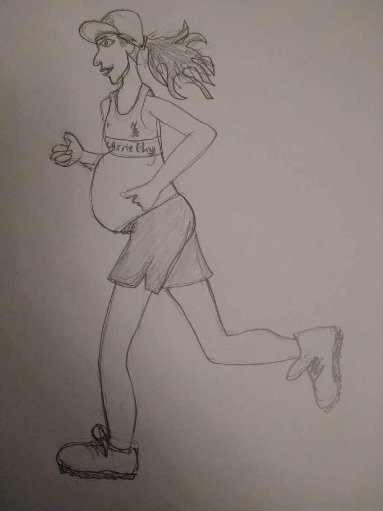

    

        
    

    
    

        I used to be a runner 
        Fast and fit and strong, 
        Now I'm getting older 
        And I'm getting fat. 
        The midwife said stay active 
        So I keep on shuffling on, 
        But every day gets harder 
        To move my bump along. 
         
        I used to be a runner 
        And dance nimbly down the hills, 
        Now I jiggle with every step 
        And prefer going up instead. 
        Then I lean into each puff 
        Let my bump lead the way; 
        I waddle like a hippo 
        But it blows the cobwebs away!
    

