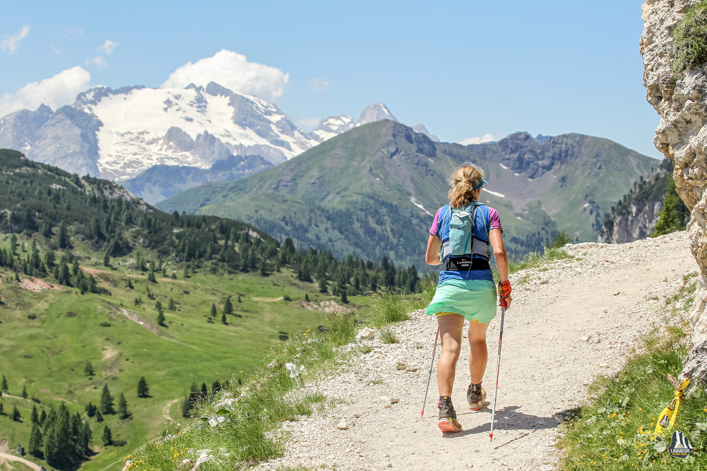
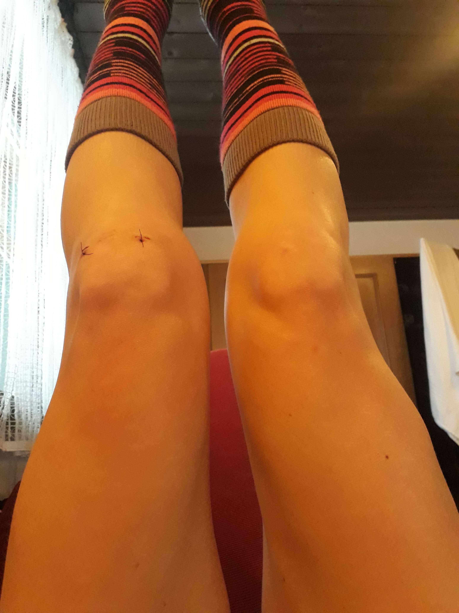
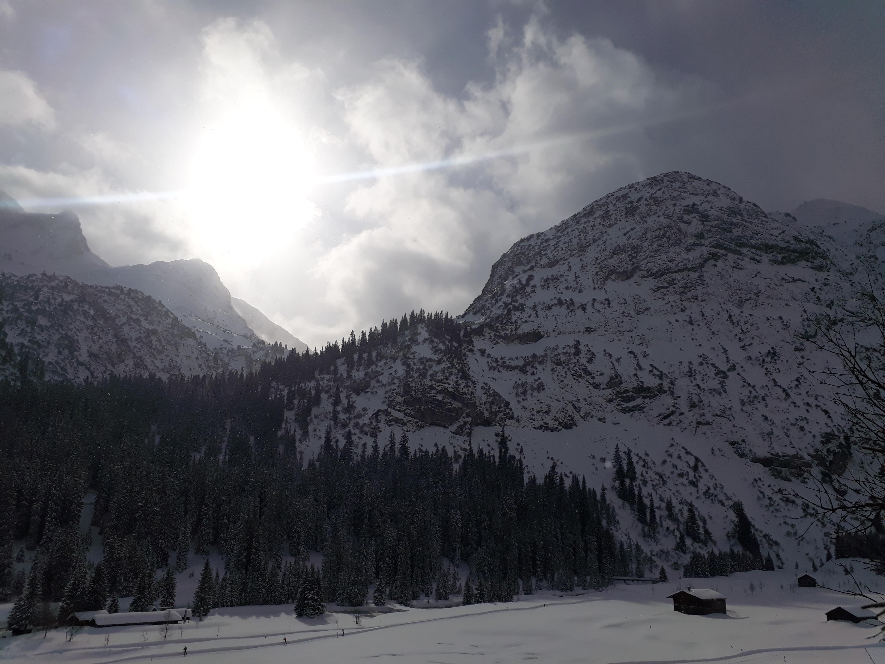

For a long time now I've had a problem with my left knee. I remember a winter session of military fitness a long time ago, running with a bib round my waist and someone using it to pull me back. I remember landing on my left foot and twisting, and sharp pain in my knee. It disrupted my training for the 2014 London marathon. I stopped running and went to see a physio. I was diagnosed with tight hips and weak glutes. Standard runner issues. Too much running, not enough strength work. I diligently did the physio exercises and swapped running for cycling. It recovered in time for me to resume training and run the marathon. But the underlying issue never fully went away and it's niggled off and on ever since. I accepted that I had a dodgy left knee and would avoid doing things to fully bend it - squat thrusts and sitting cross-legged in a certain way. It was sometimes a bit sore but crucially it didn't stop me running.

When I first fell in love with ultramarathons I knew I needed to do something to avoid my knee getting sore again. In early 2017 I signed up to [Improve My Running](https://improvemyrunning.com/) to help me work on my running technique. From race photos I could see that that my left foot often comes inwards when I run. My right hip has a tendency to get very tight. I suspected the two were related and could all be part compensation for a weakness around my left knee. With Matt's help and working to make my glutes stronger, my form has improved dramatically and my foot only turns in when I'm very tired.

📷http://canofotosports.com/

Good running form was not on my mind much during the 18+ hour sufferfest that was Laveredo in a heatwave last summer. I was certainly very tired and for the final few hours I was barely shuffling. After the race, my knee got sore again. I assumed that it would improve with some time off running. I rested through July and tried to return to running in August. Every time I tried to increase my mileage, my knee hurt. While at Loughborough University for a work event I spent an amazing few hours with a [physio](https://www.lboro.ac.uk/sport/physiotherapy-clinic) there. She didn't know what was wrong as my knee was moving well and there was no swelling, but she threw everything she could at trying to fix it. Massage, cupping, acupuncture hooked up to electricity... Nothing helped. Back home I enlisted the help of a local physio, Kenny, from [Space Clinics](https://spaceclinics.co.uk/kenny-watt/). Working with the same information - everything was moving well and there was no inflammation - he prescribed lots of glute and leg strengthening exercises. This worked, to a point. I was able to build my mileage back up and run an autumn ultra. However there were a few setbacks during the process - too many miles made my knee sore again, and meant I needed to back off for a few days.

After my last race of the season I took a few weeks off, and at Kenny's suggestion, booked an MRI scan. It took a long time for various frustrating reasons and I didn't get the results until the beginning of 2020. They confirmed what I'd been dreading - a tear in my medial meniscus. After several more weeks waiting to see a surgeon, things suddenly moved very quickly and I was booked in for an arthroscopy to remove the torn meniscal cartilage the following week. I was terrified and told only a few people.

 The operation was a week ago and went well. I still can't get my head around the fact that I was put to sleep, and someone cut my knee open, but I have the stitches to prove it! My knee mobility has been steadily improving throughout the last week. I'm under strict instructions from Kenny to not walk around much. I'm listening. Plus I've felt totally wiped out after the operation and have been unable to focus on anything (this post has taken several days to finish!), so have been mainly sleeping. My knee is bruised but not too swollen. It still hurts but it's bearable and I've cut down on the painkillers as they were making me feel too fuzzy. Sometimes I worry that it's the old pain, the same pain as before. What if the operation hasn't fixed it? Will tells me I worry too much. He may be right.

For this week I'm trying not to think too much about the rest of the year. I had big plans for 2020, and maybe some of those will need to be adjusted. That's ok. For now I'm in the mountains, spending the week resting and elevating my leg while my friends ski. I'm trying not to be too gutted at missing out on that and instead I'm accepting where I am right now. It's not where I want to be, but it's temporary. Fitness comes and goes. I'll need to work hard soon, but I will come back stronger. The stitches come out next week and then I'll be able to start training in the pool. Hopefully I'll have enough mobility to use a turbo. Until then I'll enjoy the mountain views from my window and focus on recovery.

