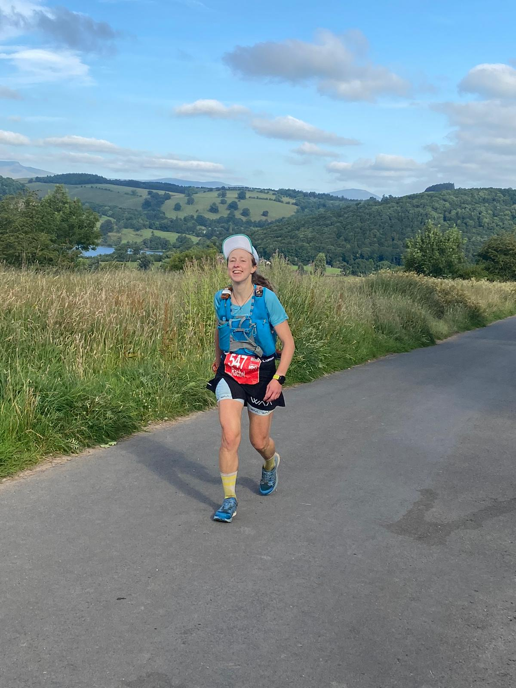
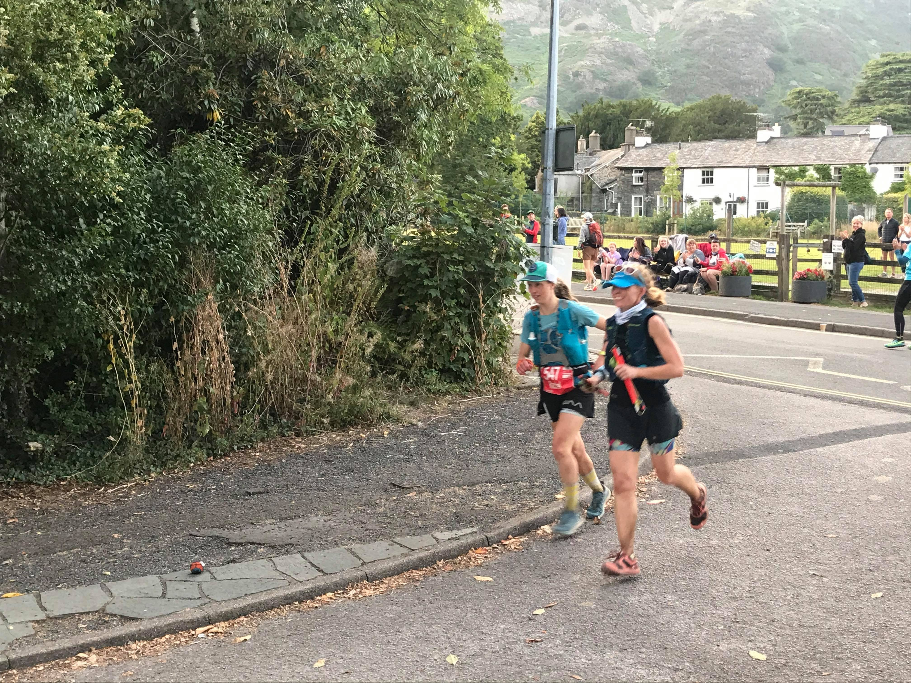

Where to start?
I ran 105 miles!
It still hasn't fully sunk in yet.
Andy pointed out the other day that I've been building up to a hundred for the last five years.
I didn't know I could do it, but I kept going, and I did!
My goal was to finish the race - my first 100 miles.
I finished, and had a solid run that I'm proud of.
I mainly enjoyed it, and it was very hot. Wow, it was so hot.

<!-- end -->

We set off at 6pm on Friday night in glorious sunshine, after a day of trying to hide from the heat and stay hydrated.
The first two hours were roasting until the sun dropped behind the hills.
I tried not to go too fast, stay relaxed, and not let the heat get to me.
At the first aid station I filled my spare water bottle and carried an extra 500ml with me just in case.
The Petzl / La Sportiva crew were at Boot and it was great to see them.

I pushed on to Wasdale Head in a small group, all of us speeding up slightly to arrive there before it got dark.
I savoured the experience of eating pizza on the climb up Black Sail pass.
There was a delicious breeze at the top and I finally felt cool enough.
On this descent and the next I looked back to appreciate the huge moon, the stars, and the line of headtorches snaking down the mountain.

There was confusion on the way into Braithwaite with headtorches up the hill on the left and off the path.
The race instructions for this section are very confusing.
Luckily I remembered this and headed down on the main trail.
Pip was outside Braithwaite checkpoint.
I was surprised Tom was so close, but learnt he was struggling in the heat.

I almost missed the turn off the A66.
This was meant to be the easy nav part, and was the one bit I hadn't recceed!
Luckily for me, Tom had missed the path, ran back to me and we found it together.
I hiked out of Keswick towards Skiddaw with Rob Brown.
His knee was also sore and he was reduced to hiking (much faster than I was!)
I arrived at Blencathra just after Anna Troup and quickly followed her out as I didn't know the changed route for the next section.
We dropped down to the railway path for a few miles.

I slowed down, suddenly feeling tired.
People passed me by.
A lady flew past up the hill to the old coach road.
Tom stayed the other side of the fence on the climb and dropped behind me.
I tried to eat a jam sandwich but it was about 3am and my body did not want it.
I retched every time I tried to eat.
There was a small group behind me but I managed to stay ahead to Dockray.
The sun came up just before I arrived.
It was beautiful and I felt my spirits lift.
I took a packet of Ready Salted crisps from the checkpoint and miraculously I could eat these.
I caught up to a guy called Martin, and we ran into Dalemain together.

Dalemain is the "halfway" checkpoint, at 59 miles, and where my drop bag was waiting.
My watch in "ultratrac" mode told me I'd already run 70 miles (by the end it thought I'd done 122. I mostly ignored it).
I followed the instructions I had left in my dropbag.
_Eat breakfast. Change top and bra. Apply sunscreen. Discard extra layers and GPS device. Switch headtorches. Take new food._
Debbie Martin-Consani arrived and came to sit by me, giving me a hug.
She had had a rough night, but now it was a new day.
I changed my top, drank some coffee and felt pretty good about life.

I left Dalemain just after Maria Cook and we ran together into Pooley Bridge.
Matt Holland was by the bridge to cheer and I paused for a quick chat with him.
I was smiling and felt good.
I left Howtown before Maria and pushed up Fusedale to try and get a bit of a gap.
I wanted to get the next few climbs done before the day got too hot.
Inhaling an energy gel on a steep section on the trail above Haweswater, I stumbled and grazed my leg and shoulder.

I almost caught up with the next woman on the climb up Garburn Pass.
She struggled uphill but disappeared on the down.
I did the opposite.
At the top I tried to eat a sweet potato and avocado wrap but it was flavourless mush and I started retching again.
My descent was slow and cautious.
I was slow to Kentmere, and any buffer I had over those behind soon disappeared.
I was desperate to see Will, who had planned to cycle to Troutbeck.
_He wasn't there._
I didn't let myself feel disappointed, instead focused on the next climb and reaching the party at Ambleside.

Will was the first person I saw as I ran into the Ambleside checkpoint.
I was **so** pleased to see him and stopped for a hug.
I hiked out of Ambleside with a man who told me he walked at least one hundred miles a week!
Even on my hundred mile journey I was awed and humbled to hear this.

The next section was too hot.
I baked in the heat as I tried to keep running.
The sun reflected too brightly off the white dusty trails, and there were too many people around.
I shuffled along feeling disgruntled and stopped to dunk my buff in a river to cool off.
Marco and John Connolly were waiting before Chapel Stile and looked worried.
Back in Ambleside people were still telling me I looked fresh.
I could see in Marco and John's faces that something had changed.
I felt frazzled.
It was too hot.
I was too hot.

I sat at Chapel Stile.
Maria ran through, barely stopping.
Debbie arrived.
I was happy to see her but sad so many people were catching me so close to the end.
I wanted to leave with Debbie but my legs were cramping.
I had to keep moving.
Debbie passed me before we hit the single track.
She declared I needed salt and gave me her remaining salt tablets.
I worried that she would need them, but reasoned I could return the favour if I found her struggling later.
She disappeared into the bracken ahead of me.
I plodded along behind, willing the salt tablet to help.

At the bottom of the next ascent two men from the 50 mile race flew past.
They went the wrong way up the climb and I followed until they realised the mistake.
Back on the proper climb I watched everyone above me pulling away and felt overwhelmingly sad.
I sat on the ground, hoping to cool down.
It wasn't a shady spot.
The ground was baking and the grass itchy.
After thirty seconds sitting feeling sorry for myself, I pulled myself together.
I got out my poles and started to hike up the hill.
By the top I was smiling again.
There wasn't far to go.
I could do this.

Marco and John were waiting at the top and were surprised I was cheery again!
They told me I was looking better.
Approaching the unmanned checkpoint I saw that Debbie was not too far ahead.
I kept running.
I wasn't going to give up.

I arrived at Tilberthwaite, the final checkpoint, only a few minutes after Debbie.
She looked at me and asked if I wanted to finish this thing.
I did.
I followed her dumbly out of the checkpoint and forced myself to stay on her heels up the final climb.
It felt like the biggest effort I'd put in all day.
On my own I would have dawdled up this last climb.
At the top Debbie said we could break 27 hours if we made it down in under 30 minutes.
I was game to try.
Poles away, we started to run downhill.
I followed Debbie's line down the rocky section.
Both of us had screaming quads, but were still moving well.

We ran into Coniston as heroes.
The streets were full and people cheered outside the pubs.
Cars stopped and we ran through the streets.
This was our moment.
We crossed the finish line together in 26 hours and 49 minutes.

I learnt a lot from my first one hundred (and five) miles.
Many people had told me how the key to keep going in long races is to keep eating.
The low points I had in the race were directly correlated to when I didn't fuel properly.
I struggled to eat during the early hours of the morning and when it got very hot the next afternoon.
This is something I need to sort out!

I also struggled to take on enough electrolytes in the heat.
I made sure that I always had one bottle of electrolyte solution, one bottle of water.
As it was such a hot day this wasn't enough.
Salt tablets saved me, thanks to the kindness of Jen Scotney at the Kentmere aid station, and later Debbie.
I'll definitely carry some in case of emergencies in future!

Overall I managed to stay positive throughout the race, but I did have some wobbles later on.
It was tough when I was slowing down and being overtaken by other runners.
The first five or six 50 mile runners passed me between Ambleside and the finish.
The were smooth, fast and fresh.
I felt the opposite!
Luckily I managed to pull myself together and stay focused.
I knew I just had to keep on moving and making progress forwards.
Getting out my poles and using these to hike with intention helped a lot with this shift.

Ultimately, it was incredible to race again and have such a _normal_ feeling race experience after tha last year and a bit.
The running community is amazing and support on the course was great.
I am incredibly grateful to everyone who cheered me on.
To Marco and John Connolly, who gave me a huge lift each time I saw them.
To Will, for always being there.
To La Sportiva and Petzl for kit and support.
To [Matt Holland](https://improvemyrunning.com/) at Improve My Running for coaching, and for his relentless belief in me.
To Gavin for the finish line hug when I needed it!
And finally to Debbie for dragging me up and over the final climb.
I was overwhelmed by her kindness and selflessness.
Finishing alongside such an ultrarunning legend was an amazing experience and meant I finished on a huge high.

I think I might do it again one day...

The [official race video](https://www.youtube.com/watch?v=tT6Jd6CQ3g0&ab_channel=EpicEventsManagement) is well worth a watch.
Prepare for spine tingles and an urge to [sign up](https://lakeland100.com/) for next year!