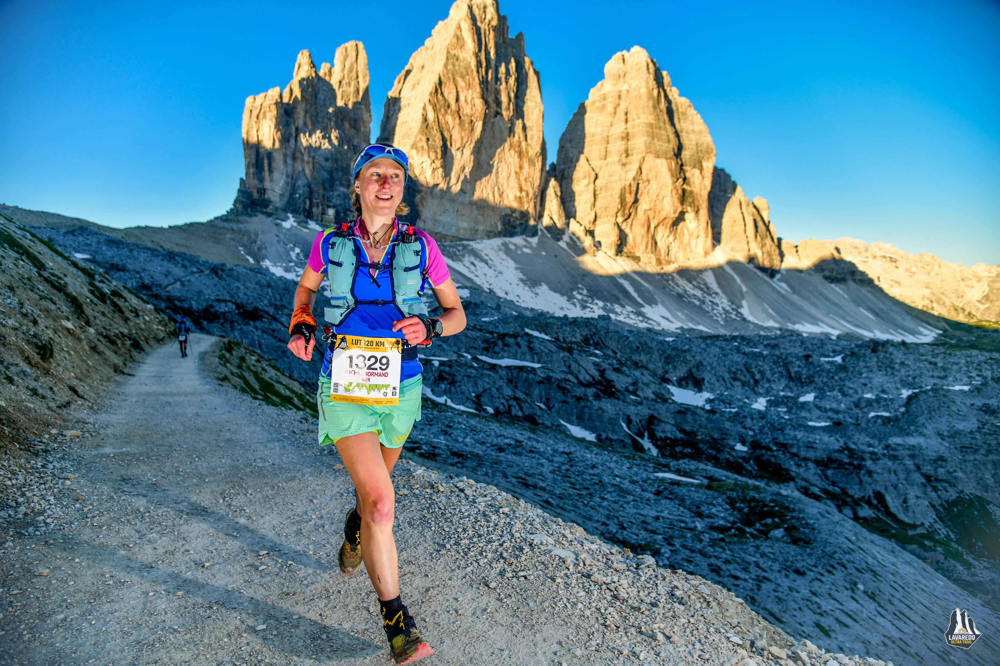

I was cocky. I felt so well trained. After a month in the mountains with a lot of vert, I felt super strong and like I could run forever in the mountains. Fast. I thought I could play with the big kids. I was nervous, sure, but I felt so confident I’d prepared well that I was able to push this aside.

<!-- end -->

The start line was rammed and I let myself get carried along, moving with the taller people in the dark, careful not to get a pole in the face. We ran through the crowds and up out of town. I kept running on the uphill roads, knowing we’d head onto track after a mile and a half. Poles were produced and waved around. I kept my head down and started hiking. Soon I came across Ryan Hogben who was moving fast uphill as he’d got boxed in at the start. We fell into what felt like an easy pace and ran along chatting, overtaking lots of people. In hindsight this was probably too fast. We were running uphill when we should have been walking. It was lovely to have company in the dark though and these miles flew by and we were at the first high point at Forcella Pospocora in no time. The descent from here was fairly technical but we cruised down it, letting faster people pass when they got too close behind. We reached the first aid station together in just under 2 hours. Ryan said that was about what he was aiming for. I worried it was a little fast, but didn’t really know so stayed relaxed.

I got my poles out for the next climb and Ryan pulled ahead. In the dark the climbing didn’t feel too tough. When I’d recced this part a few weeks before there had been a lot of snow but now it was all clear. As I ran down to Tre Croci I realised I hadn’t eaten anything and had half a rice crispy square. By this point it was about 2am and my body was not convinced eating was a good idea. It was mainly downhill from here to the next aid station at Federreveccia and I tried to relax. This path had been almost impassable on my recce due to fallen trees but they had all been cleared away now and the trail underneath was soft and spongy and easy running. At the second aid station I got worried that I had lost my cup. This kept haunting me throughout the race (much later I took a plastic one from an aid station, and later still found my original cup stuffed in my pack underneath a soft flask). Now I worried. The next climb felt ok and I remembered hiking up it previously with Will and trying to avoid a storm. I wasn’t feeling great on the run down to Lake Misurina and was nervous about tripping over a tree root in the darkness, but I made it down safely. I started to struggle on the climb after the lake, but it was starting to get light and turning off my headtorch made me feel better. The snow was gone here too and the climb was very different to the one we’d done some weeks before - we’d tried to follow footprints through the snow and ended up on the other side of the road!

A couple of females overtook me at the top of the climb, including Anna-Marie Watson, another British female. She had been tipped to do well in the race and I had a sinking feeling that I should probably not have gone out ahead of someone with so much more experience! Still, I felt stronger after the aid station, where I had a few mouthfuls of noodle soup. I had a bit of a headache but the saltiness of the soup made that subside. I also switched Tailwind for Active Root in one of my soft flasks and this went down a lot better. Running alongside Tre Cime as the sun came up was incredible. There was low cloud hanging in the valley to the right and the views were stunning. Lots of people stopped to take photos, but I assumed there were photographers around who would do a much better job than I would with my average camera phone, and continued. The traverse after the saddle was on a lovely runnable trail, totally different from when we’d recced it in deep snow. The snow-free descent was also a lot of fun and quite technical in places. I passed Anna-Marie here, but figured she would soon catch me back, and I was right - she passed me running easily on the gradual uphill cycle track in to the aid station at Cimabanche. I was running with Ryan again and we were both struggling, running bits and walking bits. It concerned me that I felt like this already, but I was looking forward to the aid station.

Cimabanche was the drop bag point, just after halfway. I was pleased to get there, but didn’t know what to do with either my drop bag or myself. I didn’t want anything in the bag. I got another bowl of noodle soup and had a few more mouthfuls, and some coke. I wasn’t feeling great and knew I hadn’t eaten much, and it was soon going to get hot, which wouldn’t help. Sophie Grant arrived as I was about to leave the aid station, looking fresh, and I knew I’d see her again soon!

The next climb was one I hadn’t recced. It looked small on the course profile but still took about 45 minutes to reach the top. My plan of only using poles for some of the steep climbs had gone out the window and I was relying on them heavily to help me on all the ascents. I struggled to run down the other side. My legs and feet were hurting and I was starting to have serious doubts about the race. I made it to the next aid station at Malga Ra Stua. People say the race starts from here. That wasn’t a good sign as I was already feeling awful. There was still about 50km to go and I was barely running. I stopped at a fountain to douse myself in water. It was already hot and I had learned a good lesson about keeping cool at Transvulcania. Sophie caught me here and also stopped to cool off in the fountain. She set off running strongly up the hill in front of me while I settled in to walk.

The big traverse round to Val Travenanzes (Death Valley) was long and difficult in the heat. Then there was no shade in Death Valley and it went on forever. Luckily the path through was well marked, which meant less river crossings than when I’d recced it, and the river was lower too. The river crossings were lovely and I took my time over them, savouring the cold water, and at one point sat down in the river (probably a bad call as I had bad chafing  after that!). The final climb out of the valley went on for ages and lots of people passed me. I felt very demoralised. I was calculating in my head how long it would take me to reach the finish, but I was only moving at about 3km an hour and that was far too long to think about properly, so I went back to thinking about the next aid station. If I could make it to Col Gallina then I could do it. It wasn’t going to be pretty and it was going to take a very long time, but I could do it.

I could barely run down from the top of the climb, or on the next descent to Col Gallina, but I made it there. Greg from La Sportiva was by the entrance to the aid station cheering, but I told him I was broken (actually I said something much less polite than that). He was impossibly cheery and told me I was doing great, which I knew was a lie. One of the women who’d passed me on the descent was still in the aid station and she came over to check I was ok and told me I needed to eat something. I tried a little more soup. I didn’t want to stay for long or I would never leave this nice shady place, so I headed out the tent and forced myself to run the initial downhill. I was boosted by support from Matt Wilson before the trail started to climb up to Averau. This climb wasn’t too bad, but I was moving super slowly and not even running on the flatter bits. Averau was an interim aid station and they had iced tea and a very welcome cold shower. There was much less water on this side of the mountain. I had mistakenly thought it was downhill from here to Passo Giau, but there was a big traverse and another climb before the descent into the aid station. It was hot and neverending. Everyone came past me and I stood aside and waved them by, trying to stay cheerful. I had no fight left. I ate some fruit at Passo Giau and mixed up some more Active Root. There were two more climbs from here to the next aid station, then it was all downhill into Cortina. I could do it. I was convinced I saw Eóin running out of this aid station, which was a little surprising as he wasn’t in the race, but I thought maybe he was there to take photos. I tried calling his name and shouting after him but couldn’t catch him. He also swears it wasn’t him. I tried to chat with a Canadian guy who was moving about the same pace as me but he didn’t seem interested so I resigned myself back to my own thoughts. They were not particularly pleasant.

The interim checkpoint here was between the two climbs. Everyone else was running on the flatter section but I just picked my way along slowly with my poles. One foot in front of the other. I was going to make it. I wobbled a bit and the marshal let me finish his bottle of coke. Some elderly walkers overtook me on the way up the final climb and stopped to check I was ok. I was so embarrassed. Every time I caught someone’s eye they had to look away. I’m rubbish at hiding my feelings and my pain and humiliation was written all over my face. I don’t know why or how I was still moving, but I wasn’t going to give up. I wanted to finish despite how hard it was. I was inspired by Aisling who’d suffered through her race the previous day but had kept going and finished and I thought that was incredible. I needed to do the same.

I struggled to breathe in the heat. A full breath made me cough so with each breath I only half filled my lungs. This meant I was constantly fighting the urge to panic as I wasn’t breathing calmly. I had never realised before how much I rely on deep breathing to keep myself calm and in control. The last climb was only short but very steep. I felt lightheaded by the top and had to pause before starting down the other side.  Finally I arrived at the last checkpoint. It was all downhill from here. I had no elation or relief as I knew this would still take me well over an hour at my current pace, but there was a photographer on the way out of this checkpoint and I held my head high. I was going to finish.

    
    
📷 <a href="http://canofotosports.com/">http://canofotosports.com/</a>

The last descent was not pretty and it went on for much longer than I thought it would. Some bits were steep and technical and I was far too cautious. My feet hurt and running hurt and I wanted it all to be over. But I kept moving and not too many people passed me. I finally reached a road and the village above Cortina. Some locals had set up their own aid station and were handing out watermelon, which tasted incredible. I kept walking the ups and using gravity to help ‘run’ the descents. A British man appeared from a driveway and told me he had been tracking me all day and was so pleased I was here. I have no idea who he was, or if he was really there. I hiked up to the main street and the final run in to the finish. I paused to gather myself. I put on my sunglasses as I didn’t trust myself not to break down completely (and I wanted to maintain some pride), and started to run. Given that I had barely run at all in the previous 10 hours, I was surprised at how easy it seemed. I high fived some people and kept running. I heard my name called by Aisling, Eóin and Lynne and I smiled. I finished.

My emotions are still pretty raw and it's still hard to objectively look at my race. I can already see there are some things that went well. I finished, when I really didn’t know if I could. I ran the furthest I’ve ever run, and for the first time all through the night. I fought on, even when I thought I had no fight left. But there are so many more things that didn’t go so well and I have a lot to learn. During the whole 18 hours 38 minutes it took me, I ate 2 rice crispy squares, 2 Clif Shot Bloks and a couple of mouthfuls of soup and fruit at the later aid stations. It's hardly surprising I had no energy later on in the race!

    
    
18 hours of wet feet is not pretty!

Lots of people didn’t finish. The heat was intense and it meant there was a high drop out rate. I not only finished, I was 15th lady and 131st overall. So many people overtook me in the latter half of the race that I felt like it was much worse. I have so much respect for everyone who ran, whether they finished or not. Running usually makes me a better person, but I’m not sure it did in this race, and that cuts pretty deep. I have some soul searching to do in the next few weeks. I'm not proud of how I ran the race but I did enjoy the experience of it. Cheering Aisling and Eóin in their races was fun and it was great to hang out with the La Sportiva crew (and massive congratulations to Sophie who was 9th, and John Kelly who was 32nd overall, despite having a tough race). And hanging out with new Scottish friends Lachlan, Lynne and Richard before the start was great and I learnt a lot from their collective Euro racing experience! The race itself was beautiful and well organised and I'd recommend it to anyone. The Dolomites are fast becoming my favourite mountains, they are truly stunning. Overall I had an amazing month living and training in the mountains and this is what I will take away from my time in the Dolomites.