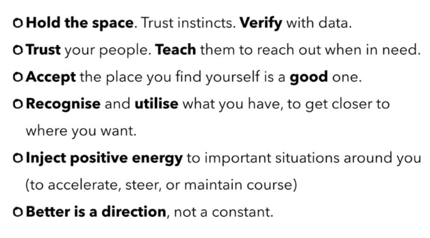

_Originally posted on engineering.tes.com [here](https://engineering.tes.com/post/learning-to-lead)_

**_Things I've learnt since becoming a Principal Engineer_**

At Tes, a Principal Engineer looks after one or more teams of engineers with the aim of helping the individuals grow and to enable the team to work together to develop and support our services.
Principal Engineers across Tes Engineering meet every week and are "responsible for the overall health of the engineering team". Read more about our management model [here](https://engineering.tes.com/post/manage-without-managers/).

<!-- end -->

I had been thinking for a while that right now I want to focus on solving people problems more than technical ones.
I’m also very interested in helping juniors develop and progress.
I was thrilled to be promoted at the end of last summer and proud to be the first female Principal Engineer here at Tes!
I wanted to make sure that I would do the best job I could for my team and the wider engineering team, so I asked some of the existing Principal Engineers for advice.

My first and favourite piece of advice was from [Gabriel](https://github.com/gabceb) - **always smile**.
I like to think about this when things get tough.
It helps to put work and what we do in perspective.
We believe in the [Retrospective Prime Directive](https://retrospectivewiki.org/index.php?title=The_Prime_Directive), that everyone is doing the best job they can.
Mistakes happen and luckily we don’t work in a high-risk environment.
Things break and we fix them.
By focusing on the positives we can foster a safe environment where people don’t worry about being blamed if they make a mistake.

[Dalibor’s](https://github.com/boreplusplus) main tip was to **keep the pulse of the people on your team**.
A lack of drama may not mean a lack of tension.
It can mean that there’s a lot of pent up tension.
As a leader you have to get a feel for this, which you do by talking to everyone and making sure that they are speaking to each other.
Communication is the base of what makes a good team.
Delivery, performance and everything else follows that.
Don’t be afraid of conflict: it can be healthy as it brings issues out into the open.
At Tes we value openness and honesty across our engineering team and want everyone to feel safe to speak their thoughts.
We have a lot of smart people but they don’t always agree.
And that’s ok - in fact this drives great ideas!

[Stephen](https://github.com/cressie176) said an important thing to remember is that **often there is no right answer.**
**You just need a _good_ answer.**
When you need to make a decision, do so quickly and confidently, so that things can move on.
You can always change your mind after 3 months.
Doing something is better than doing nothing in the quest to work out the best thing to do.
Most of the time, ["consistently good enough beats great"](https://thegrowtheq.com/its-okay-to-be-good-and-not-great/).
Don’t beat yourself up about not being perfect.
You will always get criticised for the decisions you make, but you will never know what would have happened if you'd made a different decision.

The biggest challenge I found moving from Senior to Principal Engineer was the explosion of things I needed to do (or at least thought I did).
At the beginning I was naive enough to think I could still pick up chunky features or code refactors and get them done in a timely fashion.
I quickly learned I should only do that in a pair with someone who can continue to drive the work forwards when I inevitably get pulled into other things.
I have had to be strict with my diary and to-do lists so that I can get things done.

While juggling many plates on a particularly busy day I asked [Dan](https://twitter.com/twicezer0) a slightly different question than I’d asked other Principal Engineers: "At some point I would like to have a conversation with you about how you manage 🤹‍️ without 🤯".
Dan’s answer, later immortalised in a [tweet](https://twitter.com/twicezer0/status/1219722474553847808), beautifully articulates lots of the advice I’d already been given:

I also picked up some great tips about being a good leader at the [DevTernity](https://devternity.com/) conference at the end of last year.
Roy Osherove, who wrote the book [The Elastic Leader](https://smile.amazon.co.uk/gp/product/1617293083/ref=ox_sc_act_title_1?smid=A3P5ROKL5A1OLE&psc=1) gave a talk titled The Coaching Architect Manifesto.
He said your goal as a leader is to try to grow your team.
**You should try to make yourself unneeded and remove yourself as a bottleneck**.
Your team should be empowered enough to be confident in making decisions without you.
If you can do this well, you’ll always have a job.
This seems counter-intuitive, but it makes sense.
You will be seen as someone who can build a good team, which is an invaluable skill.
Management know that you can move to another team and do the same.
A good opportunity to help grow inidividuals on your team is when someone asks you what to do.
Rather than give the answer, turn it around and ask them what are they going to do?
This is the first step to get them solving their own problems.
Of course this won’t work in every situation, but it’s a good technique to consider.
Osherove pointed out that being a leader is not about making everyone like you.
People have to be uncomfortable to learn and grow.
This means you have to challenge people and they will not always like you for it (although if you do this well they should respect you for it).
At Tes we strive to create and nourish a safe environment so that people can be challenged at the right level.
It’s ok for a task to seem scary, but people need to feel safe to ask for help and not afraid to help.
As a leader it’s important to ensure people feel supported as they learn and grow.

This last point applies to me as a leader too.
I have certainly felt challenged by my new role and the responsibilities that come with it.
But I feel supported by my team and the other Principal Engineers and know that as long as I’m doing my best, I will grow and become a better leader.
My key takeaway from all of my questioning and learning, is that **you can’t do all the things all the time**.
Delegation helps, and so does prioritising.
But it also means accepting that some things may not get done at all.
As long as you’ve done a good job of prioritising, that’s ok!
I still have a lot to learn and I’m sure I’ll make lots of mistakes along the way.
But I’m excited about the journey!
