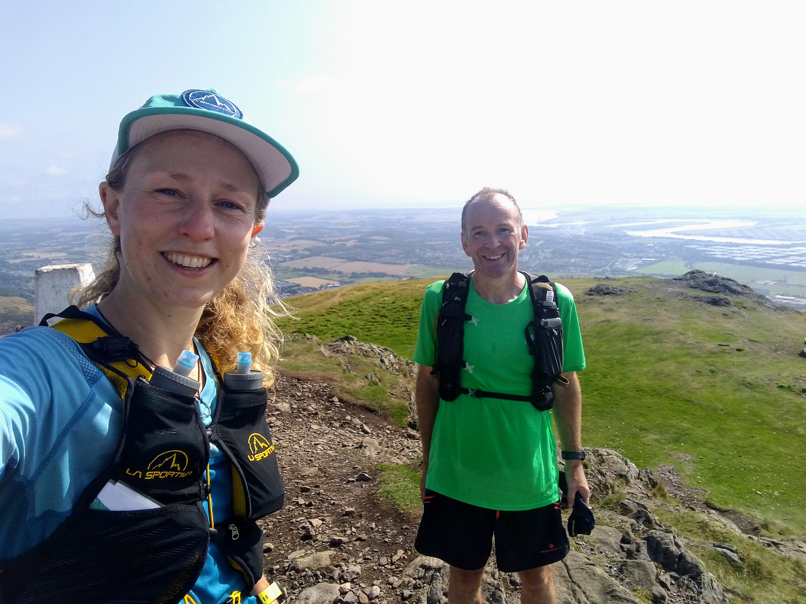

## Conquering Dumyat

I ran the [Ochil Ultra](https://ochilultra.run/) in late September.
It's a 50 mile race from Perth to Stirling across the Ochil Hills.
The idea of linking the two cities appealed to me and I liked the idea of a low-key local ultramarathon to end the season.
However there was a small problem with the route: Dumyat.

<!-- end -->

Dumyat is a hill in the Ochils, close to Stirling University.
I'd been up it once before during the Ochil 2000s hill race in 2016, and avoided it ever since.
In that race, we dropped all the way down to the road to Menstrie, and ascended Dumyat as the final climb.
It was hot and I was naive and over-caffeinated, my heart beating wildly.
The climb went on forever.

That same hill was the final climb of the Ochil Ultra race too.
I knew I'd have to overcome my fear of the hill.
Luckily Neil McLure had a plan and a month before the race took me for a run that culminated in Dumyat.
Again it was too hot and the climb went on forever.
But climbing (and surviving) it for the second time quietened my nerves.

I also recceed the first section of the race from Perth on a long run.
I planned a loop that started along the race route and returned across the hills.
I managed to get lost leaving Bridge of Earn and narrowly avoided being attacked by 2 dogs when passing through a farm.
Otherwise it was an enjoyable run and I did some long efforts at the start including up Moncrieffe Hill.
I felt ready to race!

Race morning started far too early as I had to get to Stirling for a 6am bus to the start.
Once on the bus I was able to relax, knowing that my preparations were done and now out of my hands.
Now all I had to do was run.
I chatted with Chiara on the start line, shivering in the early morning cold.
It was a small field and I settled in behind the leading group of 4 guys for the first few miles.
By the time we reached the trailhead at Moncrieffe Hill I couldn't see anyone else around.
I enjoyed the ups, downs and wiggling trails before landing back on a country road.
I ran through the first checkpoint at Bridge of Earn without stopping.
The group in the distance had splintered and I could see a few guys not far ahead.

On the next trail section I took a wrong turn and got stuck in some long grass, unsure where the trail was.
I stumbled into another runner and followed him on what I assumed was the right path.
Suddenly we arrived at an unexpected gate.
My companion realised we were off course and headed left along the fence to try and rejoin the route.
I followed slowly, loading the route on my phone, cursing myself for not having done that before, and having got lost on a section I'd recceed!
After some minutes traipsing through long grass and stepping over big holes in the ground, we could see runners much higher up and away to the left.
It was very slow going to rejoin them and we were on the wrong side of a tall deer fence.
I climbed up it and as I reached the top saw Chiara running past on the other side.
It cheered me to see her running so well and I clambered down and followed her up the hill.
I didn't know how much time I had lost but knew I needed to stay cool and not panic.
There was still a long way to go.

Soon I took another wrong turn and hiked through an overgrown field, not realising I should have been running easily on the road.
Luckily I realised my mistake and climbed back across, as Chiara reappeared behind me again!
Now I was finding my navigational mistakes funny.
I knew I was running well, I just kept getting confused by the (lack of) signs!
I decided I would just try and enjoy myself and not worry about my race result.
Over the next few miles I slowly caught up to a guy in front.
We ran together for a while and he said he'd seen me go the wrong way earlier, but had been too far away to call me back.
He assured me only him and two others had gone past.
It sounded like I was still the leading lady!
I felt my competitive edge kicking back in!

Unfortunately the next section was a long boring slog on road.
I could feel my focus drifting and kept forcing myself back to the present by counting.
Finally I reached the Ochils proper, and started to overtake some of the runners in the 30 mile race.
This was a good boost and made me feel stronger on the hills.
It was a nice reversal from feeling slow as the fast 50 mile racers came flying past me at the end of Lakeland 100!
It had turned into a warm day, and we climbed above some low cloud.
It was a glorious day to be on top of a hill and everyone I past was in good spirits in this section.
I was fooled by the dry trails and took a tumble on some spongey ground, hastily jumping back up so no one spotted me!
The descent down to Tillicoultry was fast and fun, and I got a further boost from the can of coke in my final dropbag.

I knew the end of the race would be hard.
From the final checkpoint it was four flattish miles to Menstrie, then Dumyat.
Luckily I was in good spirits and feeling fantastic, although I didn't have the legs to speed up on the flat section.
I kept chugging along, trying not to worry about what was coming.
I had a secret weapon for Dumyat in the form of a caffeinated energy gel and took this on the bottom slopes.
I was passing lots of people already, and as I reached the open middle section I could see even more targets ahead.
Everyone was struggling, and lots were stopping to rest every few steps.
I felt prepared for this.
I could see one guy ahead who I knew was in the same race as me; everyone else was running the 30 miler.
He was moving well and passing folk, but didn't look like he was enjoying it.
I slowly drew closer to him as I powered up the climb.
At the top I had a chat with a marshal about Dumyat and my relationship with it.
I felt like I had finally conquered it!

The descent was amazing.
I knew I didn't have to hold anything back and I felt so strong.
I put on a burst of speed to fly past the guy in the 50 mile race and danced down rocks and grass to finally join the road.
Unrelenting I pushed on towards Stirling University and the confusing woodland trails there.
I kept my eyes peeled for arrows and managed to correctly navigate my way onto campus.
I chuckled as I joined the main road and saw one runner appearing from behind, and two more joining up ahead.
Not everyone had found the right route through the woods!
The final 400m was a lap of the athletics track which felt painfully slow.
Luckily running on a track always makes me think about running form.
This helped me to finish strong.
I held myself tall and picked up my cadence as I cruised round the final bend to finish in 9 hours and 10 minutes.

It turned out my tracker hadn't been working all day, so the race announcers had no idea who I was or which race I'd run.
Some time after I finished the organisers realised I was the first woman to finish the 50 miler and gave me a trophy!
I hung out at the finish and cheered runners in.
Chiara finished in third after a gutsy and unenjoyable last section, but she was smiling as always.
I was tired, happy, and satisfied with a strong end to my 2021 season!

