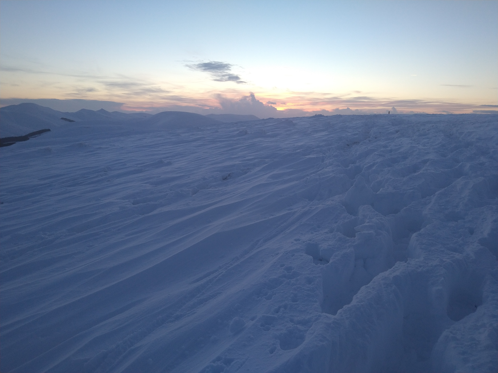
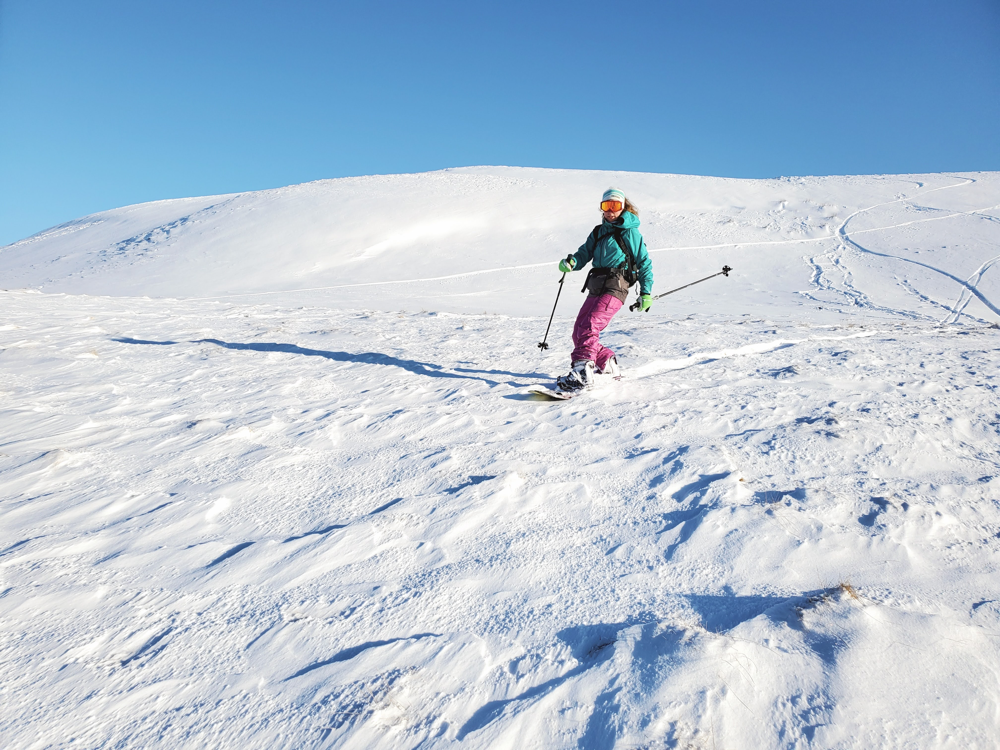
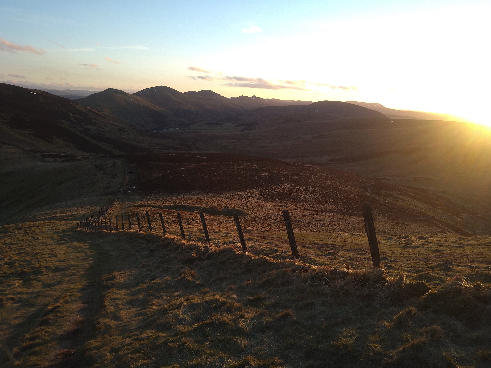

## _it's just a run_

Lately I haven't wanted to run.
First I blamed the weather.
January and February were cold, windy, and dark.
Melting snow made the low paths tough going.
Deep soft snow in the hills made for tentative steps into the unknown.
Sometimes I could dance across the snowy surface; other times I sank into thigh-deep snow.
<!-- end -->

It snowed again and I enjoyed a few glorious days snowboarding in the local hills.

Too soon the snow melted and now it feels like spring.
The mornings and evenings are lighter.
But I don't get up early and I work till late.
I make excuses because I don't want to run.
The global situation feels heavy on my shoulders.
I know I'm privileged and I shouldn't complain, but the weight of being in one place for so long is wearing me down.

And that's ok.
It's ok I don't want to leave my house when it's wet, windy and cold.
Why would I, when inside is cosy and warm?
It's ok I don't want to leave when it's sunny outside.
I am safe and comfortable inside.
It's ok I don't want to, because I always do in the end.
I put on my shoes and head out the door.
I tell myself: _it's just a run_.
Most of the time I enjoy it.
I certainly enjoy the feeling after I get back.
I love the fresh air and the endorphins.
Being outside makes you feel good.
I feel proud of myself for having the discipline to get out and run when I didn't want to.
I look forward to the days when I do want to go.

That's the thing with motivation.
Like the karma chameleon, it comes and goes.
Discipline is what gets me out the door when I don't feel like it.
Discipline will keep me going until my motivation returns.
From now on I'm going to focus more on discipline.
And I'm going to keep reminding myself:

_it's just a run_

