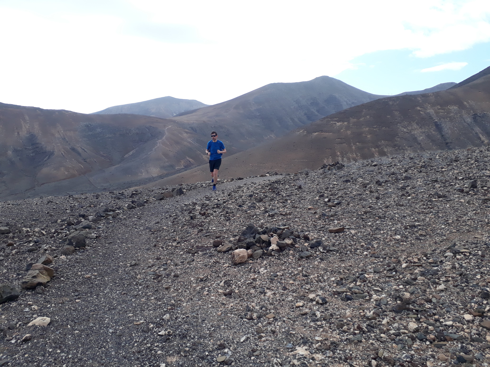
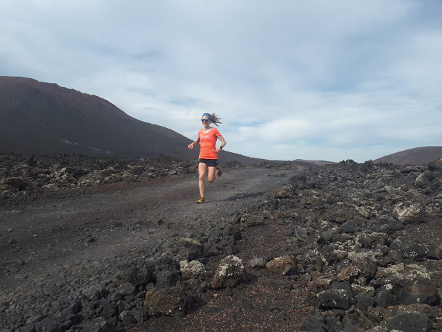
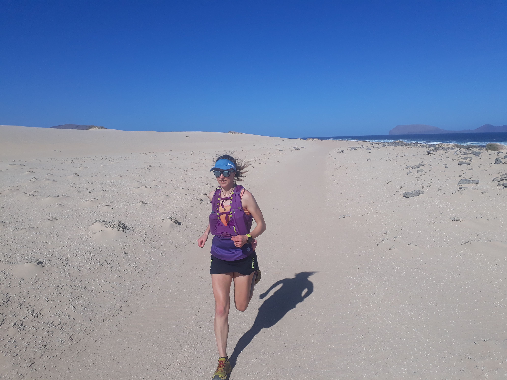
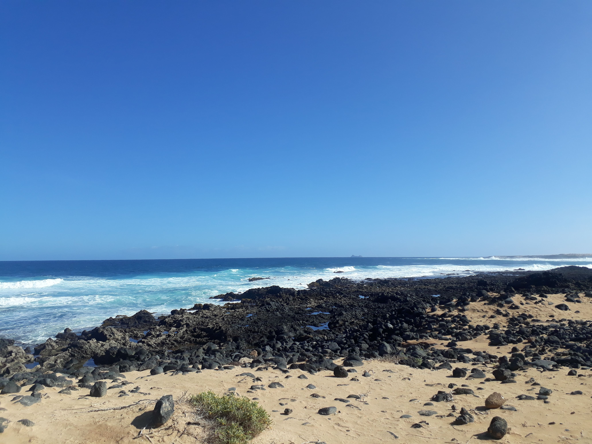
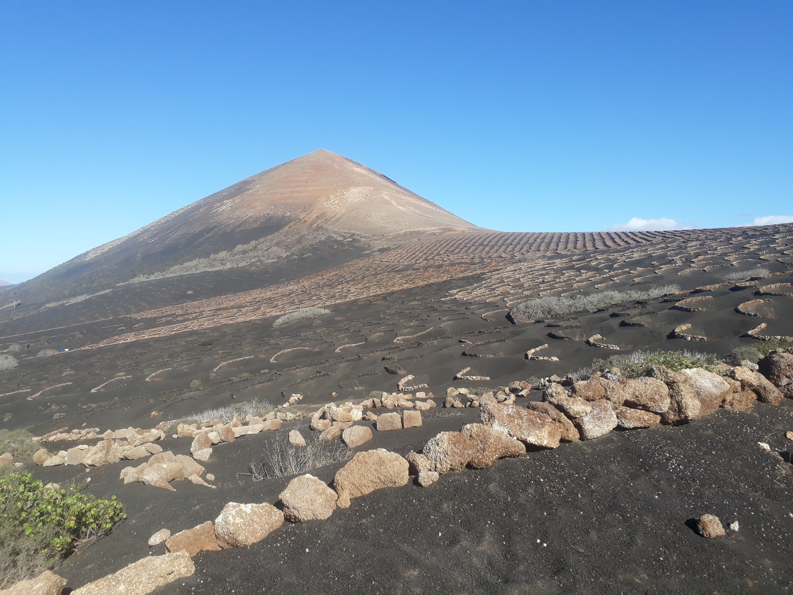
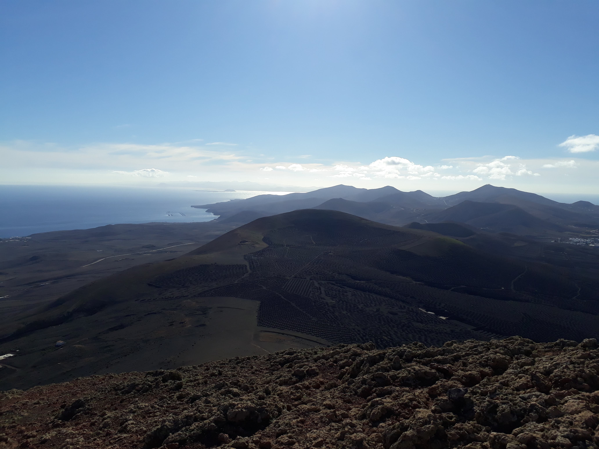
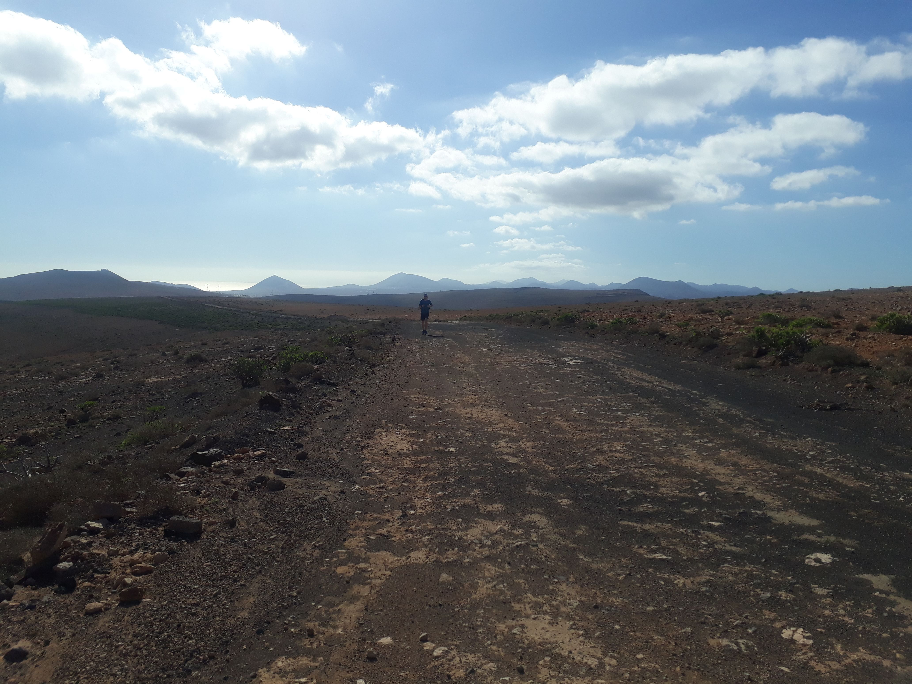
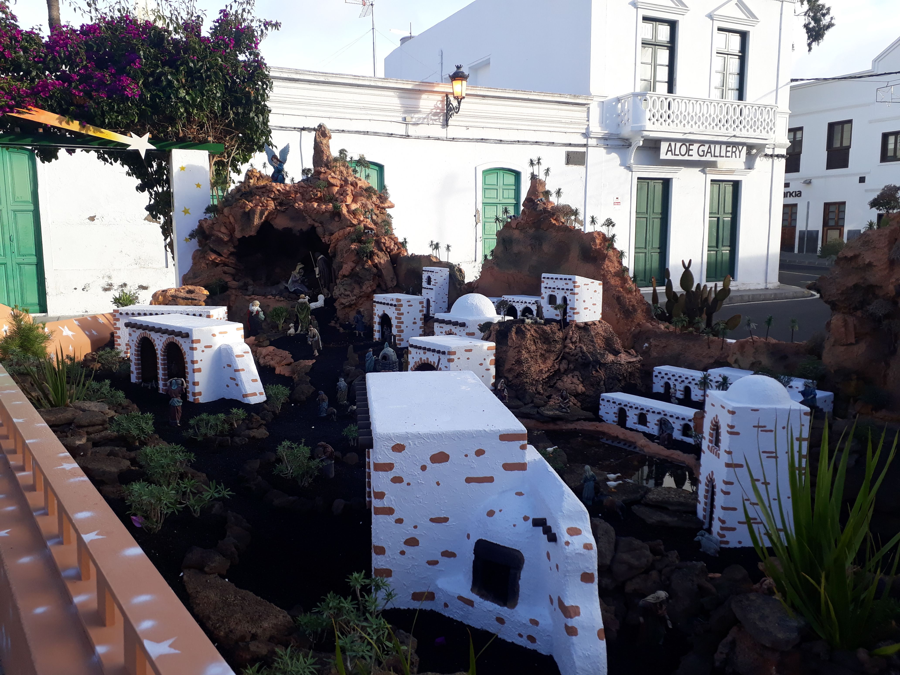
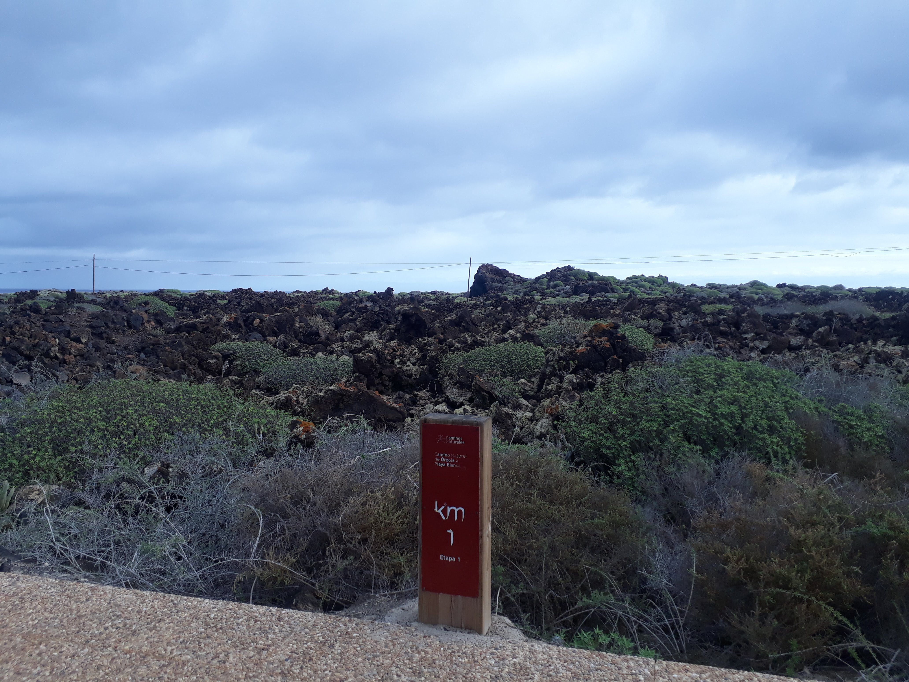

To continue my running tour of the Canary Islands I went to Lanzarote the week before Christmas. This was Will's first time to the Canaries and I hoped it would live up to everything I'd told him!

<!-- end -->

Our first day on the island was my birthday. After a lazy breakfast we ran in the Parque National de los Volcanoes around the Caldera Blanca. It was hot, dry and dusty, on a largely flat trail with some detours up volcanic craters. We had one sketchy descent where our path disappeared and we had to scramble down the rock face. We stopped to enjoy a picnic lunch on a rock. The last few miles were on road and I felt myself speeding up involuntarily as it somehow felt like the end of a triathlon! I realised why so many road bikers come to Lanzarote. The roads are super smooth, up and down long rolling hills without too much traffic.

A storm came in overnight and the next day was very windy and rather wet. We drove south to Femés. Rather misleadingly, the [guidebook](https://www.cicerone.co.uk/walking-on-lanzarote-and-fuerteventura-second) said the first part of the trail was quite exposed. We took a wrong turn and ended up on a very exposed rock face in rising wind, surprised that the guidebook would suggest a path like this even with a warning. Luckily we looked more closely at the route description and realised we were going the wrong way around a hill. We reversed to safety. The other side was far more sheltered! We combined two walks from the guidebook for an interesting run around some rocky craters. The final climb was a battle up a zig zag track into the wind, feeling like we could be back in Scotland (but a lot warmer)!

    

        
    

On the third day we took a ferry to the small island of La Graciosa and ran around the easter half of it. It was a huge contrast to the previous day and was we ran in glorious sunshine on pale sandy beach all the way. We hiked up Montaña Bermeja for beautiful views across Playa de los Conchas and the ocean. I resisted the temptation to try and run around the whole island. Instead we enjoyed a lazy lunch on the beach in the sunshine before taking the ferry back.

## GR131 south to north
The GR131 is a long distance trail crossing all of the Canary Islands. On Lanzarote it stretches 45 miles (72km) across the island. The "official" way to run it is north to south and the km markers are numbered for that. This is probably sensible as it means you will be going with the prevailing wind, rather than against it. However we didn't realise this and the guidebook describes the route the opposite way, so we ran from south to north over 3 days. This time I'd planned the days carefully with fewer miles on the first and last days to allow us to get to and from the trail. We parked our car in the capital city, Arrecife, and took a bus to the south.

    

### Playa Blanca to Conil (18 miles)
We started with our toes in the sea and narrowly avoided being soaked by a big wave. We ran out of the busy town of Playa Blanca amidst bemused looks from tourists who were lazing about in the sun. The suburbs were full of run-down buildings and wasteland, which turned into lava fields . The path cut through black sand and nothingness until the next village of Las Breñas rose out of the desert. It was the hottest day so far and Will did not enjoy the heat, the dull trail, and running with a heavy bag. I ran ahead and doubled back to him a few times, feeling surprisingly sprightly.

We stopped in Yaiza for coffee and a sandwich and both got a second wind. We detoured off the path to climb a volcano as we were bored of the flat sandy path through the desert! This was much more fun, with lots of loose sand and rock at the top which made the descent interesting. Our [B&B](https://www.google.com/travel/hotels/Conil/entity/CgoIjpWZ8YiA1YgpEAE?g2lb=2502405%2C2502548%2C4208993%2C4254308%2C4258168%2C4260007%2C4270442%2C4274032%2C4285990%2C4289525%2C4291318%2C4301054%2C4305595%2C4308216%2C4308227%2C4313006%2C4314846%2C4315873%2C4317816%2C4317915%2C4324293%2C4326405%2C4328159%2C4329288%2C4338068%2C4270859%2C4284970%2C4291517%2C4292955%2C4316256%2C4333108&hl=en&gl=uk&un=1&q=b%20and%20b%20conil%20lanzarote&rp=EI6VmfGIgNWIKRDAk-bBh-by560BEI3M8b7wlNiZ1gEQos6f9JH6r-tZOAFAAEgC&ictx=1&ved=2ahUKEwiPt93mtuXmAhXMOcAKHRmPDY4QvS4wAHoECAsQIw&hrf=CgUIlgEQACIDR0JQKhYKBwjkDxABGAcSBwjkDxABGAgYASgAWAGqAQwKAwijARIDCKYBGAGSAQIgAQ&tcfs=EhoaGAoKMjAyMC0wMS0wNxIKMjAyMC0wMS0wOFIA) was not far off the GR route and was comfortable with a friendly host who drove us to the coast for dinner.

### Conil to Haría (25 miles)

My left knee and the muscles around it stiffened a lot overnight, which meant the first part of the run was a painful shuffle. We got very lost at Montaña Blanca due to a lack of signs and confusing directions in the guidebook. We were halfway up Montaña Blanca itself when we realised we should be much lower and heading to the village of the same name. I decided to climb to the top anyway. From the village the route took a convoluted wiggle around several volcanoes to eventually reach San Bartolomé, which we could see ahead for ages. The main road we'd been on not too long before went directly to it and we grew irritated with the guidebook and whoever made the GR route! We continued on to the old capital of Teguise, growing increasingly hot and tired. Finally we arrived and found a shady cafe for lunch.

    

We climbed from Teguise to the highest point of the island (Peñas del Chache at 672m). We didn't go quite that high as it's out of bounds, but reached over 600m, which isn't very high at all! There were lots of people hiking around the top and cars parked in surprising places off the road, but the GR signs kept us straight here. Finally we could see the village of Haría below us. The descent to it was the best running we had all week - the trail dropping sharply through rocks and cutting across switchbacks in the road, skipping over boulders and bushes. I danced down, loving it. We finished with ice cream, coke and chocolate milk in the quirky mountain town of Haría.

### Haría to Órzola (7.5 miles)

    

My delight at the final descent the previous day had led me to be quite reckless as I ran down and forget about protecting my left knee. I spent the evening massaging the calf which had tightened and was made it painful to straighten my leg. I was worried I wouldn't be able to run at all but managed a slow shuffle to start. Every time I lifted my leg there was a sharp, stabbing pain at the top of my calf where it went into the knee joint. Luckily the route was mostly downhill to the sea at Órzola. After the muscle warmed up the pain eased and I could get into a rhythm, using gravity and momentum to push me forwards. I channelled all my thoughts into running with good form and trying to keep my left foot and arm doing the right thing. Finally we reached the final km marker of the GR131 and not long after, the port of Órzola and the end of our journey!

It was a lovely holiday, but I have to confess that Lanzarote is my least favourite Canary Island so far. Apart from scattered volcanoes it was very flat, and the trails were quite uninteresting and same-y. Whereas other islands have forests and lots of trees, Lanzarote was mostly desert, and I missed the variety. However the weather was lovely and December was a great time to visit as it wasn't too busy or hot. If I went back I'd definitely hire a road bike!

