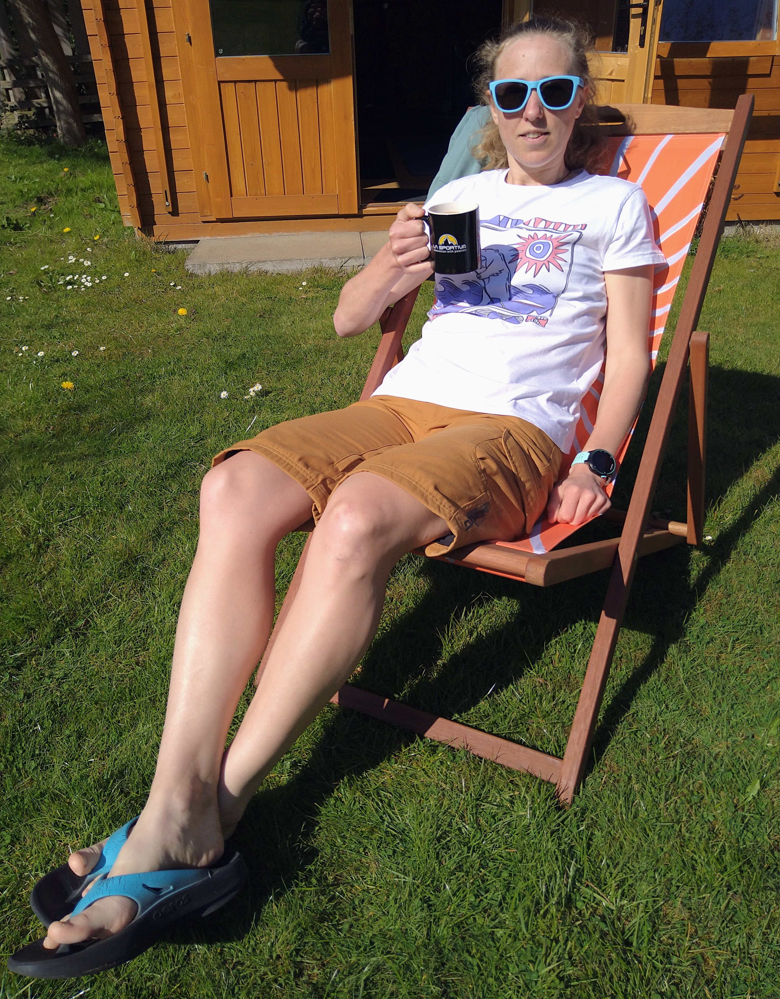

## Saturday 24th April 2021, 08:00 - 20:00

[Pyllon Exposure](http://www.pyllonultra.com/exposure-live) was a new event for 2021; the brainchild of Paul Giblin and the team at [Pyllon Ultra](http://www.pyllonultra.com/), who a lot of my friends train with.
The concept was simple, but sounded tough.
From the race website:

> in order to complete the race you’ll have to commit to taking part for the full race period (6, 12, or 24 hours). However, you won’t know exactly what distance you have to run. Each hour of the event, we will reveal how many miles you will have to cover that hour. It’s then up to you to choose how fast you want to run - run hard and gain some rest time before the next hourly exposure? Pace it more carefully knowing that you’ll have to survive another 5, 10, or 20 hours?

Will signed up for 6 hours and I signed up for 12.

<!-- end -->

    

Our lockdown in Scotland ended early which meant we could have driven somewhere new and exciting to run.
But after being in one place for the last seven months we favoured comfort and familiarity and the ease of returning home every hour.
We didn't consider that this would make it much harder to get back out later in the day!

I spent Friday baking and preparing snacks: rice cakes and polenta cakes from [Feed Zone Portables](https://feedzonecookbook.com/portables/), sweet potato cookies from [Run Fast Eat Slow](https://runfasteatslow.com/pages/books), savoury muffins and sweet muffins from the [Steam Punk recipe book](https://www.steampunkcoffee.co.uk/collections/gift-ideas-1/products/recipes-for-happiness-preorder), [cheese flapjacks](http://allrecipes.co.uk/recipe/24488/chilli-cheese-flapjacks.aspx). 
A scallion pancake that was a disaster - it was basically just flour and water that I didn't roll thin enough.
We threw the undercooked dough straight in the bin! 
I planned loops of different distances from the house.
In my head it was going to be a big snack party, with some running in between.
During the week I test-ran a few of my loops and tried to imagine going back out to do another after a short rest.
I couldn't visualise it.
I realised it was going to be quite a challenge!

We started at 8am with **5 miles**.
To make the most of the early hour we both ran along the canal.
I ran in towards town, knowing it would be too busy to do so later.
Will ran in the opposite direction - we didn't want to run together early on as we were running quite different races!
I knew I'd get carried away and try to keep up with him, which would likely bite me later in the day.
The sun was already shining and there were a few dog walkers and rowers about, all smiling at each other as we greeted the day.
There was a cold breeze from the east, making my first few miles a push into a headwind.
But it's hard to run slowly on the canal, especially when you're feeling fresh after an easy week!
Will beat me home by a few minutes and we took on some water while we waited for our next text.

**6 miles**.

We set off together again to do a loop along the Water of Leith and Woodhall Road.
Will went up West Mill road for a clockwise loop while I stayed on the Water of Leith to go anti-clockwise.
I crossed Gintas coming under the bypass.
I'd talked him into the 6 hour Exposure and he'd planned a 6 hour adventure round Edinburgh, seeing where he would end up at the end of each Exposure!
I crossed Will as I climbed the steps to Blinkbonny.
After an uphill start I enjoyed the rolling downhill miles towards home and arrived home shortly after Will again.
We were both feeling good and had espressos to celebrate!

Exposure 3 was **5 miles**.
For this one we both put podcasts on and ran towards Craiglockhart.
I caught up with Will at the traffic lights, dodging cars to cross the road.
The route was hilly: we ran up and around the side of Wester Craiglockhart hill and it was hard work to maintain a good pace.
This was a small dillema for a virtual race from home.
Most of the interesting runs from our house are hilly, but that wasn't practical for when we were trying to get back well inside an hour.
It meant we spent a lot more time running on tarmac than usual!
This loop came in slightly under distance as we approached our road, so we split up to lap up and down nearby streets.

Next up was another **6 miles**.
This time Will and I set off in opposite directions from each other.
I went through Hailes Quarry Park, then followed the cycle path through Stenhouse to the Jenners factory and joined the Water of Leith.
I sidestepped through the crowds of people playing in the sunshine in Saughton skate park and dashed across Gorgie Road.
This time I beat Will back.

Exposure 5 was only **4 miles** and I ran a short loop on the Water of Leith, Woodhall Road and Lanark Road.
Running back down Lanark Road I found it hard to control my speed down the hill and clocked my only sub-7 minute mile for the 12 hours!
Will had done a loop through Colinton and I caught up with him on the downhill as we turned for home.
We had a decent rest before the next Exposure, but were both feeling tired from the heat and from running fast.
I tried a red lentil rice cake but it was disappointingly bland and the texture was gloopy.
I won't make those again!
We agreed that this was a very hard challenge.
I was jealous that Will had only one Exposure left.
Why had I signed up for 12 hours?

Exposure 6 was **5 miles**.
We were both struggling so set off together for an easy out and back on the Water of Leith.
The trail is sheltered from the wind.
The way out is uphill but that means an easier run back when you're more tired (at least this is what I always tell myself).
It gets super busy at the weekend with families and dogs but in most places the trail is wide enough to hop to the side and overtake.
I'd assumed I'd get left behind but Will soon dropped behind me.
By the Colinton tunnel I couldn't see him at all.
I could hear the echo of his footsteps slapping the tarmac through the tunnel.
His steps sounded tired!
The half mile before the turnaround felt like a lot of effort.
I followed the diversion onto the main road and continued along there until it was time to turn, sidestepping people and parked cars.
Luckily I was motivated by the thought of the downhill.
It's barely noticeable to look at but when I run intervals here I run substantially faster on the way back because the slight gradient makes me feel like I'm flying!
Coming back through the tunnel I spotted a guy running towards me wearing an Exposure race bib, but there was no time to say hello or even wave.
As usual the tunnel was full of people standing around reading and photographing the mural, unaware of anyone passing through.
Luckily I've danced through this tunnel enough times in the last year to barely break stride.
The last mile was definitely a slog and the uphill to home felt like climbing a mountain.
Will returned a good 10 minutes later looking slightly shell-shocked.
It had been a long shuffle for him, but he'd just run the furthest he'd ever run in a day!

    

I was feeling slightly broken and not sure if I could continue.
Luckily the best text message came through with the mileage for Exposure 7 - **1 mile**!

_I could run 1 mile._

Revived by that positive thought I headed out to the canal and managed to run a mile in under 8 minutes.
Now I needed to recover before what was sure to be a big next Exposure!
I ate a bagel and a cheese flapjack and lay on the floor with my legs up against the wall.
My legs were twitchy.
My back was chafed and my toes were blistered.
I felt like a wreck and there were still five Exposures left!
My heart was racing so I focused on slowing down my breathing, closing my eyes, and trying to relax.
With 15 minutes to go I got up and changed my clothes and shoes, and had another espresso while I waited for the next text to come through.

**5 miles**.

Will told me I could do it and suggested I run out and back along Lanark Road.
I had no better ideas, and hadn't done that yet, so I agreed.
The first mile to the traffic lights is a slow and painful uphill slog on the best of days.
Today at least the wind was on my side.
After the traffic lights I settled into the run and felt much better by the turnaround.
I took the final downhill mile a lot slower than usual but still finished in a respectable time.
The afternoon was roasting and I changed my top again and had a rehydration sachet, then put my legs up again for another ten minutes.

Exposure 9 was **3 miles**.
I headed out feeling ok and ran along the canal to Hailes Quarry Park for a few loops.
After the first two miles I suddenly felt terrible and slowed down to a trot.
I made it back home but didn't feel good at all.
I was shivering despite the heat and put a down jacket on as soon as I got through the door.
I tried eating a polenta cake (it tasted much better than the rice cake, but it was not what I wanted at this point).
Will gave me some mini cheddars which tasted like the most amazing food ever!
Then the text I had been dreading came through: the next Exposure was **6 miles**.

_I can't do it_, I told Will.

He told me I had to try.

**_Go. Shuffle. You got this._**

So I shuffled out and down to the Water of Leith, planning to run the revers of the 6 mile loop I'd run on Exposure 2.
This meant the climb came shortly after the first mile.
I made a pitiful attempt to run it but soon resorted to a march.
Luckily the climb is short but steep, so running up it isn't much quicker than walking.
However I was finding walking a bit of a challenge too.
I had to grab hold of a tree and use it to haul myself up the hill.
Last time I had to grab hold of that particular tree was when I crashed into it on my snowboard earlier this year.
At least this time it was helpful!
I managed to start running again at the top.
I shuffled through Campbell Park, onto Woodhall Road and through to Blinkbonny.
As I rejoined the road I saw it climbing up and away from me and couldn't face another climb, so turned downhill instead!
I shuffled back along the Water of Leith to the canal junction, and had to walk the uphill to the bridge over Lanark Road.
Then I had to walk again up Arnott Gardens.
I tried to make myself feel better by reminding myself that I have to push my single speed up this road when it's windy!
Unfortunately I still had another half mile to run so I had a slow plod up and down the road till my watch finally beeped for 6 miles.

    

As Exposure 10 had taken me 55 minutes I had little time to spare and had already received my text for the next hour.
**2 miles**.
Remembering the magic powers coke can have during an ultramarathon I drank most of a can, hoping that the sugar and caffeine would save me.
After a 10 minute rest I went back out.
I ran a mile out and a mile back along the canal and felt a lot better than I had on the last Exposure.
I tried to focus on just those 2 miles and not think about what the final hour would bring.
Back home again I finished my coke and lay back on the floor again.
By now straightening my legs was too painful so I elevated them on a gym ball.
I was still shivery and my legs were still shaking.
My body was trying to tell me to stop.
Will gave me some hot water to warm me up.
My friends messaged with encouragement for the final Exposure.
I waited fearfully for the text, trying to mentally prepare for a big number.

It was **4 miles**.

I went back to my route board and picked a 4 mile route I hadn't yet run.
It meant a big push uphill to start, but then some flat and downhill running and a flat last mile along the canal.
I pulled myself together and put my headphones in and the [Shoot Your Shot SWAP playlist](https://open.spotify.com/playlist/0jbx2LsInVAAIhhu6XXLXj?si=PuXoG1Z-QBmxl1P9vV9EUw) on.
I staggered outside for the final time.
Knowing that the first mile was uphill and going to be horrible somehow made it easier.
I plodded along focusing on my music and blocking out the cars hurtling past.
I endured the first mile and then I knew I would be ok.

_I had this._

The streets of Baberton were bathed in the evening sunshine, and I enjoyed a glorious downhill to the canal at Wester Hailes.
I knew it was still a misleadingly long way home.
The buildings and bridges along the canal all look the same here so the trick is to assume there's always another corner to go around.
Eventually you are pleasantly surprised!
I felt almost euphoric as I ran along in a semi-dehydrated haze.
Probably not the best state to be in running through Wester Hailes on a Saturday evening, but there weren't many people around!
Finally I reached the level crossing at Kingsknowe.
I'd been avoiding this all day in case it shut as I arrived.
Now I felt lucky, and besides, it wouldn't be a disaster if I had to finish the final Exposure somewhere other than home.
Upon thinking that I realised it wasn't true.
I wanted to finish at home very much.
I was looking forward to laying down and not needing to get up and run again!
Anyway I was lucky and the barriers were up.
I ran up the final small hill.
I'd hoped for a glorious, triumphant run in to finish in front of my house, but life is messy and I had to run 0.2 miles further!
I ran up and down the street a few more times.
I don't know what the neighbours thought as they watched me stagger out of my house and limp into a run every hour, and shuffle back up and down when I returned!
Extra distance done, my watch finally beeped outside my house and I collapsed inside.

The next few days were a struggle.
I needed assistance to get up from sitting down and to get down the stairs.
My quads felt like I ran a hard road marathon.
My hamstrings and ankles were sore and my toes blistered and bleeding.
It was a great feeling after over a year without racing!
Despite being a virtual event it felt like being part of something bigger.
There was a real thrill coming back and checking the leaderboard every hour and waiting for the next text!
It was a unique event and I although I probably started a bit fast, I don't know that I'd run it any differently.
I found the rest periods hard to manage and I let myself stiffen up during these which made it hard to start running again.
Usually in a long race my mantra is _keep on moving_, so this was very different.
Usually you don't have the time during a race to realise you have blisters and chafing!
There was a lot of recovery time where I had to not let my mind or body think it could stop.
Luckily my self-talk was a lot more positive than it had been at my last long race ([Lavaredo](https://powderach.com/posts/lavaredo-120km)).
This time I told myself _you got this_, rather than doubt myself.

**_Surrender is your only option_**

Aside from a dark 10th Exposure I had a positive experience.
I ran 52 miles in under 7 hours (6:56:47) which is certainly faster than I've run that far before.
But I could have run a lot further in 12 hours by running continuously, and I suspect I would have felt less destroyed afterwards!
Running this way was fun but not sustainable.
I'm now excited about more racing this summer.
Thanks to the Pyllon crew for a fun and impeccably organised event.
I look forward to the next one!
