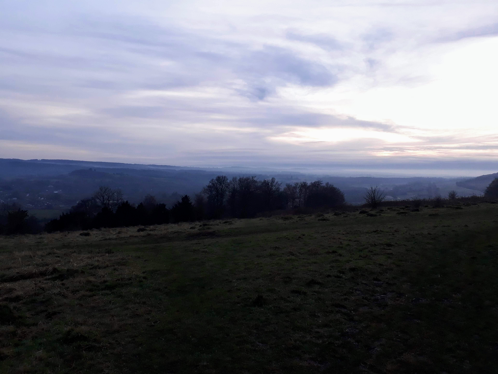

Between Christmas and New year I _almost_ recced the [North Downs Way 50](https://www.centurionrunning.com/races/north-downs-way-50-2020). It was a half plan that sort of fitted in with the holidays. We were down south anyway visiting my folks and trains were running. I booked a Travelodge in Dorking for the evening of Friday 27th December. After Lanzarote my knee was more sore than I wanted to admit but I hoped it would hold out. It felt much better after an emergency massage from [Grant](https://www.equilibry.co.uk/), and he taped my knee up for good measure. We bailed on the annual Boxing Day race due to bad weather and I ran alone instead, testing the knee. It didn't hurt on every step and there were moments where I forgot about the pain. I clung to these.

<!-- end -->
It took 4 trains to get us to Farnham, where the North Downs Way starts. It was dry, not too cold, and we were traveling light, excited to be free and alone after a family Christmas. Excited for another new adventure.

We set off. Road, trail, road, trail. We didn't get lost till the second mile. We checked the map and went back to where we'd missed the sign. After 5 miles the trail was flooded. Water obscured the path as far as we could see. We checked the map again and found a way around on a road. We figured we'd done about a mile extra.

The route was muddy and lots of fun. Through forests on a winding trail, across rolling hills, emerging suddenly in small villages with huge houses. Sticky mud that sucked each step into it with a delightful squelch. It was my favourite sort of trail.

We didn't stop to drink until two and a half hours. We'd been having too much fun, but we shouldn't have waited this long. We bypassed Guildford and quickly got hungry and wished we'd stopped. We were covered in mud. Finally we reached an amazing cafe at Newlands Corner called [The Plucky Pheasant](https://thepluckypheasant.com/). We were the muckiest in there but there was already mud on the floor so we didn't feel out of place. We ate paninis and treated ourselves to chips, craving the warmth and saltiness. Revived by food and coke we set out again in high spirits, hoping to reach Dorking before dark.

We'd eaten too much. For the next few miles I felt dizzy and ill and Will felt sick. We slowed considerably. I told stories of running cross country races at Denbies Wine Estate and we fantasised about arriving there. It seemed a long time coming. Finally we arrived, just ahead of the rapidly approaching darkness, and saw the shapes and lights of Dorking spread below us. Reaching the main road we turned off the trail and towards town and a hot shower.

We had a lovely evening of pizza and Star Wars, although it wasn't a real cinema and the seats had no leg room. After nearly three hours of cramped legs my knee stiffened and walking was painful. We consulted the map and decided to finish early the next day, at Merstham. It was an easy place to get a train from, and meant a much shorter run.

The first mile on the road back to the trail in the morning was slow and painful. The same stabbing pain I'd felt in my calf the previous week had returned and it made lifting my leg very difficult. Once I got into a rhythm on the flat or downhill it was manageable, but uphill was not good. I hoped it would ease off as my muscles warmed up. Unfortunately from Dorking the North Downs Way goes up Box Hill. It wasn't quite the start I was hoping for! More fortunately, it's mostly big steps, so there was little running anyway. I had a tantrum partway up, telling Will my knee was sore and I couldn't do it and it was too hard and there was no way I could run this in a single day. He suggested firmly that I pull myself together. By the time we reached the top of the hill I'd snapped out of it. We chased a group of mountain bikers along some muddy trails and luckily lost them before the long gradual descent. It was great fun and we loved having the trail to ourselves here!

By Reigate there were people everywhere and we slowed to appreciate the final views and the last few miles. We stopped running as we entered Merstham and had time for coffee and to change into warm clothes before the train arrived.

I'll be back to recce the final section soon!