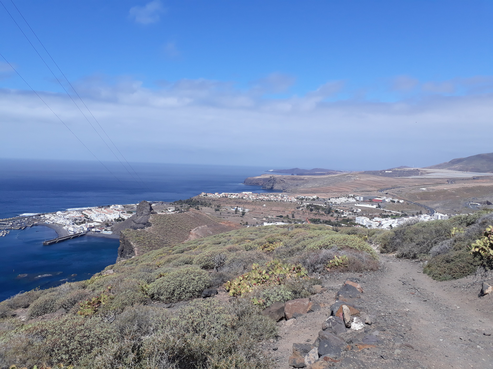

This was going to be a post about my trip to Gran Canaria at the end of February. I was meant to be running the marathon at TransGrancanaria but my knee operation meant that wasn't possible. I went on the trip anyway and enjoyed the race weekend cheering on some friends who were running.

<!-- end -->

The world has changed dramatically since the end of February. I can't quite muster the energy to write in much detail about that past world. It feels like a lot longer ago than a few months. However looking back at the photos have cheered me up on this stormy Saturday, and helped me recall a great few weeks of training. It was before I was able to run post-operation, so I biked, swam, aqua-jogged and hiked. Since then my knee has recovered a lot and I'm now running four times a week, but still enjoying riding my bike too. I'm still finding my way in this new covid-19 world, establishing new routines and exploring from my front door. One of the big lessons of the year for me so far is appreciating slowing down and not always looking to the future and rushing on to the next next adventure.

## Training when you can't run

I started each day aqua-jogging in the [sea pools at Agaete](https://www.hellocanaryislands.com/natural-pools/gran-canaria/las-salinas-de-agaete/), ten minutes walk from where I was based. It was chilly before the sun came up and I was glad to have brought a shorty wetsuit with me. I aqua-jogged in laps around one of the larger pools, quickly establishing a line that would avoid sharp rocks on the bottom. I'm a bit scared of what might be underneath me when in open water, so this was a great opportunity to face that fear every morning!

    

        
    

    

        
    

After a morning's work I had a quick swim at lunch time (it had to be quick because the water was freezing!) and then hiked up and down the nearest hill. After work every evening I rode my bike until it got dark. I hired a road bike for the first half of my stay, and a mountain bike for the rest, both from [Cyclo Agaete Bike Rental](https://www.facebook.com/Cyclo-Agaete-Bike-Rental-641591279633781/). The bikes were excellent and the price very reasonable.

Most of the roads were smooth and empty, with lots of big climbs. I could feel myself getting stronger each time I rode! Occasionally I'd make a bad route choice: what I thought from Google maps was a proper road turned out to be a gravel track. One evening I narrowly beat the darkness home after wobbling precariously along dirt trails for miles on skinny road tyres.

I was lucky to have some great mountain bike trails right from my doorstep that weren't too technical. To begin with I was worried my knee wouldn't cope with downhill mountain biking, but my confidence (and strength) grew each day. My regular trail started with a 40 minute uphill slog in the sun. It was worth it for the views and the downhill.

On my last day of mountain biking I explored some new trails that were a bit too steep and technical for me. I fell hard on my elbow and ended up with a deep cut. Luckily it was towards the end of my ride, but gave a fright to the lady who was out walking her dog nearby. Her dog ran up to me and was jumping excitedly at me, while I held my bloody elbow in the air. I think she thought her dog had bitten me! It took a few weeks of removing bits of black sand from the cut when I was back home before it healed.

I headed south for the [TransGrancanaria](https://www.transgrancanaria.net/) race weekend and cheered on some friends who were running. I hired another road bike (this time from [Free Motion](https://www.free-motion.com/) in Maspalomas) and cycled a big hilly loop on race day, passing one of the race checkpoints three times.

I was lucky to catch someone I knew on each loop past the checkpoint, although I missed seeing Meryl, my roommate for the weekend. She won the 30km race and was through much so quickly I hadn't arrived yet! Another friend Katie had a great race in the marathon, finishing 5th amongst a very competitive Spanish field.

    

        
        Carnethy club mates Dorothy and Billy Elliot
    

    

        
        Katie Kaars Sijpesteijn
    

Despite not racing myself I was glad to be able to soak up the atmosphere and feel part of the race. It made me excited to start back running again!