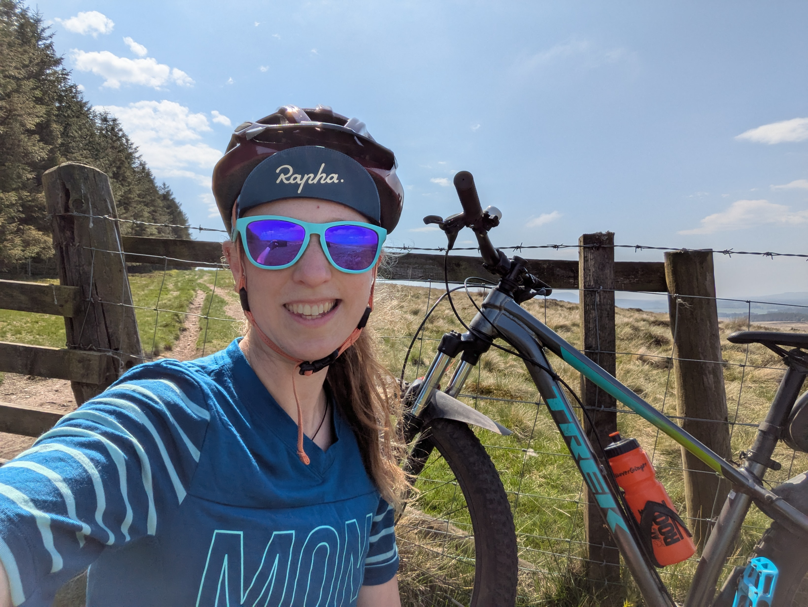
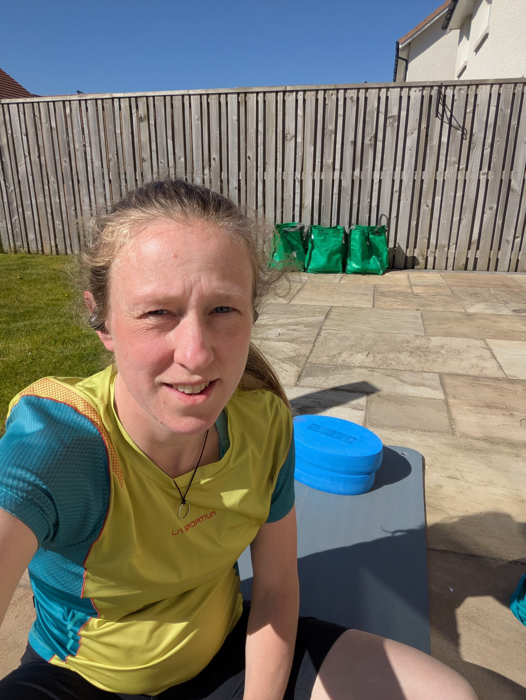

This post is inspired by a few conversations I’ve had recently.
I was on the [Pyllon Ultra Pod](https://www.pyllonultra.com/podcast) talking about running through pregnancy and postpartum with John Connolly and Paul Giblin.
It was refreshing to have this conversation with two men and I appreciated their openness and willingness to engage on the topics.
Subsequent conversations with friends made me realize that there’s still lots of uncertainty and confusion about what you can do when pregnant.
I wanted to share what I’m doing to stay active this time around, with the caveat that my pregnancy has so far been straightforward.
My midwife has advised that staying active makes sense for me, but everyone and every pregnancy is different so this won't work for everyone.

<!-- end -->
I must confess I don’t love being pregnant!
I am excited to have another baby and I’m grateful that I could get pregnant; I know this is a privilege.
But I find the everyday reality difficult and often find myself counting down the days and weeks till the baby will be born.
This pregnancy feels similar to my first, but I’m more tired at baseline as I have a toddler to chase around and who doesn’t want to go to sleep till 10pm (which is much later than when I want to be in bed myself)!

So what does training look like at the moment?
I certainly don’t have any sort of rigid plan as I’m trying to be guided by how I feel each day.
I felt pretty awful again during the first trimester and didn’t do much at all, but since about 20 weeks I’ve had more energy and minimal nausea so have been able to get out more.
For the last few months I've done something like this:
- Monday: run 3km to do a [Bump Club](https://thebumpclub.com/) class. Afterwards I’ve been doing a longer run / hike up into the hills for a few hours with a lunch stop up a hill. I’ve enjoyed spending some time in the hills, but recently this has become too tiring and I've struggled for energy the following day. So for the last few weeks I’ve swapped the longer run for a cruise in the hills on my mountain bike instead.
- Tuesday: [online pregnancy pilates](https://www.jillyreidphysio.co.uk/pilates) and an easy evening run (usually 5-6km) with our local mum’s running club. I struggle to keep up with the main group now but there are usually some newer runners that I can hang with.
- Wednesday: rest
- Thursday: 30 min run followed by 20 mins of core and strength work
- Friday: Bump Club with an 8km cycle to and from the class with Jane on the bike (it's uphill on the way home so this is hard work)!
- Weekend: run for about an hour run one day, and rest the other

Some days I feel great so I run further or push harder.
Other days I feel tired so I’ll cut a run short, opt for the easier version of an exercise, or skip the workout altogether.
I’ve got it wrong a few times and overdone it by running for too long.
When that's happened I felt ok at the time, but was extra tired and had some pelvic floor weakness the next day.

    

I’m doing lots of core and strength work as I think it set me up to recover well postpartum last time.
It’s also an element of training I often neglect when I’m focused on a race so it’s fun to invest the time in doing it while I’m running less!
I particularly like doing classes that are specifically designed for pregnant women, or where there are always safe variations given.
For example, at Bump Club I've switched from doing core work on my back to doing it on my hands and knees.
I get to work the same muscles but in a safe and more comfortable way, and Sarah the instructor always checks on my form and that different exercises feel ok.
The pregnancy pilates classes are pre-recorded but physio Jilly always gives different modifications for each exercise.
  

Although the research on exercise in pregnancy has increased a lot during the last ten years there are still huge gaps.
Most of the existing research is focused on how exercising affects the fetus rather than how it affects the mother.
It’s difficult to get studies through ethics committees and also to find participants when there is so much that's still unknown.
No one wants to approve, or volunteer for, a study that might harm a baby!
However, as more women are staying active (and at high levels) during pregnancy, hopefully this means that more research will follow.
I’ve been listening to the [Active Mom Podcast](https://carriepagliano.com/active-mom-podcast/) with Dr Carrie Pagliano which is great for keeping up with the latest research.
She interviews researchers and health professionals who are leading on this, as well as interviewing athletes about their stories.

One of the main challenges I’ve found when training during pregnancy is feeling like I've lost my athletic identity.
I struggle to feel like an athlete when I'm not training with progression or purpose.
This feeling is easier to handle second time round as I have the experience and knowledge of having been here before and got back to running at a high level.
I frequently remind myself that pregnancy is just a short time in the context of life!
I also tell myself that anything I can do now (walking, core work, strength training) should make getting back to exercise easier, plus it helps me feel more like myself!

I do find it hard to accept the physical loss of control of my body.
As an athlete I’m used to having fine-grained control of my body through diet and training.
In pregnancy I can’t control the way it changes and my growing belly is a constant reminder of this.
Everything feels harder as I’m carrying more weight and my heart and lungs are being squished by the baby.
I get out of breath very easily!
However one advantage of being an athlete is that I’m good at listening to my body, and trusting that it knows what it's doing.
Accepting that I can't control everything is also good practice for motherhood!

I’ve been to see a women's health physio during my pregnancy (something I also did last time).
This time it was mainly for reassurance and advice around pelvic floor training.
I found that my pelvic floor was already weaker at the start of my pregnancy than it was last time, so I’ve had to do more work on this.
My bump grew bigger earlier than last time, which then means the increased weight pushing down on my pelvic floor will be for longer.
This is definitely something I’m conscious of when running, especially on downhills, and I walk sections if I feel uncomfortable.

I am more confident in what I’m doing this time, even though it’s a higher volume than last pregnancy.
That confidence comes from having gone through it before, but also from learning from others and what they have done.
Recently I particularly enjoyed listening to Leah Yingling on the [Trail Network Podcast](https://sandyboyproductions.com/the-trail-network/) (episode 55) talk about doing a 50km race when 5 months pregnant and how it was much harder than she had expected!
I'm sure my training volume will decrease as I get closer to full term, but I'll certainly try to stay as active as possible to the end.

