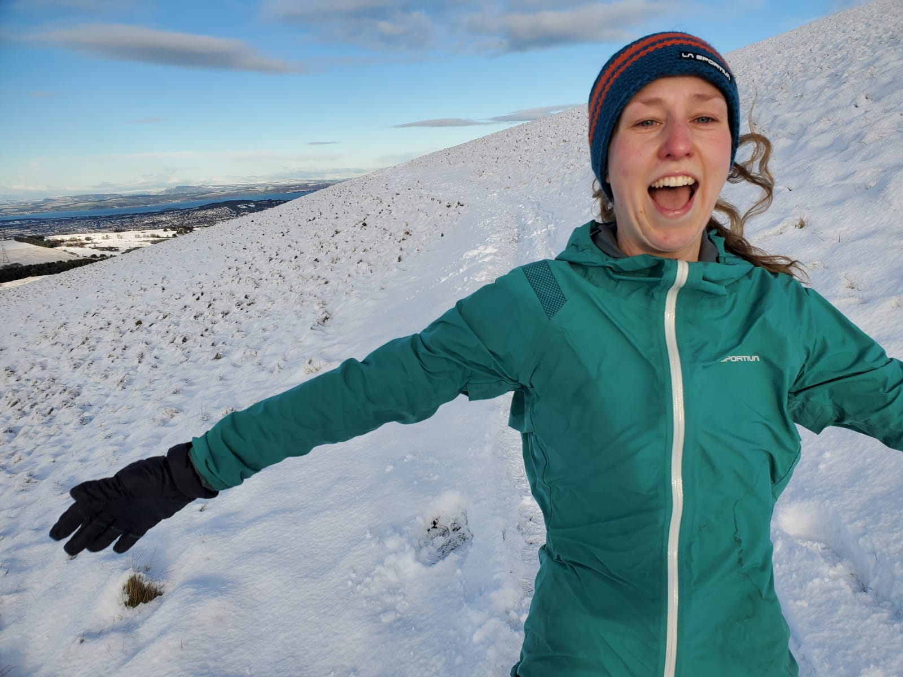
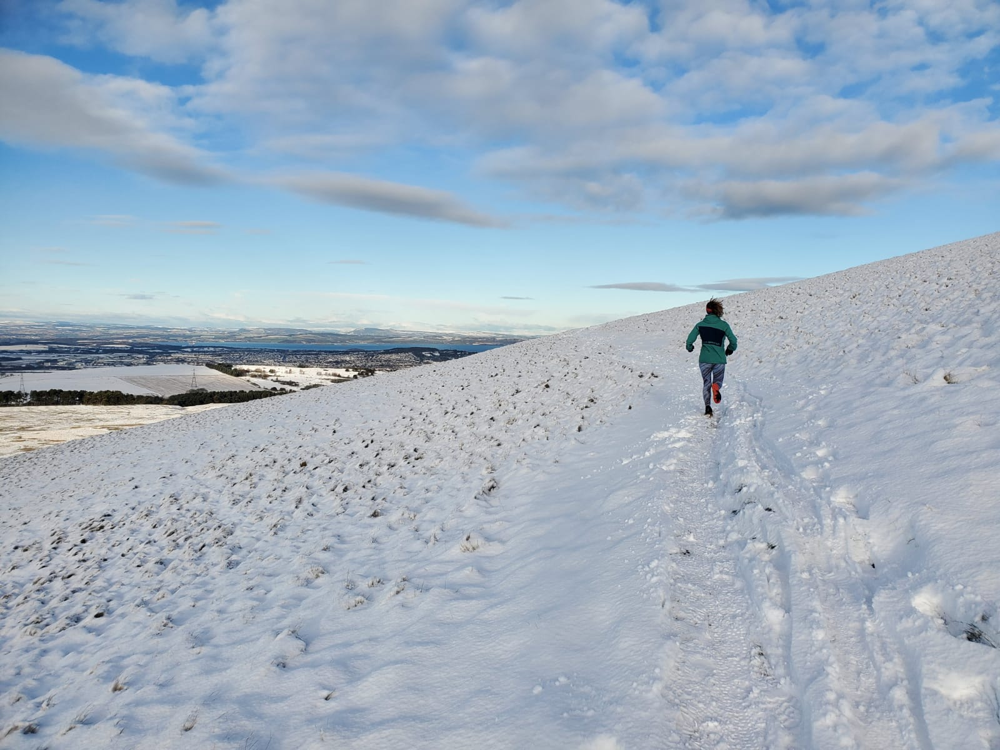
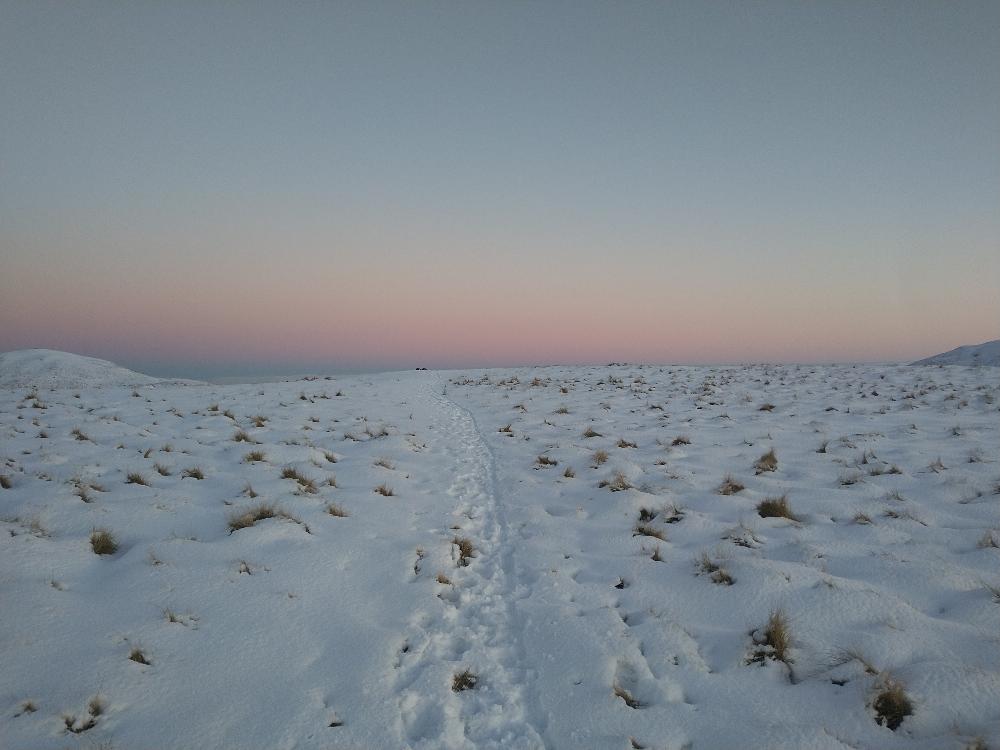
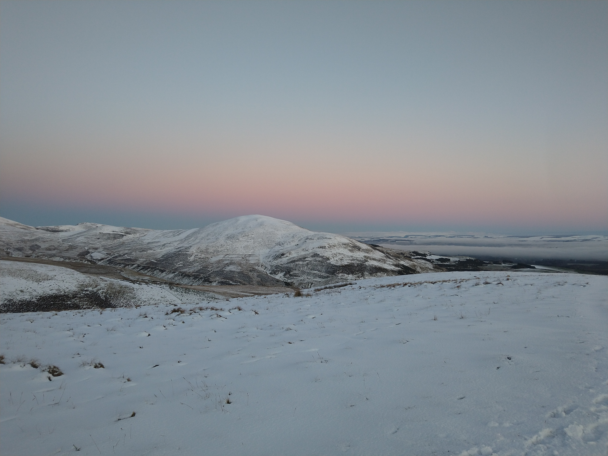
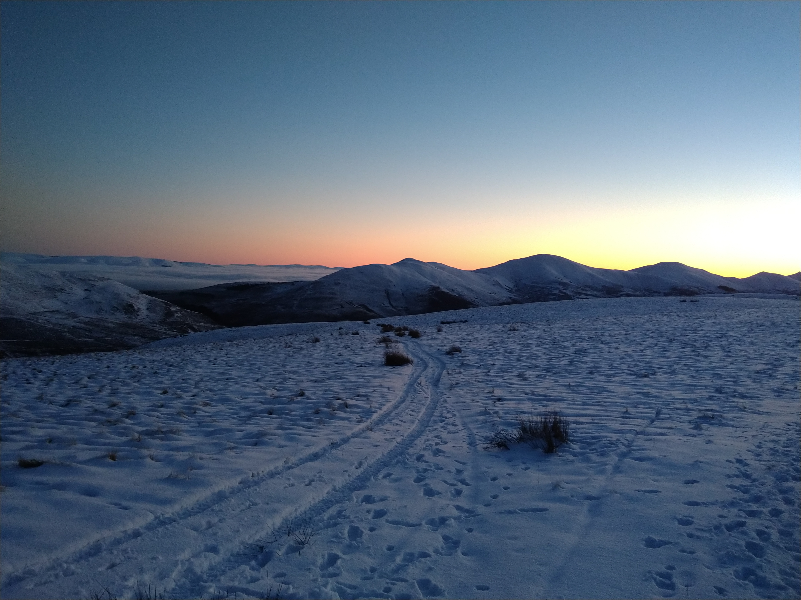
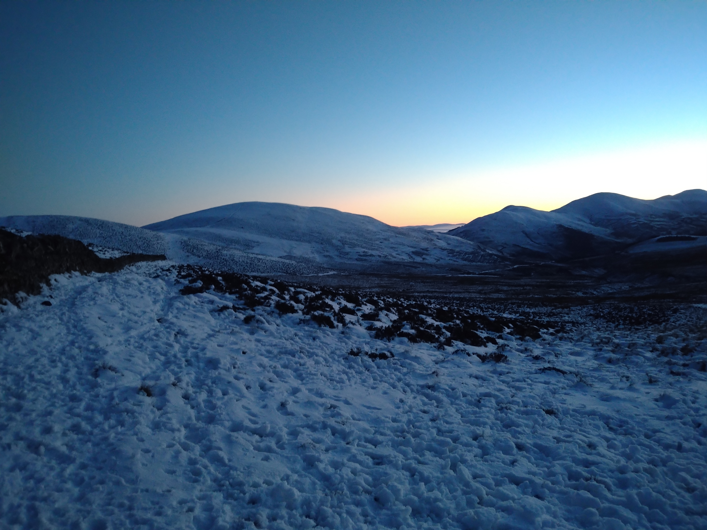
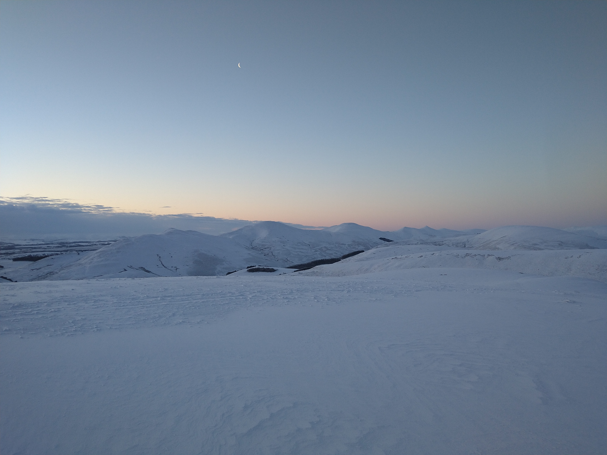
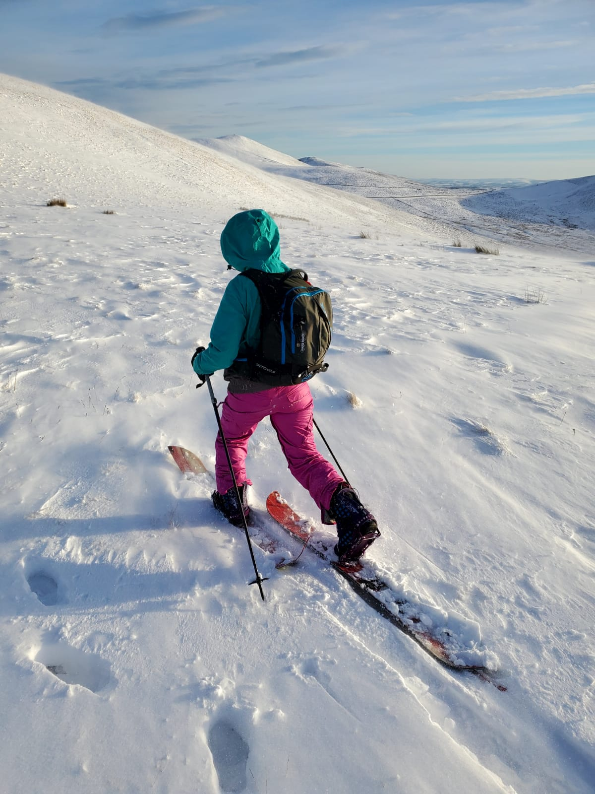
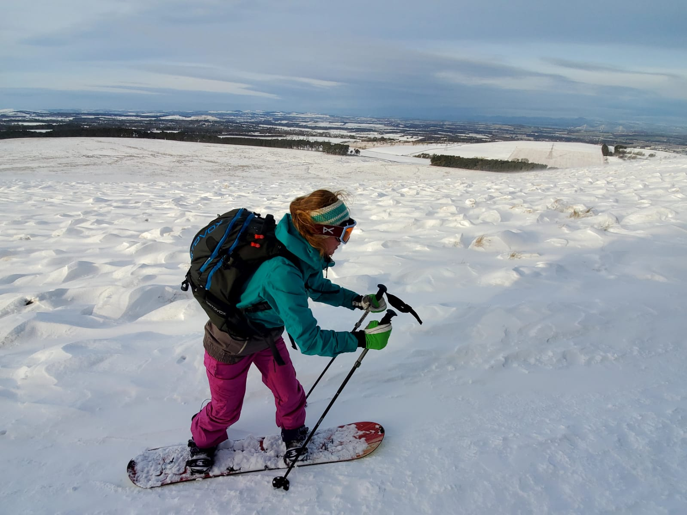
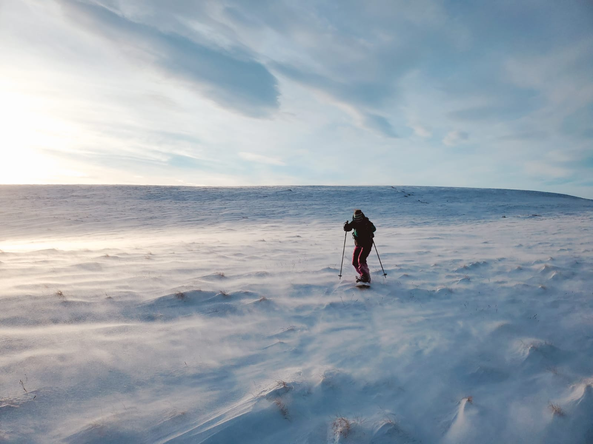

Some photos from running and sliding in the snowy Pentlands over the last few weeks...

A long run that I didn't want to go on ended with this beautiful sunset. I didn't want to go home!

I should have headed back after Capelaw but it was still light and beautiful so I pushed on to Allemuir. It suddenly got dark very quickly! I took a too-steep descent off the summit, breaking trail through a heavy crust of snow, feeling nervous all the way to the pumphouse.

After more snow overnight we made it back up Capelaw for sunrise.

We got out early Saturday morning with ski touring kit before the temperature rose and lots of the snow melted. It was cold and windy and we were very glad to be wearing full ski gear and goggles!

    

        
    

