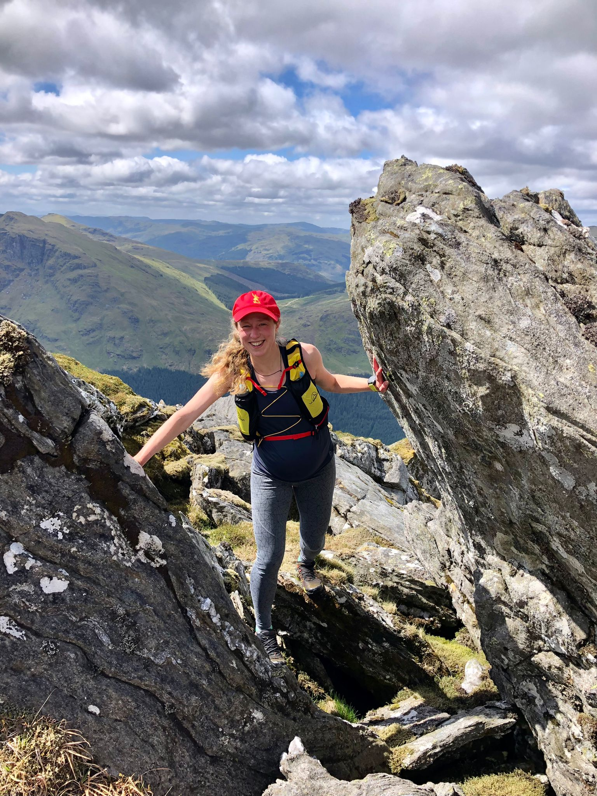
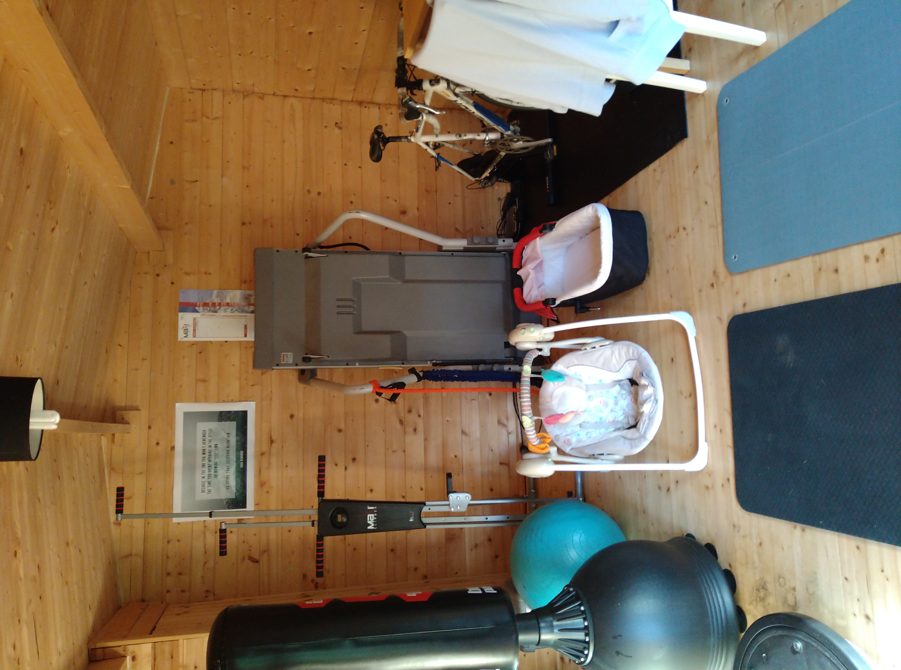
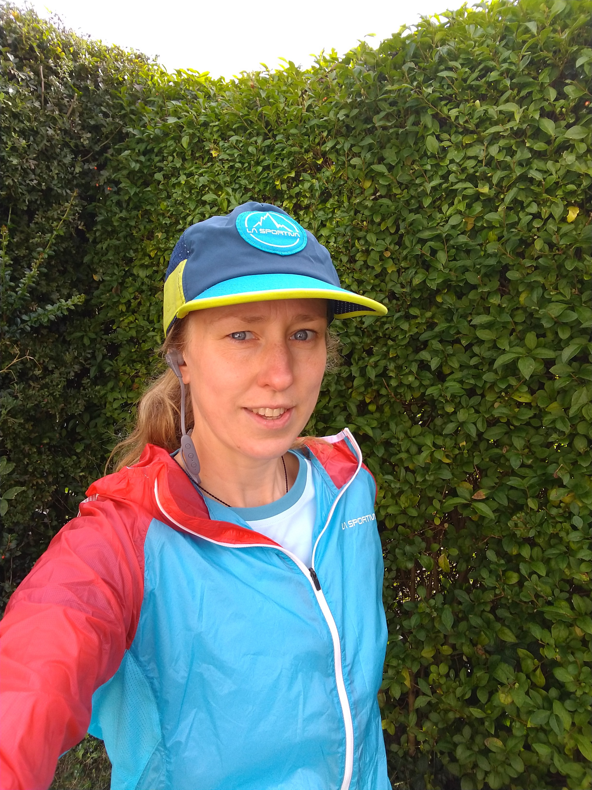
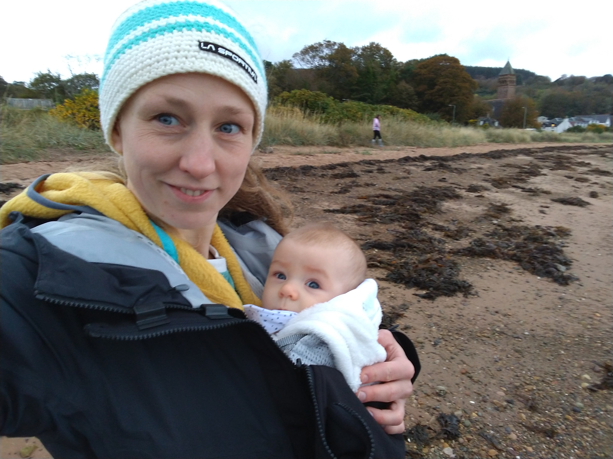

I've read lots of stories of people who tried to return to running too quickly after having a baby, and had problems later. I hope not to have a story like this and have been erring on the side of caution. I started the [NHS Couch to 5k](https://www.nhs.uk/live-well/exercise/running-and-aerobic-exercises/get-running-with-couch-to-5k/) program at 17 weeks post-partum. I'm currently in the middle of week 4. I'm finding it slow going, but it's giving me a good structure to avoid rushing back into running, and helping me work out where I can fit running in to life with a small baby!

<!-- end -->

Jane was born on Saturday 11th June. We were out of hospital the next day and the day after that I did a very short walk around the block. I was lucky to have a fairly straightforward birth. It was still the hardest and most extreme thing my body has ever been through and I didn't feel prepared for it! I kept very fit during pregnancy and ran up to the week of birth, plus did lots of swimming, cycling, and pilates. A few weeks before Jane was born I ran / hiked a Munro and some Corbetts for Carnethy's [Corbetts in a Day](https://carnethy.com/2022/05/corbetts-in-a-day-ticked/) challenge. The week post birth felt like the week post 100 miler, including the blurry headedness, with the addition of very little sleep, and a brand new tiny human to look after! I took it very easy. By the end of the first week I was able to slowly walk a slightly longer loop (probably 10 mins max) with Jane in a carrier or buggy.

I slowly regained some fitness by walking, exploring further each day with the baby in the carrier. If I went too far my insides felt sore in a way I can't really explain, but it felt weird and scary and made me rest up and back off. At the 6 week mother and baby checkup the GP asked if I was ok and I said yes. This seems to be the extent of postnatal care for the mum from the NHS, which focuses almost entirely on the baby once they are born. This makes sense as newborn babies are completely helpless creatures that need all the support they can get. But after the enormity of changes in my body through pregnancy and childbirth I wanted a much more thorough checkover than this!

I booked in to see a women's health physio on advice from other mum athletes. The physio was super booked up and the first available appointment was 10 weeks after birth (this is a great sign that other women are getting checked out post birth too). Before this I'd been walking a lot and doing pelvic floor exercises every day (religiously throughout pregnancy and I restarted after the first week). Physio [Edel McCann](https://www.physiomummy.com/) assessed the separation of my stomach muscles (1cm) and the state of my pelvic floor. It was ok but had some weakness at the front. At this point I had pretty good pelvic floor control apart from if I unexpectedly sneezed! She explained that everything around my pelvis and hips was still super tight after giving birth and I needed to stretch it all out, then strengthen back up before thinking about running again.

After seeing the physio I started doing weekly postnatal pilates to rebuild my core strength, which I'm continuing to do now. I do a pre-recorded online class with [Jilly Reid](https://www.jillyreidphysio.co.uk/pilates), another women's health physio. I'd been seeing Jilly during pregnancy for check-ups and enjoyed her pregnancy pilates classes too. I keep a whiteboard next to me and note down the exercises I find most challenging and then repeat these when I get a chance during the week. I do these in mini interval sessions with an interval timer app: 6 exercises for 50 seconds each, with 10 seconds rest between. Repeat 2 or 3 times, depending on how the baby is doing. She plays on a mat next to me and finds it funny when I'm lying on my back waving my arms and legs in the air too!

I've also started doing regular mum and baby fitness classes. It's a great way to get a workout in and not worry about needing childcare! I spent one whole session holding Jane while she was unhappy, doing lots of squats and lunges with her. There's usually at least one mum holding a baby while exercising, or taking a pause to feed. At [The Bump Club](http://thebumpclub.com/) there's a trained nursery nurse who looks after all the babies together at the front of the room. My baby gets a bit overwhelmed by all the noise and toys and often falls asleep during the class! The sessions are designed for postnatal women who are recovering and regaining fitness and there are always different options depending on where you're at. At the beginning I avoided all jumping; now I'm doing more as it feels ok.

I had a follow-up physio appointment 6 weeks after the first. I still have a small separation in my abs but my core is pretty solid so I don't need to worry too much about this. She said I was safe to start jumping and building up single leg work alongside starting Couch to 5k. First she set me a return to running test, to double check I was ready. I did this at home the next day and the exercises (some leg strength, and some hopping / jumping) all felt fine. I started Couch to 5k that weekend. Finding the time to fit in a 30 minute run is much harder than I expected, but having a program to follow is helping me work it into our routines.

I'm so excited to be back running again but I'm going to continue being patient. I want to play the long game and still be running for many years to come, so I'm happy to take it slowly! I'm now almost halfway through Couch to 5k. This time last year I'd just won a 50 mile race. It's humbling, but in the meantime my body has changed a lot and given birth to a tiny human, which is pretty amazing! I'm grateful I am able to run again and that it feels good. I've missed the feeling of flying along with the wind in my hair. In a few months I'll have completed the program, and Jane will be big enough for the running buggy. I'm super excited for all the adventures we're going to have!

