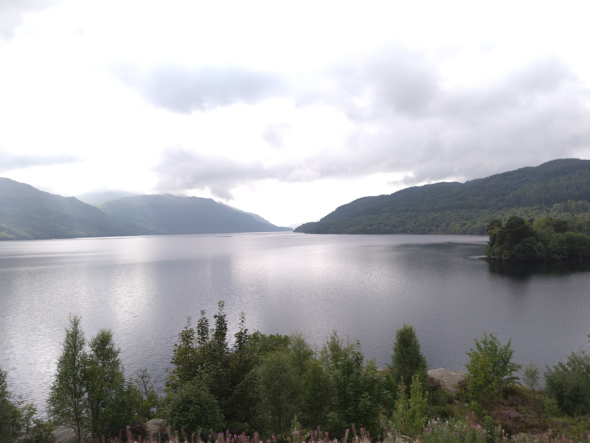
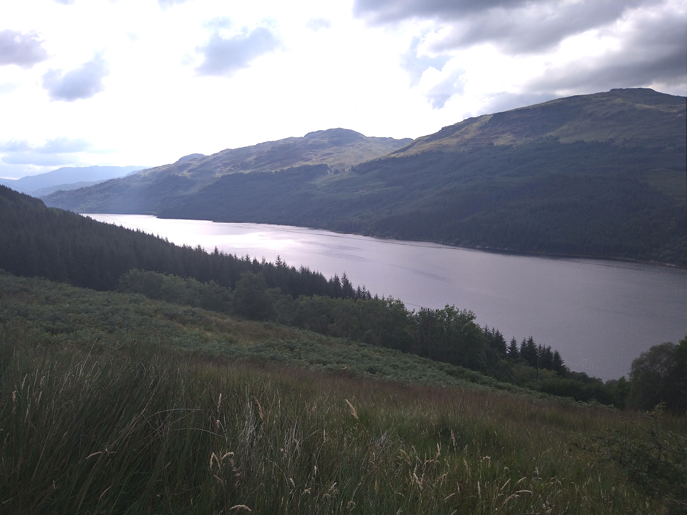
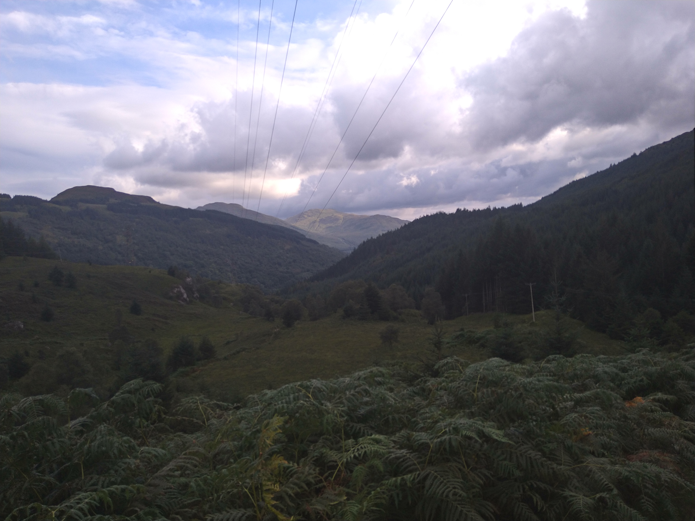

The [Three Lochs Way](https://threelochsway.co.uk/) is a 34 mile marked trail from Balloch to Inveruglas, both on Loch Lomond, via the Gareloch and Loch Long. I'd run parts of it before as Will's parents live on the Gareloch near Helensburgh, including a memorable run over the last twenty miles where I ended up getting totally lost trying to get back to Arrochar afterwards, and ended up running along the A82. I liked the idea of running the whole trail, both for the satisfaction of running something end to end, and to see how my knee would cope with the mileage. I also hoped it would work out that I would finish in good time to drive down the loch to cheer John Kelly on as he rode through Inverbeg on his Grand Round attempt.
<!-- end -->

After a leisurely breakfast at my in-laws, I drove to Inveruglas, then rode 20 miles down the A82 on the west side of Loch Lomond on my single speed bike. Luckily it was fairly flat and there weren't too many cars, but I arrived in Balloch already feeling tired and sweaty. I was carrying a litre and a half of water and I hoped this would be enough. Here I made my first mistake as I should have taken a short rest and rehydrated so that I started the run in a calm mindset. But I got flustered by all the people hanging around at Balloch visitor centre and set off promptly, my feet still numb from the cycle. Ten minutes later I had to stop to re-lace my shoes and catch my breath.

Away from the crowds at Loch Lomond Shores I began the first climb out of town and was delighted to run into Karen who was finishing her morning run. She ran up the hill with me and I immediately felt better with someone to chat to. From the top of the hill there were great views out to Loch Lomond and fun forest trails. The descent into Helensburgh was excellent fun, very twisting and fast. Unfortunately my knee felt sore and my pack heavy and bouncing around. At this early stage I was already questioning why I was doing it.

Running into Helensburgh I weaved amongst the school children and wondered if I should buy some more water. I decided against it. I left the shore of the Gareloch and turned up through the town, heading up to the [Hill House](https://www.nts.org.uk/visit/places/the-hill-house), built by Charles Rennie Mackintosh. Here I was back on familiar trails and enjoyed the run down to the old Glen Fruin road. This was now the section I'd been dreading - road miles in the midday sun and heading uphill. I wasn't moving very fast and it seemed to take forever. I was relieved to finally turn off the road but by this point I was rationing my remaining water. The next section was on military road and felt a bit eerie. The road was very straight and quiet, with signs on either side warning you not to touch suspicious objects. I could see down to the base at Faslane and was wary of taking any photos around here in case someone suddenly appeared to stop me!

At Garelochhead the road became trail and headed up again. I considered detouring to Garelochhead to get water, but it was over a mile away so didn't seem worth it. There were a few stream crossings and I doused myself in water (but didn't dare drink any). It helped cool me down a bit. This section was the most picturesque, with great views out across Loch Long with the Arrochar Alps rising behind to the north. But by now all I could think about was water. I felt so tired and didn't want to run too fast because it made me feel more thirsty, so I took frequent walking breaks. Then I got annoyed at myself for not moving fast enough. I was also worried that by the time I eventually found a shop it would be so late it was shut!

Finally at mile 27 I descended into Tarbet and was overjoyed to find a small shop. I stumbled towards the entrance and was firmly stopped and told I needed to put on a mask. My hands were shaking as I found one in my bag. I'd been so single track focused on getting water I'd forgotten about a global pandemic. I bought a litre of water and a bottle of coke, and drank half the water and most of the coke straight away. Feeling a hundred times better I followed the trail left through the rail station and into the woods towards Arrochar at the head of Loch Long. The last time I'd run this section there had been a diversion back onto the road, so I was pleased that the official route stayed on trail high in the woods. The path then turned north and headed back towards Loch Lomond, with the Arrochar Alps visible to the west. There were lots of small rises and I walked a lot of this section.

Rejoining a small road I knew it was all downhill to Loch Lomond and found some extra energy for a few faster miles at the end. I dropped down to the side of the loch and wound along the side of the road until I was back at the car. I was far too early to get to see John and made a plan to drive back out once I'd showered and eaten. However the second I sat down I could barely keep my eyes open! My longest run of the year had certainly taken a lot out of me. In the event John didn't reach Inverbeg until the early hours of the next morning, and had to cycle up to Fort William in a storm. I was glad to be safely tucked up in bed!

The Three Lochs Way was a fun trail to run and I'm keen to try it on a mountain bike next! I was pleased with how my body held up, but found the long day very hard work. And next time I'll definitely carry more water which will make the experience lots more enjoyable!