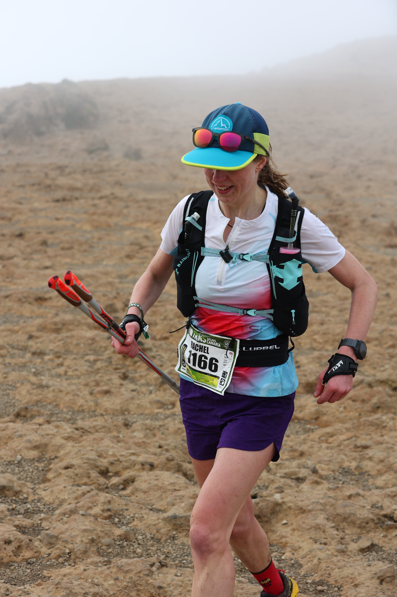
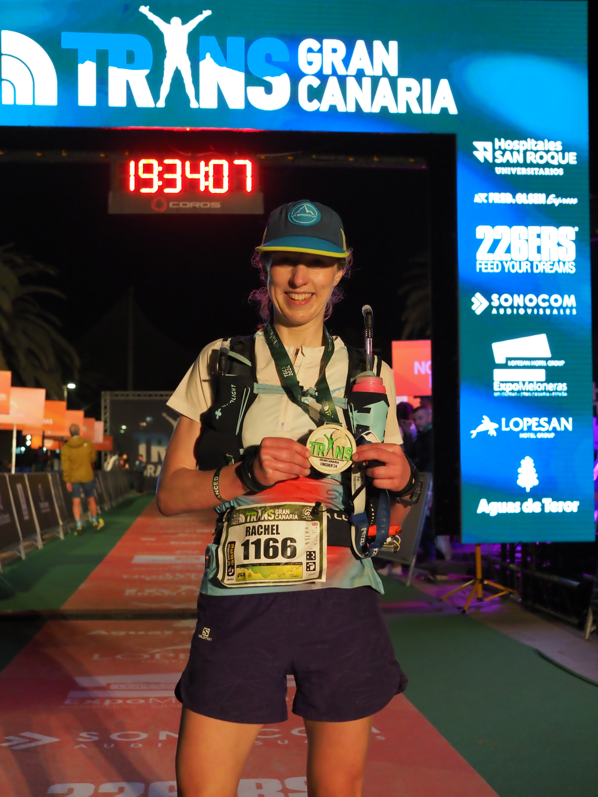

---
path: "/posts/transgrancanaria-advanced"
date: "2024-04-08"
title: "Transgrancanaria Advanced"
imageShare: ../images/transgrancanaria-advanced/rocks.jpeg
--- 

[Transgrancanaria Advanced](https://transgrancanaria.net/) is an 89km trail race from Puerto de las Nieves in the north of Gran Canaria, to Maspalomas in the south.
It's part of a festival of trail running with races from a vertical km up to the 126km Classic, which is the headline race. 
The Advanced took in some of the trails that Lindsay and I followed on a multi-day run across the island at the end of 2016.
I had some lovely memories from this trip and was excited to race on the trails!
It was my first big international race since 2019 and I had a dream goal of finishing in the top 10.
I also wanted to finish before dark, and ideally in time for the 19:30 bus back, but mostly I wanted to finish feeling strong and happy.

<!-- end -->
Training had gone well, or as well as could be hoped given the Scottish winter conditions.
I struggled to enjoy long solo runs on cold, wet, and windy hill tops, but I got them done.
Tempo runs felt easy and I was religious about doing strength and conditioning.
I did some heat acclimation in the sauna to prepare for very different conditions than I was used to running in.

We went to Gran Canaria the week before the race for a family holiday.
We hiked, swam, and did a lot of chasing a toddler around a beach.
It was fun although maybe not ideal race prep!
Will did the 22km Starter race on the Thursday and had a great race.
I wasn’t brave enough to drive the tiny, twisty roads into the mountains with Jane to spectate, so we wandered around the aquarium and eagerly refreshed the race tracker.
We loved watching him cross the finish line on the live cam!
We enjoyed the live coverage of the marathon the following day, although I started to worry that the trails looked more technical than I remembered.

Our apartment was across the road from my race start which made Saturday morning relaxed and easy.
I went into the start pen early and then tried to stay calm as it filled up from the front and it suddenly seemed like there were hundreds of people in front of me.
There were so many people and it was hard not to feel overwhelmed!
I pushed on the first climb, fuelled by adrenaline and nerves, trying to hold my position.
I’d been warned that the first descent was one of the most technical in the race and was torn between wanting to be cautious and not hold up runners behind me.
I ended up running much harder and faster than I should have.
On the one hand this meant I felt confident for all the later descents.
On the other, I had a big adrenaline crash at the bottom and my legs felt like jelly.
We began the next climb (the biggest in the race), and I felt shaky, dizzy, and a bit sick.
I slowed down a lot and tried to regain control of my breathing.
I lost count of the number of women who passed me here and realised I might be waving my dream of top 10 goodbye.
However it was still very early in the race and I didn't want to spend the day worrying about position what position I was in!
I ate a cereal bar, focused on putting one foot in front of the other and tried to stay positive, ignoring all the runners overtaking me.

By the first aid station I felt normal again so I quickly topped up my water bottles and continued on the climb.
We'd merged with runners from the Classic race just before the aid station but split off again soon afterwards.
This was good as it was a narrow trail and the people we were passing were moving very slowly (as they'd been running all night!)
I climbed steadily but still slowly.
I was now a bit afraid of pushing too hard.
The higher we got, the colder and windier it was.
People around me started putting on jackets but I stubbornly resisted, telling myself I had trained in much colder conditions and it would surely warm up soon!
It didn’t.
Then it rained.
This wasn't what I'd signed up for!

At the next aid station I ended up in a mess of white powder as I tried to top up the electrolytes solution in my flask in gusting wind.
I continued to climb steadily into the cloud.
When I reached Cruz de Tejeda I ran past the hotel Lindsay and I had stayed at in 2016 and rued that there had been no views then either!
By the descent my hands were so cold I couldn't collapse my poles and wished I'd brought gloves.
We did a small loop around the Roque Nublo plateau but I struggled to even see the famous rock in the mist, my eyes scrunched almost shut against the wind.
I overtook a couple of women around here who had climbed past me earlier, and that was a good feeling.

The next aid station had my drop bag so I restocked my bars and gels.
I made another big mess of electrolyte powder, this time managing to cover a volunteer in it too!
I'd moved quickly through all the previous aid stations but I was slow here because my hands were cold and I struggled to stuff everything into my pack.
When I started running again my bottles were still flapping everywhere, the long straws attacking me.
I felt like a total novice.
However I was moving very well and overtaking people all the time.

The long descent to Tunte was a mix of road, trail and cobblestones.
I felt relaxed and confident running downhill and I was delighted that the sun was starting to peek through the clouds.
Finally I could enjoy dusty sun-baked trails like I'd imagined! 
I'd done most of the climbing now and I was happy that I could finish the race (although I wasn't sure it would be before dark).
I ran into Tunte with a Chinese lady and we chatted briefly about what position we might be in.
Neither of us stopped for long at the aid station and we started the climb out together.
I didn't use my poles in the second half of the race as the climbs were shorter and I'd struggled to get into a groove using them.
I hadn't done enough practice with them in training.
Every run I brought them on was cold and windy and I was terrible at building and collapsing them while wearing mittens.
On the day I used the poles efficiently on steep non-technical climbs, but I didn't really know how to use them on rocky terrain.
I struggled to collapse them and get them back into my pack.
I was pleased once we reached the shorter climbs and I climbed well without poles anyway, feeling strong, and leaving my new friend behind.

I enjoyed the long descent down to the final checkpoint at Ayagueres.
Another woman flew past me just before the aid station, and the Chinese lady arrived while I was chugging some coke.
I didn't know what position we were in the race overall, but this particular race was on!
I was delighted to see Coops here too.
He was running the Classic and was in good spirits but (unsurprisingly) looked a bit tired!
I left the aid station with him and the two women.
I’d studied the terrain and profile of this last section and was able to use this to my advantage.
I knew I was still climbing well so I ran up the climb and pulled away from the others.
It was a dusty path with switchbacks and I was able to disappear from view quite quickly.
The following descent was only short.
I ran it hard and then hit the dreaded dry riverbed.
I'd heard a lot about this section from people who'd done the race before but was secretly looking forward to it.
I quite like skipping over rocks! 
I tried to maintain a fast cadence with John’s words echoing in my head that “most of the rocks don’t move!”
Luckily that turned out to be true and I overtook lots of people here.
This added to my momentum and rising excitement that I was nearing the finish.

Before the end of the riverbed I realised that it was going to be dark by the time I finished.
One thing I learned during Lakes In A Day last year is that it’s better to have your headtorch ready before you really need it.
I slowed to a fast hike, dug it out of my pack, and swapped it for the sunglasses that I'd carried around on my hat all day.
The light was rapidly fading as I joined the dusty track to Maspalomas and I could see lights twinkling in the distance.
It was headtorch time!
There was only 2km to go and I felt like I was running fast.
A quick glance at my watch showed that I was well above my tempo pace, but I was certainly moving much faster than everyone around me, and I passed more and more people.
Eventually the trail turned into a road and I could hear the crowds and announcers in Parque Sur.
There were a few more twists and turns until I finally turned onto the red carpet and was hit by a wall of cheering and music.
I ran down the finish chute and across the line feeling great.

I finished in [11 hours, 31 minutes and 20 seconds](https://transgrancanaria.livetrail.net/coureur.php?rech=1166).
I was 11th woman, just three and a half minutes behind 10th.
I had just missed my goal of finishing in daylight and annoyingly just missed the first bus back to the start.
But overall I had a great race.
I thoroughly enjoyed the trails and the few views we had, I descended well and I finished feeling strong.
Luckily some of Meryl's friends were driving north so I got a lift with them and didn't have to wait three hours for the next bus.
When I got back to our apartment Will went and got me a pizza.
It was the best thing I've ever eaten!

After a few weeks of reflection, I've picked five things I'm going to work on before my next race:
- Try to run my own race at the start and not get carried away by the crowds!
- Practice more with poles, particularly on technical terrain. Get familiar with building and collapsing them and getting them in and out of my pack.
- Research the route and race profile in plenty of time. A week on holiday with an active toddler is not the time to do this! I feel more relaxed when I know what to expect on the route, and not have to rely solely on the race profile printed on my race number! 
- Do some longer climbs and descents in training. I did most of my training in the Pentland Hills, and the highest hill, Scald Law, is only 579m. I did a lot of reps so got plenty of elevation, but it meant some of the climbs in the race felt never-ending. I'd like this to be less of a surprise to my body on race day! This should be easier to do as the weather improves and it's easier to get to bigger hills.
- Run faster on the descents! I’m really pleased with how I descended in this race as it’s taken a while to build my descending confidence back up postpartum. But now I feel strong downhill again so it’s time to push a bit outside my comfort zone!

