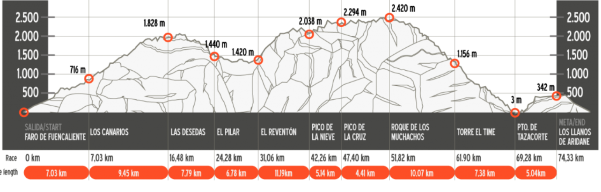
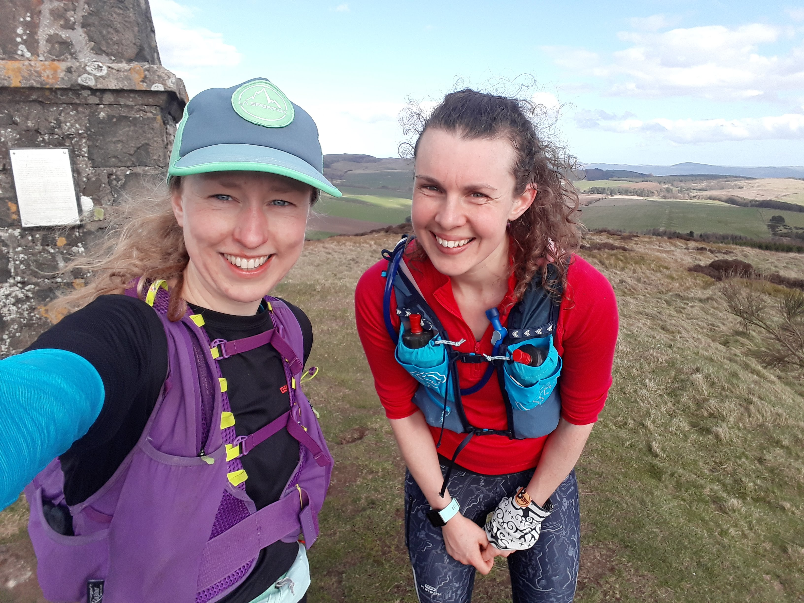
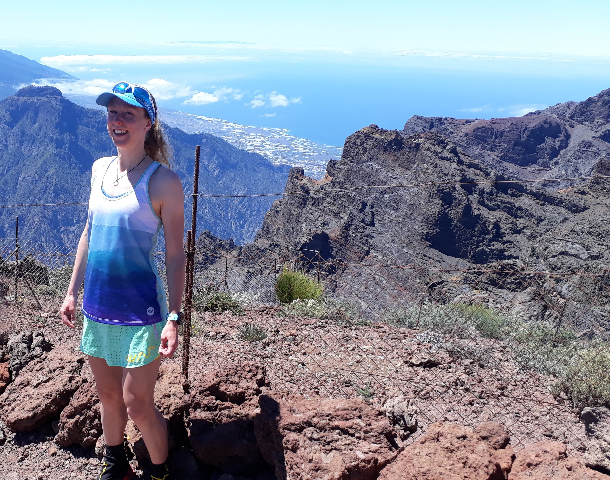

    <i>
    You gotta have faith. 
    You gotta trust the training. 
    (And do the training).
    </i>

I'd wanted to run this race since the first time I opened [Ian Corless' Running Beyond book](https://iancorless.org/runningbeyondbook/). Transvulcania is the first entry. The jagged volcanic ridges scared and inspired me in equal measure. After failing to convince Will that we should honeymoon on La Palma (it is a pain to get to) I put it out of my mind for a few years. But 2019 is the year of doing big scary races abroad. Transvulcania was first on the list. Running in Tenerife over Christmas has both given me confidence that it was possible, and scared me further. The Blue Trail route goes up higher, so neither the climb or the descent would be as long at Transvulcania, but over Christmas we'd split the route over multiple days. It was going to feel similar to if we'd run the first two days in one. I couldn't fathom this.

<!-- end -->

In true ultra style I broke it down. The race in its entirety was too scary. There's a lot of climbing in the first 10 miles, then some ridge running with lots of spiky bits (both in profile and on the trail itself), then a huge descent to the sea. And for good measure there's a final 300m climb up to the finish (because finishing back at the sea would be too easy...) I also knew that a fair amount of the climbing would be done on black sand, and that it was likely to be hot. These were all things I could prepare for, with Matt's help.

Training had been building since Tenerife. The block up to Glentress went well and my body was coping ok with the higher mileage and harder sessions. The big shift since Glentress is in how I've approached the training. It took a weekend away in the lakes with the [Pyllon team](http://www.pyllonultra.com/) for me to really commit to the process. Before I was running the reps, but I wasn't pushing it, I wasn't giving it everything. I was always holding back, too scared of failing to really try. The weekend away inspired me. Being surrounded by so much positivity and amazing people, hearing so many tales of bravery, success and failure, made me think I could achieve something awesome too. I came away hungry to try. It took a few weeks of tough grinding to feel the change. I had some dreadful sessions and endured some terrible long runs. [Thirty something miles on the 3 Lochs Way](https://www.instagram.com/p/BvcA-qQgYAa/?utm_source=ig_web_copy_link) that ended in an uphill slog in the wrong direction in horizontal rain and having to be rescued running down the main Loch Lomond road was a particular low point, but I survived.

Finally something clicked. I attribute it partly to the change in weather and the clock change. The weekend the clock's changed I repeated my least favourite session from my last training block. Three reps of Tinto Hill, pushing the final descent and back up to the gate hard after that. I was dreading it. However the conditions were much better than before. There was no ice or snow. It was daylight. It wasn't 6am on a Tuesday. Also I felt much better this time. I knew I was stronger and I knew I could complete the session. So although I approached it with a sense of foreboding, there was some optimism mixed in. My criteria for this session to be a success was to run all the way to the top at least once. I set off slowly, but running. I ignored the pain in my legs and I ignored the voice inside my head. From halfway up the voice was too loud to ignore so I argued with myself instead and kept running. Eventually I could see the top of the hill at the edge of my vision. I didn't let myself look at it, and kept running. I ran all the way to the trig-point and threw my arms around it (to the great surprise of the group of walkers already there). The next 2 reps included some walking, but that was ok. Overall I definitely ran more than I walked.

This was my turning point. The following day I ran the Sidlaw Skyline from Dundee to Perth with some friends. There was a huge section in the middle where we trudged uphill though heather, not sure where we were, unable to find a path and going nowhere fast. It took over 7 hours to run 33 miles. It should have been awful, but the combination of good weather, good company an a positive attitude meant it was great fun. The following weekend I raced a [32 mile ultra down in Exmoor](https://www.endurancelife.com/exmoor) (north Devon). I won with a big gap and was 4th overall in a new female course record and inside the old men's one. More importantly I felt strong throughout and climbed well. A few more weeks of big mileage culminating in a 100 mile week with the Arran trip at the end and I got to my taper feeling great.

")

I'd been spending twenty minutes a week in the sauna, which in hindsight isn't very much, but it was at least some effort to train for the heat... So It had been a good build up but I was worried about the two weeks preceding the race as they involved a lot of travel. I vowed to stay as relaxed as possible. I spent a weekend racing in Ireland with Carnethy, a day at home, a few days in the Lakes for the La Sportiva UK team meetup and then straight out to Madrid for a few days. I tried not to get too stressed by being in a big busy city, and with everything breaking at work. Finally I flew to La Palma and could relax.

I had a week on the island before the race. The first few days I braved the scary mountain roads in my tiny hire car driving on the wrong (right) side of the road and hugging the outside of each bend, praying there would be nothing coming the other way. I sought out bits of the course and ran and hiked to familiarise myself with the trail and the heat, and to appreciate the views without the excitement of race day. I watched videos from previous years and thoroughly scared myself. Then I caught up with Bob Allison at the VK and he put my mind at ease about most of my worries. And also gave me some perspective - he has a serious medical condition and was preparing to spend the day chasing cut offs. Yet he was here in La Palma, excited and ready to give it everything he had. I needed to be more like Bob. I received an email from Adrian that inspired me again, with advice to "run the race not the occasion". I realised I'd got carried away worrying about the spectacle of it. Ultimately it was just a trail race and it was going to be awesome. I'd spent the week wishing I wasn't tapering and could be out running on the beautiful trails. On race day I would finally get the chance to run without abandon. I was excited.

(... read part 2 [here](./transvulcania-2019) - in which I actually write about the race!)