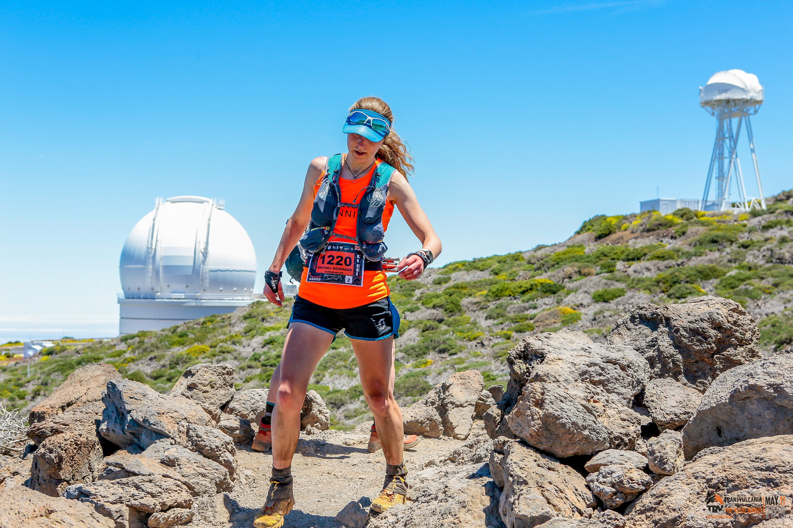
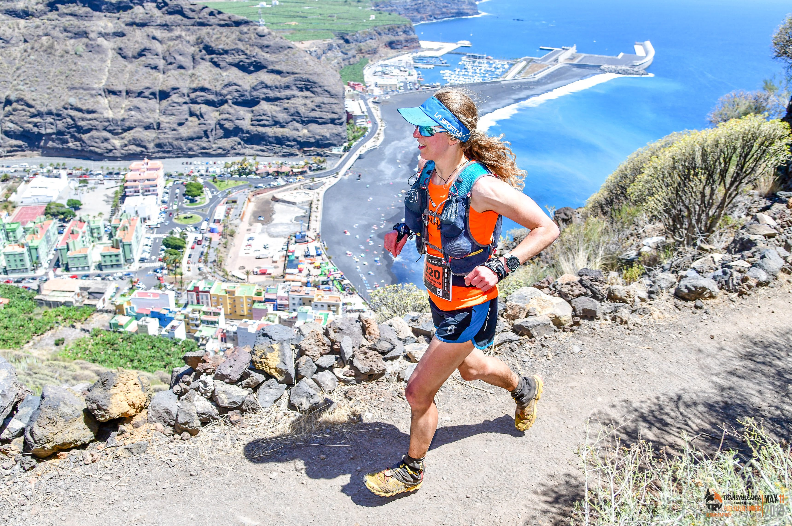
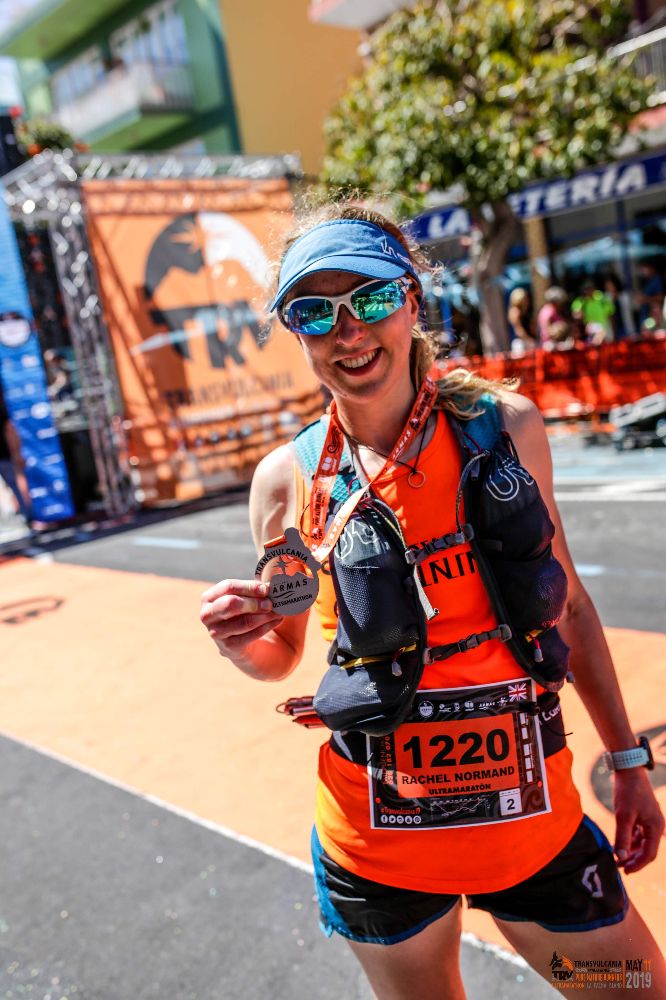

`youtube: https://www.youtube.com/watch?v=B69IU-893zE`

<!-- end -->
Race morning started with a 3:30 am bus to Fuencaliente. I was too nervous to sleep on the bus, but this was reminiscent of last year's Fling and it hadn't mattered then. I ate overnight oats walking down to the lighthouse when we were dropped off. It was cold in the wind so I put on a super light waterproof jacket that I planned to carry with me and made sure I was in a good position for when the start pen opened. I wished I was in the elite pen, but no matter, when the main pen opened I got into a good position not too far back and stood like a sardine for an hour, refusing to give up my spot. The atmosphere was electric. We counted down from ten in Spanish to AC/DC and then set off to cries of "Venga, venga!" The first mile or so was uphill on road, before we turned onto the sand. I'd heeded Bob's advice about the clouds of dust and sand during the early stage and had a buff to breathe through, but it made little difference and quickly I felt my lungs fill with dust and wanted to cough.

I passed Gemma as we got to the first off-road section and we exchanged a "see you later". I tried to control my breathing and the adrenalin surging through me. I was running. I felt good. As we hit the wide gravel track I chanced a glance behind me. My heart filled with excitement at the sight of the trail of headtorches lighting the darkness all the way back to the sea. This was awesome, and I was part of it! The trail narrowed again to single file before Los Canarios but everyone around me was climbing happily and there was no rushing or pushing. One guy stumbled on a rock and we all helped him up. I realised probably everyone else was as nervous as I was!

In his [podcast after last year's race](https://iancorless.org/2018/05/24/episode-156-kelly-wolfe-brittany-peterson-and-alex-kurt/) Ian Corless said that coming through Los Canarios is like being in the Tour de France. I'm not sure it lived up to this hype for me, but the crowds were immense and hyper and I can imagine if you were one of the first runners through it would have been wild. There were people lining the streets, many of them still in dressing gowns, dancing to the loud music pumping from the aid station, and volunteers everywhere. I'd barely touched my water so I didn't stop. From Los Canarios we climbed for the next ten or so miles before a short descent to El Pilar. I got my poles out and settled into a rhythm climbing on the sand, trying not to get too close to anyone to avoid a faceful of dust. The dust was everywhere and made breathing harder. We climbed above the cloud and were rewarded with incredible views of other islands poking through and the sun coming up between them.

    

I reached El Pilar sooner than I'd expected and feeling great. I topped up my water and continued on, passing lots of people in the aid station. The marathoners were all lining the path and cheering us on as they waited to start their race. The support here was incredible and we were made to feel like superstars. The trail is super runnable from El Pilar and I felt myself flow into a nice rhythm. A woman caught up to me and I slipped in behind her. It was starting to heat up and there wasn't much shade on the wide track. The next aid station also came sooner than expected. I refilled both bottles but turned down the offer of cold water on my head, which turned out to be a mistake. From here we started to climb again and I began to suffer in the heat. I'd been racing for four and a half hours and had enjoyed it all so far. I'd been feeling great: running smoothly, feeling strong on the climbs and  staying top of my nutrition and hydration. Now it was mid morning and there wasn't much shade as we climbed out of the forest. Lots of people started to pass me on the climbs, including people I'd overtaken earlier on. The woman I'd been running with disappeared over the distant horizon. I had my poles out to help on the climbs but should have put them away here as I ended up power hiking sections I should have run, or I ran awkwardly with my poles in one hand. Gemma overtook me on one of these undulations, looking very strong.

At the next aid station at Pico de Nieve I again stupidly declined the offer of a cold shower. Ensuring I kept cool wasn't something I was used to doing and my inexperience showed here. On the climb up to the high point I slowed even more as I was so hot. It felt like I was slowly roasting, and my body was unable to move any faster. But I was mentally holding it together and was drinking lots and eating at planned intervals. I kept putting one foot in front of the other. Relentless forward progress. I finally wobbled into the tent at the Roque de los Muchachos aid station and was immediately taken to sit down by some volunteers. They poured cold water over my head and neck from a saucepan. I wished I could cut all my hair off to keep it off my neck! I ate some fruit and left as soon as I could stand without assistance.

I'd been looking forward to the descent but didn't enjoy the first part of it. I still wasn't feeling great and was being too cautious. I was scared of slipping and picked each step carefully. That's no way to run down a hill. A few guys flew past me kamikaze style. The marathon runners were catching up now and their race finished down at the beach so they weren't holding back on the descent! One guy kept passing me and then stopping to stretch, so I'd pass him and we'd do it all again. It was too hot to get annoyed so each time I calmly pulled aside and let him go past. Slowly I started to feel better and flow down the descent more comfortably. Every time there was an easier section I made sure I took a drink. I was on Active Root by now and it tasted amazing. I started to reel people in, including Gemma. She'd bashed her knee and it meant she was having to be cautious downhill. At the aid station at El Time I got doused in cold water again, ate some orange and took some more water. The descent was too fast and furious to think about eating real food outside of the aid stations and I was a little sick of Rice Crispy Squares by this point. Fruit and Clif Shot Bloks were going down ok. I left the aid station as Gemma arrived and told her I'd see her on the final ascent, fully expecting to be caught. I'd been climbing so badly up to Roque I didn't know how the last climb would go.

I flew past the lady I'd been running with back at El Pilar. I had thought she was long gone. It made me realise how important it is to keep moving, however bad you feel and however slowly you think you're moving. Everyone has highs and lows in a long race and you should never consider yourself beaten. Thoughts were passing through my mind quickly as my focus had to keep returning to the manic descent. It was breathless and never-ending (it took me over 2 hours!) We dropped from over 2400m to sea level in 17km. My ears popped on the way down! Towards the end we ran down the VK route: super steep road, then steep cobbled switchbacks with a huge drop into the sea on one side. It was awesome and relentless and required all my tired focus. I almost fell about twenty times, stabbing a rock with my foot and just catching myself before smashing face first into the rock. I ran with a massive goofy grin, tongue out, loving it. I felt in my element on the cobbles, quick feet dancing downwards and catching people on every bend.

    

I finally hit the seafront in Tazacorte at the same time as a marathon runner (who looked much more wiped out than I felt!) I high-fived him and ran through the marathon finish line and into the final aid station amidst huge cheers and a pumping baseline. Another cold shower, more fruit, and I took off onto the beach and the dry stony riverbed. It was more runnable than I'd thought it would be. I ran / walked, hopping over rocks when I could, catching people. It was over quickly and I climbed up to the road and the final switchbacks. I didn't bother with poles and hiked, hands on knees, drinking frequently and running the flat sections between climbs. I felt like a different person from a few hours before and climbing felt easy again (although I was wary of pushing too hard as I didn't want to overheat again).  I overtook a handful of guys who looked totally beat. I didn't know how many switchbacks there were but never let myself think I might be on the last one, or about the finish line.

    

Finally I reached the road into Los Llanos and started to run (it felt super fast but was actually 8:40 mile pace!) I'd walked up and down this road in the heat of the day during the week and I knew how long it could feel, but it felt so good to be moving freely again after so much climbing and descending. I ticked off the things as I ran past them - the Chinese Bingo (not what I thought it was), the stadium, the supermarket, the first arch. People appeared from everywhere to line the street, there were children eating ice creams holding out sticky hands for high-fives and men dashing out of bars for high-fives when they saw me running past. It felt exhilarating (and the celebrations went on all through the evening and into the night, so every finisher was made to feel like a hero!). I slowed and high-fived as many people as I could and crossed the finish line feeling overjoyed.

I finished in 10 hours 26 minutes. 17th female and 101st overall. I finished totally in love with the race, the island and people of La Palma and the whole incredible experience. And I finished feeling proud of how I ran and with lots of ideas for improvements.

Some thank yous: firstly to Matt for his unwavering confidence in what I can do, even when I don't believe it myself. To Adrian for the pre-race wisdom, and to Stewart Liesnham and Karl Zeiner for patiently answering all my pre-race questions. And finally to Bob, who didn't make it to the finish this year (but will be back in 2020) and was my inspiration throughout the day.

(... read part 1 (my buildup) - [here](https://powderach-running.blogspot.com/2019/05/transvulcania-2019-build-up.html))