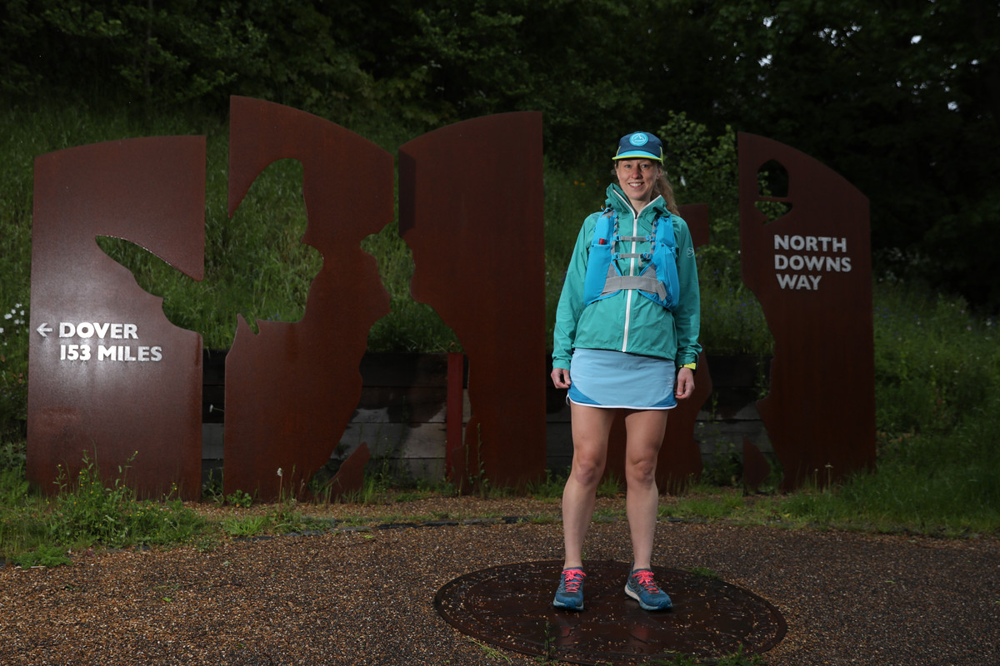
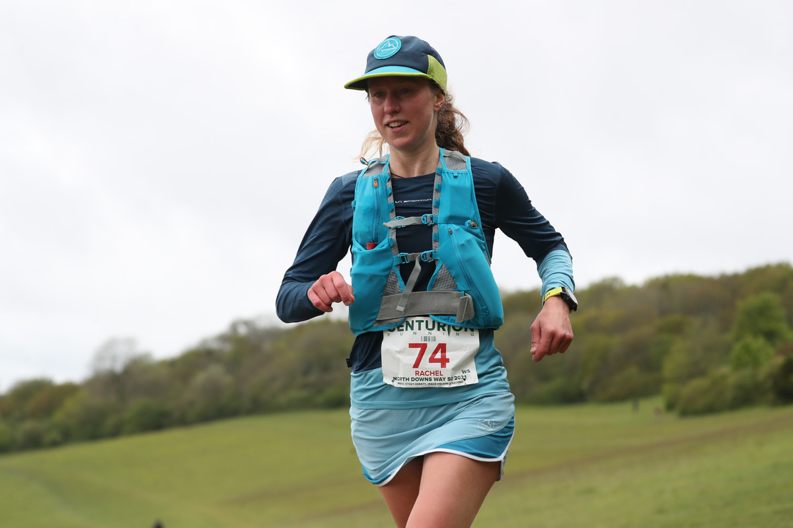
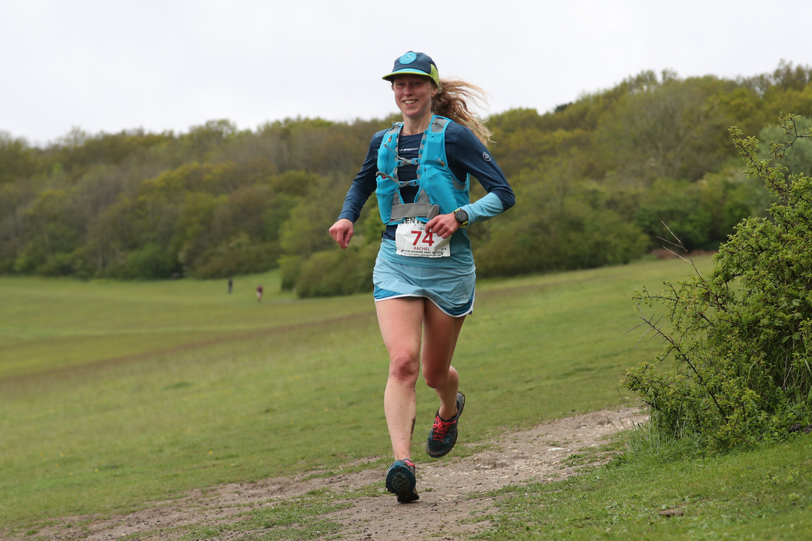
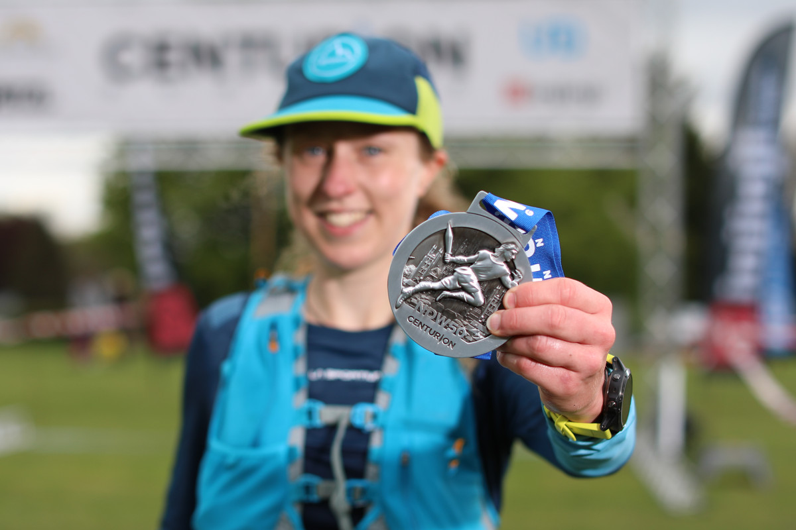

<h2>North Downs Way 50 mile Race</h2> 

It's early. 
I'm ready to run 
Am I ready to race? 
It's been so long. 
A knee operation 
A pandemic 
I don't know what I'm doing any more 
James tells me there are 2 ladies down the road 
I start

<!-- end -->
I ran this trail before the pandemic 
The ground feels familiar 
The sensation in my stomach does not 
Butterflies 
I sing Eminem to myself 
My breathing is shallow 
I try to relax 
I've missed this.

An aid station 
People cheering! 
What a great feeling 
I cruise through 
I feel ok 
I feel amazing 
Forests of bluebells 
The smell of wild garlic 
I think of Aisling 
She'd like this trail

Mile 13 is hard 
Am I going too fast 
Or not fast enough? 
This shouldn't feel hard 
Ry flies past in Helios 
I'm envious 
My steps feel heavy 
Maybe in Helios I would fly too

Aid stations are hard 
Hands slick from sanitizer can't open bottles 
Can't turn the tap off 
I remember eating chips at Newlands Corner 
And trampling mud into the cafe 
Back in a different world where you could go to a cafe and relax

The endless trail to Denbie's 
Sue is a surprise and a delight 
Memories of Heathside rabbling on muddy hills 
Much like this 
But I'm much more tired 
I remember racing through vineyards in the rain 
Up one row 
Down the next

We double back to the underpass 
Why didn't they put it closer to Box Hill? 
I'm not fast on the road 
I think I used to be faster 
At least I should be good at hills 
I'm not good at steps 

Up, down. 
Up, down. 
I see Caroline out for a run 
We both double take 
It's a small running world 
More supporters on the hill 
<i>"It's Rachel from Scotland!"</i> 
Thank you. 
Thank you for being here.

I used to run cross country in Reigate. 
It's as muddy as I remember 
The views stretch for miles 
Rolling fields 
Shades of green 
This is the England I remember 
This is why I keep running 
Mile 32 and James says I'm doing well 
I don't believe him

Flat coke has given me a speed boost 
I stretch out downhill 
I zigzag with a few guys 
They run away from me in the villages 
I'm not fast on flat roads

I'm tired 
And my legs feel sore 
But I felt worse at mile 13 
So I may as well keep going

School buildings and astroturfs 
Who invented astroturf? 
Why is it covered in sand? 
Does Mike Lebowski blink or wink? 
So many questions

I've abandoned my time goal 
I just want to finish 
I'm glad I kept my goal to myself 
But maybe I'm my own worst critic

I reach the final checkpoint 
Seven miles to go 
I plod on 
Just keep running 
No excuses 
I think of Chiara 
She wouldn't flinch.

I get into a rhythm with a chant: 
"Clear eyes 
Full hearts 
Can't lose"

In one field 
Out another 
I wait at a kissing gate 
A lady and a dog can't decide 
<i>"It's fine, no rush"</i> 
Not true 
I can't stop 
Don't let me stop 
I can't think yet

Time has slowed down 
I slip and slide through muddy puddles 
Puddy muddles 
My head feels muddled 
When can I stop?

Mile 49 and I can see the finish arch 
Always finish strong 
I remember to smile 
It's done

08:20:49 
3rd Female 
13th Overall

A huge thanks to James Elson and the [Centurion Running](https://centurionrunning.com/) team for making this race happen.
I loved it.

[Race website](https://centurionrunning.com/races/north-downs-way-50-2021) and [report](https://centurionrunning.com/reports/2021/north-downs-way-50-2021-report). 

