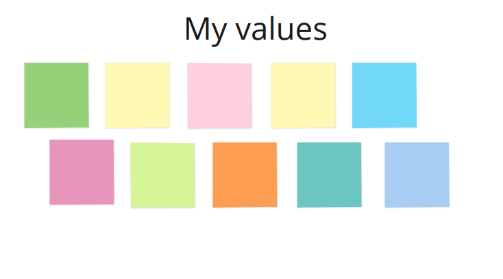
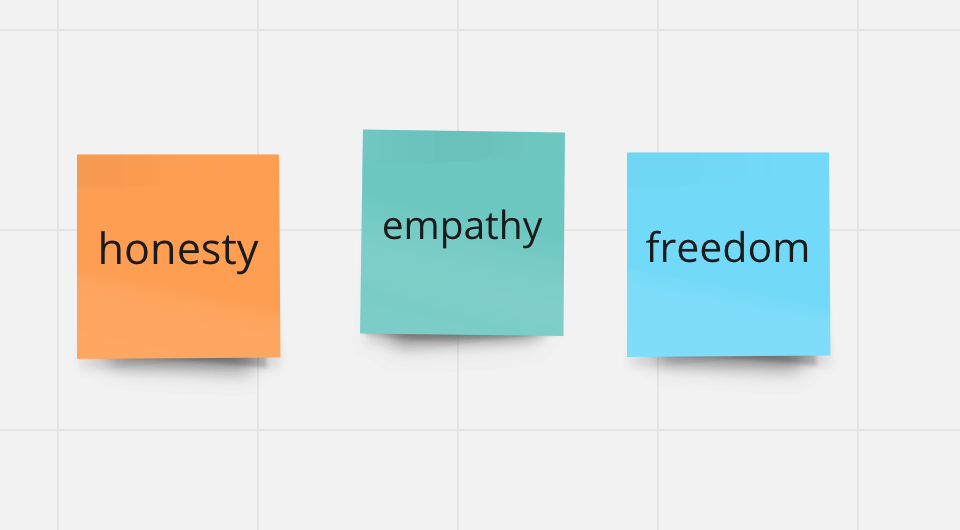

Last year I ran a personal values workshop for some teammates which was a fun and valuable exercise.
There are lots of suggestions on how to run a workshop like this on the internet.
I picked one that would work well remotely.
Everyone created their own values board individually, and we had time at the beginning and end for discussion to make the sesion more interactive.
The workshop fit into a one hour session but some of the discussions felt a little rushed, so longer would probably be better.
I encouraged people to take extra time to reflect afterwards.

<!-- end -->

## Introduction
We started by discussing what personal values are, and why they are important.
We used this definition:

> Values are basic and fundamental beliefs that guide or motivate attitudes or actions. They help us to determine what is important to us. Values describe the personal qualities we choose to embody to guide our actions; the sort of person we want to be; the manner in which we treat ourselves and others, and our interaction with the world around us. They provide the general guidelines for conduct.
>
> When aligning with our values we tend to feel more energetic, positive, and live with clarity.

## Activity
Most people created their own [Miro](https://miro.com/) board from a template I'd created.
But you don't need a template or Miro - you just need 10 post-it notes.

1. **Start by writing down 10 values that are important to you, one on each post-it note.**
You can look at a [list of examples](https://examples.yourdictionary.com/examples-of-core-values.html) for ideas if it helps.
But don't let the list restrict you!
There is no right or wrong answer.
Each value should be important to _you_.
It's ok for this first part to take a while.
We only spent 5 minutes on this and some people felt a little rushed.
The timings for the next stages are strict, so take some extra time here to ensure everyone feels comfortable with their 10 values.

2. **Next refine the values.**
You have 30 seconds to discard the 3 _least_ important values of those you wrote down.

3. **Refine again.**
Now you have 20 seconds to discard 2 more.

4. **And again.**
For the last time, take 20 seconds to discard 2 more. This is meant to be hard!

5. **The values remaining are your 3 core values.**
You might want to reword them or better define what they mean to you, and add notes about why you chose them.
Maybe you discarded something because it was encompassed by one of your remaining values: is there a word or phrase that would better express both?
If you feel super uncomfortable about one of your last discards it's ok to bring it back in.
Having 3 - 5 core values is best. More than this would be too many to try and live by. 

## Discussion
Now you have your values, discuss the following questions as a group:
- What do I feel about the values I ended up with?
- Were they as expected or did they surprise me?
- How do these values show themselves in my everyday life?
- What actions do I already take to live by them?
- What actions would I like to take to live by them?

## Finish up

Your values are not static and are likely to change over time.
They should be memorable and things that you feel strongly about at your core.

I found this exercise very powerful.
I ended up with the following values:

Realising these were the values most important to me helped me identify things in my life that were in direct conflict with these values.
Before I'd been feeling a deep sense of discomfort and couldn't put my finger on why.
Having a clear set of values helped me better articulate what I was feeling, and then change the situation.
Since doing this exercise I've left a job that had become bad for me.
I've started somewhere new where I feel aligned with the values of my team and company.

## Resources
[Instructions as pdf](/Values%20workshop.pdf)
